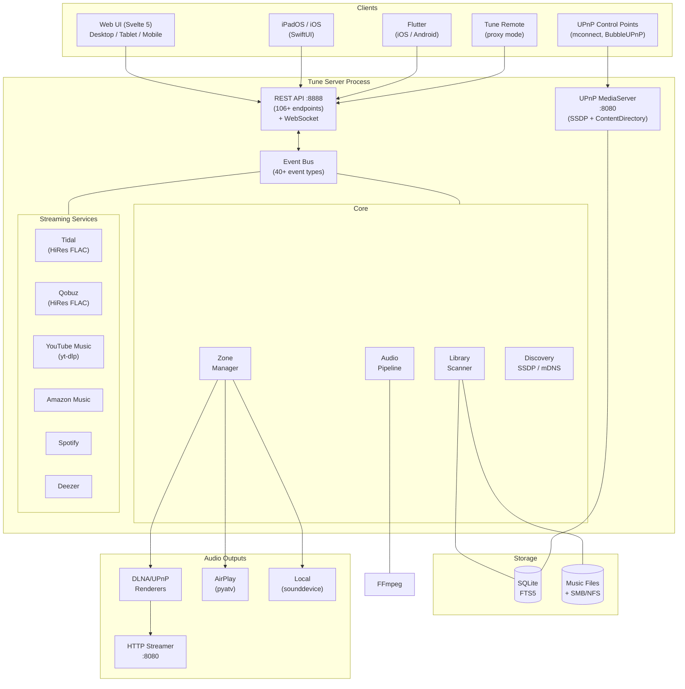
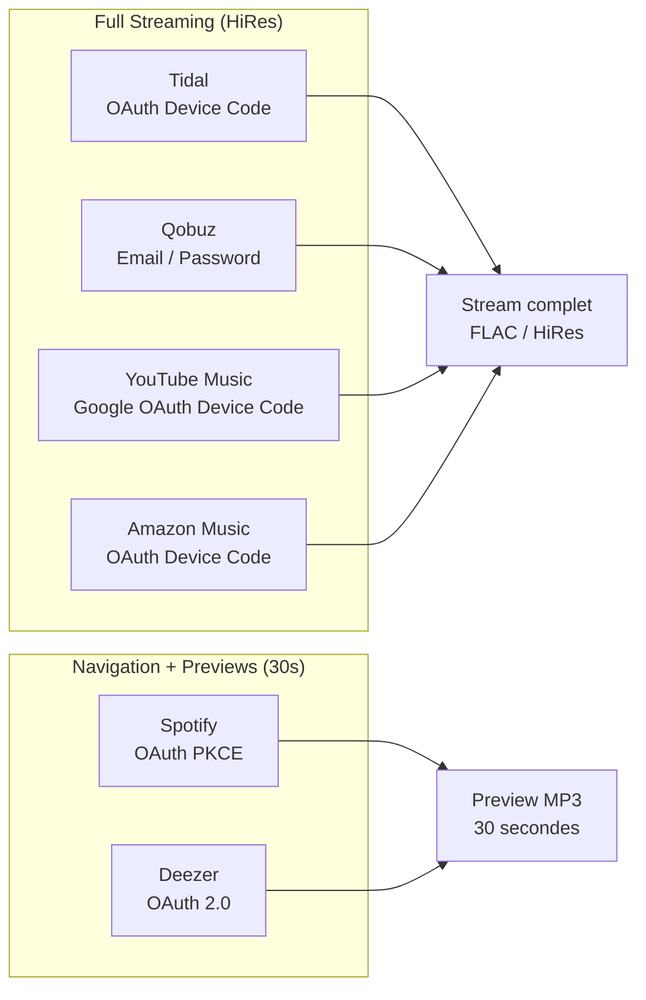
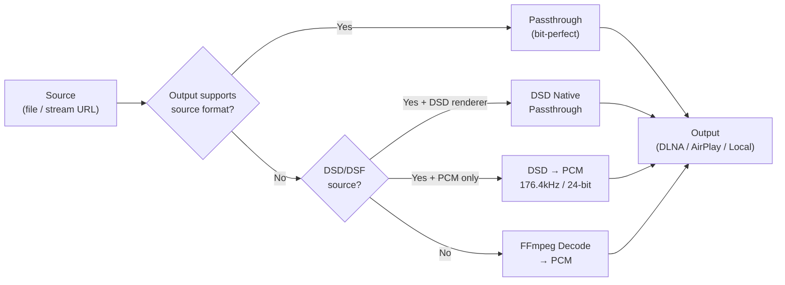

# Tune Server

A free, open-source multi-room music server for audiophiles. Manage your local library and streaming services (Tidal, Qobuz, YouTube Music) from a single interface. Stream to any DLNA/UPnP renderer, AirPlay device, or local soundcard.

Available on **Linux**, **macOS** (signed `.dmg`), **Windows**, **iPadOS/iOS** (native Swift), and **Flutter** (cross-platform).

## Features

### Audio & Playback
- **Multi-Room** — Create zones, group them for synchronized playback
- **Bit-Perfect Playback** — Passthrough when the output supports the source format
- **Native DSD** — DSF/DFF bit-perfect passthrough to DSD-capable DLNA renderers; PCM fallback (176.4kHz/24-bit)
- **Gapless Playback** — Seamless track transitions with pre-buffering
- **Multiple Outputs** — DLNA/UPnP renderers, AirPlay devices, local soundcard

### Library & Content
- **Library Management** — Scan local folders, extract metadata (mutagen), full-text search (FTS5)
- **Metadata Editing** — Edit track/album/artist metadata, upload artwork, MusicBrainz enrichment
- **Streaming Services** — Tidal (HiRes FLAC), Qobuz (HiRes FLAC), YouTube Music, Amazon Music, Spotify, Deezer
- **Federated Search** — Search across local library and all streaming services simultaneously
- **Playlists** — Full CRUD with track management and real-time sync events
- **Internet Radio** — M3U/PLS import, ICY metadata, genre filtering, favorites

### Network & Discovery
- **Device Discovery** — Automatic SSDP (DLNA) and mDNS (AirPlay) scanning
- **UPnP MediaServer** — Tune Server announces itself as a UPnP MediaServer on the LAN. Browse and play from any DLNA control point (mconnect, BubbleUPnP, etc.)
- **Network Shares** — Discover and mount SMB/NFS shares; browse DLNA MediaServers

### Clients & Remote
- **Web Client** — Embedded responsive Svelte SPA (desktop, tablet, mobile with bottom tab bar)
- **Tune Remote** — Run Tune in proxy mode to control a remote Tune Server from any machine
- **iPadOS/iOS App** — Native SwiftUI app with embedded server or remote mode
- **Flutter App** — Cross-platform (iOS/Android) with full feature parity

### Infrastructure
- **Real-Time Events** — WebSocket push with pattern-based filtering
- **Background Enrichment** — MusicBrainz metadata and artwork lookup
- **Security** — Optional API key authentication, configurable CORS origins
- **Multi-Platform** — Linux, macOS (ARM + Intel), Windows, Docker

## Architecture



## Platforms

| Platform | Install | Notes |
|----------|---------|-------|
| **Linux** (Debian/Ubuntu) | `.deb` package, install script, pip, Docker | Primary platform |
| **macOS** (ARM + Intel) | Drag `Tune Server.app` from the signed + notarized `.dmg` | Menubar wrapper, no Terminal |
| **Windows** | Download `.exe` from GitHub Releases | Standalone PyInstaller bundle |
| **iPadOS / iOS** | Native SwiftUI app (TestFlight) | Embedded server or Remote mode |
| **Flutter** | iOS + Android | Cross-platform client |

## Tune Remote Mode

Tune Server can run in **remote mode** — a lightweight proxy that connects to another Tune Server on the LAN. The web client is served locally, but all API calls and WebSocket events are forwarded to the remote server.

```bash
# Auto-discover and connect to the first Tune Server found
TUNE_MODE=remote python -m tune_server

# Or specify the host explicitly
TUNE_MODE=remote TUNE_REMOTE_HOST=192.168.1.50:8888 python -m tune_server
```

This turns any PC/Mac into a Tune remote control — just open `http://localhost:8888`.

## UPnP MediaServer

Tune Server announces itself as a **UPnP/DLNA MediaServer** on the local network. Any UPnP control point can browse the library and play music:

- **mconnect** (iOS/Android) — browse Albums/Artists/Tracks, play to any renderer
- **BubbleUPnP** (Android) — full DLNA control
- **foobar2000** (Windows) — UPnP browser plugin

The ContentDirectory exposes: Albums, Artists, All Tracks, Genres. Audio is streamed via HTTP with Range support and proper DLNA headers.

Configuration:
```bash
TUNE_UPNP_SERVER_ENABLED=true    # default
TUNE_UPNP_SERVER_NAME="Tune Server"
```

## Requirements

- **OS**: Debian 12+ / Ubuntu 22.04+ (or macOS / Windows)
- **Python**: 3.11+
- **FFmpeg**: for audio decoding/transcoding

## Installation

### Option 1: macOS DMG (recommended for macOS)

Download the signed and notarized `.dmg` from
[mozaiklabs.fr/download](https://mozaiklabs.fr/download) or the
[GitHub Releases](https://github.com/renesenses/tune-server-linux/releases) page.

1. Open the `.dmg` (double-click).
2. Drag **Tune Server.app** to the **Applications** folder.
3. Launch it from Launchpad — the 🎵 icon appears in the menu bar.
4. Click **Ouvrir l'interface web** from the 🎵 menu (or open `http://localhost:8888`).

The bundle ships its own Python runtime, FFmpeg, and the web client — no system
dependencies. Data lives in `~/Library/Application Support/Tune Server/`.

### Option 2: Debian package (recommended for Linux production)

Build and install the `.deb` package, which handles everything: dependencies, systemd service, user creation, web UI.

```bash
# On the build machine
git clone git@github.com:renesenses/tune-server.git
cd tune-server

# Build the web client (requires Node.js)
cd /path/to/tune-web-client
npm ci && npm run build
cp -r dist/ /path/to/tune-server/web/

# Build the .deb package (requires debhelper)
sudo apt install build-essential debhelper python3 python3-venv python3-pip
cd /path/to/tune-server
./build-deb.sh

# Install on the target machine
sudo dpkg -i ../tune-server_*.deb
sudo apt install -f  # install any missing dependencies
```

After installation:
1. Edit `/opt/tune-server/.env` to configure music directories and streaming services
2. Start the service: `sudo systemctl start tune-server`
3. Open `http://<server-ip>:8888` in your browser

### Option 3: Windows

Download `tune-server-x.y.z-win-x64.zip` from [GitHub Releases](https://github.com/renesenses/tune-server-linux/releases). Extract and run `tune-server.exe`. Data is stored in `%LOCALAPPDATA%\TuneServer\`.

Run `install.bat` to create a desktop shortcut.

### Option 4: Quick install script (Linux)

```bash
git clone git@github.com:renesenses/tune-server.git
cd tune-server
sudo ./install.sh           # Install to /opt/tune-server
sudo ./install.sh --systemd # Install + enable systemd service
```

### Option 5: Development setup

```bash
# System dependencies
sudo apt update
sudo apt install -y python3 python3-pip python3-venv ffmpeg \
    libasound2-dev libportaudio2 portaudio19-dev \
    avahi-daemon

# Clone and install
git clone git@github.com:renesenses/tune-server.git
cd tune-server
python3 -m venv .venv
source .venv/bin/activate
pip install -e ".[test]"

# Run
cp .env.example .env  # edit as needed
python -m tune_server
```

### Option 6: Docker

```bash
docker run -d --name tune \
  --network host \
  -v ./data:/data \
  -v /path/to/music:/music:ro \
  renesenses/tune:latest
```

`--network host` is required for DLNA/SSDP multicast discovery and mDNS.

A `docker-compose.example.yml` is included in the repo for reference.

### Upgrading

**Debian package:**
```bash
sudo dpkg -i tune-server_<new-version>.deb
# .env is preserved (conffile), service restarts automatically
```

**Manual install:**
```bash
cd /path/to/tune-server
git pull
source .venv/bin/activate
pip install -e .
sudo systemctl restart tune-server
```

## Configuration

All settings use environment variables with the `TUNE_` prefix. Copy `.env.example` to `.env` to get started:

```bash
cp .env.example .env
```

| Variable | Default | Description |
|----------|---------|-------------|
| **Library** | | |
| `TUNE_MUSIC_DIRS` | `["~/Music"]` | Directories to scan for music (JSON array) |
| `TUNE_DB_PATH` | `tune_server.db` | SQLite database path |
| `TUNE_SCAN_ON_STARTUP` | `true` | Scan library on startup |
| `TUNE_WATCH_FILESYSTEM` | `true` | Watch for file changes |
| `TUNE_ARTWORK_CACHE_DIR` | `artwork_cache` | Directory for cached album artwork |
| **Server** | | |
| `TUNE_API_HOST` | `0.0.0.0` | API listen address |
| `TUNE_API_PORT` | `8888` | API port |
| `TUNE_STREAM_HOST` | `0.0.0.0` | Audio stream server address |
| `TUNE_STREAM_PORT` | `8080` | Audio stream server port |
| `TUNE_LOG_LEVEL` | `INFO` | Log level |
| `TUNE_LOG_FORMAT` | `console` | `console` or `json` |
| **Security** | | |
| `TUNE_API_KEY` | `None` | API key for authentication (None = no auth) |
| `TUNE_CORS_ORIGINS` | `["*"]` | Allowed CORS origins |
| **Web UI** | | |
| `TUNE_WEB_DIR` | `None` | Path to built SPA (enables embedded web UI) |
| **Streaming** | | |
| `TUNE_TIDAL_ENABLED` | `false` | Enable Tidal integration |
| `TUNE_TIDAL_QUALITY` | `HI_RES_LOSSLESS` | Tidal quality: `LOW`, `HIGH`, `LOSSLESS`, `HI_RES_LOSSLESS` |
| `TUNE_QOBUZ_ENABLED` | `false` | Enable Qobuz integration |
| `TUNE_QOBUZ_APP_ID` | `None` | Qobuz application ID |
| `TUNE_QOBUZ_APP_SECRET` | `None` | Qobuz application secret |
| `TUNE_YOUTUBE_ENABLED` | `false` | Enable YouTube Music integration |
| `TUNE_YOUTUBE_CLIENT_ID` | `None` | Google OAuth client ID (TVs and Limited Input devices) |
| `TUNE_YOUTUBE_CLIENT_SECRET` | `None` | Google OAuth client secret |
| `TUNE_AMAZON_MUSIC_ENABLED` | `false` | Enable Amazon Music integration |
| `TUNE_AMAZON_MUSIC_REGION` | `us` | Amazon Music region |
| `TUNE_AMAZON_MUSIC_QUALITY` | `HD` | Amazon quality: `SD`, `HD`, `ULTRA_HD` |
| `TUNE_SPOTIFY_ENABLED` | `false` | Enable Spotify integration |
| `TUNE_SPOTIFY_CLIENT_ID` | `None` | Spotify app client ID |
| `TUNE_SPOTIFY_REDIRECT_URI` | `http://localhost:8888/api/v1/streaming/spotify/callback` | Spotify OAuth redirect URI |
| `TUNE_DEEZER_ENABLED` | `false` | Enable Deezer integration |
| `TUNE_DEEZER_APP_ID` | `None` | Deezer app ID |
| `TUNE_DEEZER_APP_SECRET` | `None` | Deezer app secret |
| `TUNE_DEEZER_REDIRECT_URI` | `http://localhost:8888/api/v1/streaming/deezer/callback` | Deezer OAuth redirect URI |
| **Discovery** | | |
| `TUNE_DISCOVERY_ENABLED` | `true` | Enable network device discovery |
| `TUNE_SSDP_ENABLED` | `true` | Enable SSDP (DLNA renderer discovery) |
| `TUNE_MDNS_ENABLED` | `true` | Enable mDNS (AirPlay discovery) |
| **Network** | | |
| `TUNE_NETWORK_SHARES_ENABLED` | `false` | Enable SMB/NFS share discovery |
| `TUNE_NETWORK_MEDIA_SERVERS_ENABLED` | `false` | Enable DLNA MediaServer discovery |
| `TUNE_SMB_MOUNT_DIR` | `~/.tune/mounts` | Directory for network share mount points |
| **WebSocket** | | |
| `TUNE_WS_HEARTBEAT_INTERVAL` | `30` | WebSocket ping interval (seconds, 0 = disabled) |
| **UPnP Server** | | |
| `TUNE_UPNP_SERVER_ENABLED` | `true` | Enable UPnP MediaServer advertisement |
| `TUNE_UPNP_SERVER_NAME` | `Tune Server` | Friendly name shown to DLNA control points |
| **Remote Mode** | | |
| `TUNE_MODE` | `server` | `server` (full) or `remote` (proxy to another Tune Server) |
| `TUNE_REMOTE_HOST` | `None` | IP:port of the Tune Server to connect to |
| `TUNE_REMOTE_AUTO_DISCOVER` | `true` | Auto-discover Tune Servers on LAN if no host set |

## Usage

```bash
# Start the server
python -m tune_server

# Or via the entry point
tune-server
```

The server starts on two ports:
- **:8888** — REST API + WebSocket (+ Web UI if configured)
- **:8080** — HTTP audio streaming (for DLNA renderers)

### With embedded Web UI

Build the web client and point `TUNE_WEB_DIR` to the output:

```bash
# Build the web client
cd /path/to/tune-web-client
npm ci && npm run build

# Start the server with the embedded UI
TUNE_WEB_DIR=/path/to/tune-web-client/dist python -m tune_server
```

Open `http://localhost:8888` in your browser — both API and UI are served from the same port.

## systemd

A systemd unit file is provided for running Tune Server as a system service:

```bash
sudo cp tune-server.service /etc/systemd/system/
sudo systemctl daemon-reload
sudo systemctl enable --now tune-server
sudo journalctl -u tune-server -f
```

## API

### Library

```bash
# Search
curl "localhost:8888/api/v1/library/search?q=bashung"

# Browse
curl localhost:8888/api/v1/library/tracks
curl localhost:8888/api/v1/library/albums
curl localhost:8888/api/v1/library/artists
curl "localhost:8888/api/v1/library/albums/236/tracks"

# Trigger scan
curl -X POST localhost:8888/api/v1/system/scan
```

### Federated Search

```bash
# Search across local library + all streaming services
curl "localhost:8888/api/v1/search?q=radiohead&limit=10"

# Search specific sources only
curl "localhost:8888/api/v1/search?q=radiohead&sources=local,tidal,youtube"
```

### Playlists

```bash
# Create a playlist
curl -X POST localhost:8888/api/v1/playlists \
  -H 'Content-Type: application/json' \
  -d '{"name": "Favorites", "description": "My top tracks"}'

# List playlists
curl localhost:8888/api/v1/playlists

# Add tracks to a playlist
curl -X POST localhost:8888/api/v1/playlists/1/tracks \
  -H 'Content-Type: application/json' \
  -d '{"track_ids": [42, 43, 44]}'

# Get playlist tracks
curl localhost:8888/api/v1/playlists/1/tracks
```

### Devices

```bash
# List discovered network devices (DLNA/AirPlay)
curl localhost:8888/api/v1/devices

# List local audio output devices (USB DACs, soundcards)
curl localhost:8888/api/v1/devices/audio

# Trigger a fresh SSDP/mDNS scan
curl -X POST localhost:8888/api/v1/devices/scan
```

#### Manually adding a DLNA device

Some DLNA renderers do not respond to SSDP multicast discovery (firewall rules,
firmware limitations, isolated VLANs). You can register them directly by
providing their UPnP device description URL:

```bash
curl -X POST localhost:8888/api/v1/devices/add \
  -H 'Content-Type: application/json' \
  -d '{"description_url": "http://10.1.1.31:49152/description.xml"}'
```

The device description URL is typically `http://<device-ip>:<port>/description.xml`
— check your renderer's manual or network scanner. Tune Server will fetch the
description, add the device to the available list, and persist it in the database
so it is automatically restored on the next server restart.

To remove a manually-added device:

```bash
curl -X DELETE localhost:8888/api/v1/devices/<device-id>
```

### Zones

```bash
# List zones
curl localhost:8888/api/v1/zones

# Create a DLNA zone
curl -X POST localhost:8888/api/v1/zones \
  -H 'Content-Type: application/json' \
  -d '{"name": "Living Room", "output_type": "dlna", "output_device_id": "<device-id>"}'

# Create a local zone
curl -X POST localhost:8888/api/v1/zones \
  -H 'Content-Type: application/json' \
  -d '{"name": "Local", "output_type": "local"}'

# Delete a zone
curl -X DELETE localhost:8888/api/v1/zones/2
```

### Playback

```bash
# Play a track
curl -X POST localhost:8888/api/v1/zones/1/play \
  -H 'Content-Type: application/json' \
  -d '{"track_id": 42}'

# Play an album
curl -X POST localhost:8888/api/v1/zones/1/play \
  -H 'Content-Type: application/json' \
  -d '{"album_id": 10}'

# Pause / Resume / Stop
curl -X POST localhost:8888/api/v1/zones/1/pause
curl -X POST localhost:8888/api/v1/zones/1/resume
curl -X POST localhost:8888/api/v1/zones/1/stop

# Next / Previous
curl -X POST localhost:8888/api/v1/zones/1/next
curl -X POST localhost:8888/api/v1/zones/1/previous

# Seek (ms)
curl -X POST localhost:8888/api/v1/zones/1/seek \
  -H 'Content-Type: application/json' \
  -d '{"position_ms": 60000}'

# Volume (0.0 - 1.0)
curl -X POST localhost:8888/api/v1/zones/1/volume \
  -H 'Content-Type: application/json' \
  -d '{"volume": 0.7}'

# Queue
curl localhost:8888/api/v1/zones/1/queue
```

### Streaming Services



```bash
# List available services with auth status
curl localhost:8888/api/v1/streaming/services

# Authenticate a service
curl -X POST localhost:8888/api/v1/streaming/tidal/auth

# Search a service
curl "localhost:8888/api/v1/streaming/youtube/search?q=radiohead&limit=10"

# Browse service catalog
curl localhost:8888/api/v1/streaming/tidal/albums/12345/tracks

# Featured content
curl localhost:8888/api/v1/streaming/qobuz/featured/sections
curl "localhost:8888/api/v1/streaming/qobuz/featured/new-releases?limit=20"

# Disconnect a service
curl -X POST localhost:8888/api/v1/streaming/tidal/disconnect
```

### Network

```bash
# Discover network shares (SMB/NFS)
curl localhost:8888/api/v1/network/shares

# Scan a specific host
curl "localhost:8888/api/v1/network/scan-host?host=192.168.1.10&protocol=smb"

# Mount a share
curl -X POST localhost:8888/api/v1/network/mounts \
  -H 'Content-Type: application/json' \
  -d '{"host": "192.168.1.10", "share": "music", "protocol": "smb"}'

# Browse DLNA media servers
curl localhost:8888/api/v1/network/media-servers
curl "localhost:8888/api/v1/network/media-servers/<server-id>/browse?object_id=0"
```

### Library Management

```bash
# Browse by directory
curl localhost:8888/api/v1/library/browse
curl "localhost:8888/api/v1/library/browse/dir?path=/home/user/Music/Rock"

# Metadata completeness stats
curl localhost:8888/api/v1/library/stats/completeness

# Upload album artwork
curl -X POST localhost:8888/api/v1/library/albums/236/artwork \
  -F "file=@cover.jpg"

# Rescan artwork for all albums without cover
curl -X POST localhost:8888/api/v1/library/artwork/rescan

# Merge duplicate albums
curl -X POST localhost:8888/api/v1/library/albums/merge-duplicates
```

### Radios

```bash
# List radios
curl localhost:8888/api/v1/radios

# Create a radio station
curl -X POST localhost:8888/api/v1/radios \
  -H 'Content-Type: application/json' \
  -d '{"name": "FIP", "stream_url": "https://icecast.radiofrance.fr/fip-hifi.aac", "genre": "Éclectique"}'

# Upload radio cover
curl -X POST localhost:8888/api/v1/radios/1/artwork -F "file=@logo.jpg"

# Import from M3U/PLS
curl -X POST localhost:8888/api/v1/radios/import -F "file=@stations.m3u"

# Play on a zone
curl -X POST localhost:8888/api/v1/radios/1/play/1
```

### Multi-Room

```bash
# Group zones (zone 4 = leader, zone 1 = follower)
curl -X POST localhost:8888/api/v1/zones/group \
  -H 'Content-Type: application/json' \
  -d '{"leader_id": 4, "zone_ids": [1, 4]}'

# List groups
curl localhost:8888/api/v1/zones/groups/list

# Dissolve a group
curl -X DELETE localhost:8888/api/v1/zones/group/<group-id>
```

When zones are grouped, play/pause/stop/next/previous commands on any zone in the group affect all zones.

### WebSocket

Connect to `ws://localhost:8888/ws` for real-time events:

```json
{"type": "playback.started", "data": {"zone_id": 1, "track_id": 42}, "source": "player"}
{"type": "playlist.created", "data": {"id": 1, "name": "Favorites"}, "source": "api"}
{"type": "device.discovered", "data": {"id": "...", "name": "DMP-A8", "type": "dlna"}, "source": "ssdp"}
```

**Subscribe to specific events (fnmatch patterns):**

```json
{"action": "subscribe", "patterns": ["playback.*", "playlist.*"]}
```

**Unsubscribe (reset to all events):**

```json
{"action": "unsubscribe", "patterns": []}
```

### System

```bash
# Health check
curl localhost:8888/api/v1/system/health

# System stats
curl localhost:8888/api/v1/system/stats

# Server configuration
curl localhost:8888/api/v1/system/config

# Scan status
curl localhost:8888/api/v1/system/scan/status
```

## Audio Pipeline



- **Passthrough** — Output supports the source format (e.g., DLNA playing FLAC): original bytes served directly. Bit-perfect, zero processing.
- **DSD Native** — DSF/DFF files sent bit-perfect to DSD-capable DLNA renderers (auto-detected). Fallback: PCM 176.4kHz/24-bit.
- **Decode** — FFmpeg decodes to PCM at the appropriate sample rate and bit depth. Never upsamples.

## Project Structure

```
tune_server/
├── app.py              # Bootstrap, wires all components
├── config.py           # Pydantic Settings
├── event_bus.py        # Async pub/sub (40 event types)
├── models.py           # Pydantic models
├── db/                 # SQLite + FTS5
├── library/            # Scanner, metadata, artwork, watcher
├── audio/              # Pipeline, decoder, encoder, buffer
├── playback/           # Queue, player state machine, gapless
├── zones/              # Zone manager, grouping, sync engine
├── outputs/            # DLNA, AirPlay, local, HTTP streamer
├── discovery/          # SSDP, mDNS, device registry
├── streaming/          # Tidal, Qobuz, YouTube, Amazon, Spotify, Deezer
├── upnp_server/        # UPnP MediaServer (SSDP ad, ContentDirectory, audio serving)
├── remote/             # Tune Remote proxy mode (discovery + reverse proxy)
├── api/                # FastAPI routes, WebSocket, deps
└── utils/              # Network, audio helpers
```

## Documentation

- [API Reference](docs/api-reference.md) — Full endpoint documentation (106+ endpoints)
- [Architecture](docs/architecture.md) — System design, component diagrams, data flows
- [Audio Pipeline](docs/audio-pipeline.md) — Decode, passthrough, and direct URL streaming
- [Event Bus](docs/event-bus.md) — 40 event types and pub/sub system
- [Database](docs/database.md) — Schema, FTS5, repository pattern
- [Device Discovery](docs/discovery.md) — SSDP (DLNA) and mDNS (AirPlay) scanning
- [Outputs](docs/outputs.md) — DLNA, AirPlay, and local output targets
- [Multi-Room](docs/multi-room.md) — Zone grouping and synchronized playback
- [Tidal Setup](docs/tidal-setup.md) — OAuth device code, quality levels
- [Qobuz Setup](docs/qobuz-setup.md) — App ID/Secret authentication, Hi-Res FLAC
- [YouTube Music Setup](docs/youtube-music-setup.md) — Google OAuth, device code flow
- [Amazon Music Setup](docs/amazon-music-setup.md) — OAuth device code, regions, quality
- [Spotify Setup](docs/spotify-setup.md) — OAuth PKCE, Free vs Premium
- [Deezer Setup](docs/deezer-setup.md) — OAuth 2.0, app ID/secret
- [Linux Deployment](docs/linux.md) — Audio, mDNS, firewall, troubleshooting
- [Project History](docs/project/index.md) — Development phases and decisions
- [Roon vs Tune](docs/roon-vs-tune.md) — Feature comparison

## Dependencies

| Library | Purpose |
|---------|---------|
| fastapi + uvicorn | REST API + WebSocket |
| aiosqlite | Async SQLite |
| mutagen | Audio metadata extraction |
| async-upnp-client | DLNA/UPnP control |
| pyatv | AirPlay streaming |
| zeroconf | mDNS discovery |
| sounddevice + numpy | Local audio output |
| aiohttp | HTTP audio server + HTTP client |
| watchfiles | Filesystem monitoring |
| structlog | Structured logging |
| pydantic-settings | Configuration |
| ytmusicapi | YouTube Music catalog browsing |
| yt-dlp | YouTube audio URL extraction |
| tidalapi | Tidal streaming |
| deezer-python | Deezer catalog browsing |

## Ecosystem

| Repository | Description |
|-----------|-------------|
| [tune-server-linux](https://github.com/renesenses/tune-server-linux) | Server (Python/FastAPI) — Linux, macOS, Windows |
| [tune-web-client](https://github.com/renesenses/tune-web-client) | Web client (Svelte 5) — responsive desktop/tablet/mobile |
| [tune-server-ipados](https://github.com/renesenses/tune-server-ipados) | Native iPadOS/iOS app (SwiftUI + GRDB) — embedded server or remote |
| [tune-server-flutter](https://github.com/renesenses/tune-server-flutter) | Flutter cross-platform app (iOS/Android) |
| [tune-server-macos](https://github.com/renesenses/tune-server-macos) | macOS distribution + Homebrew formula |
| [tune-server-win](https://github.com/renesenses/tune-server-win) | Windows distribution (PyInstaller) |
| [tune-connector-tidal](https://github.com/renesenses/tune-connector-tidal) | Tidal streaming connector (standalone plugin) |
| [tune-connector-qobuz](https://github.com/renesenses/tune-connector-qobuz) | Qobuz streaming connector (standalone plugin) |
| [tune-connector-youtube](https://github.com/renesenses/tune-connector-youtube) | YouTube Music connector (standalone plugin) |
| [tune-connector-amazon](https://github.com/renesenses/tune-connector-amazon) | Amazon Music connector (standalone plugin) |
| [tune-connector-deezer](https://github.com/renesenses/tune-connector-deezer) | Deezer connector (standalone plugin) |

## License

MIT — see [LICENSE](LICENSE)