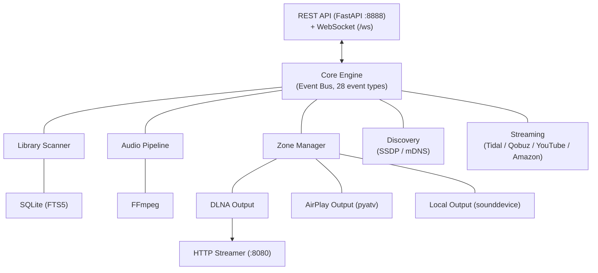

# Tune Server

A multi-room music server for local libraries and streaming services, with DLNA/UPnP, AirPlay, and local audio output. Designed for **Debian/Ubuntu Linux**.

## Features

- **Library Management** — Scan local music folders, extract metadata (mutagen), full-text search (FTS5)
- **Multiple Outputs** — DLNA/UPnP renderers, AirPlay devices, local soundcard
- **Multi-Room** — Group zones for synchronized playback
- **Streaming Services** — Tidal, Qobuz, YouTube Music, and Amazon Music integration
- **Federated Search** — Search across local library and all streaming services simultaneously
- **Playlists** — Full CRUD with track management and real-time sync events
- **Bit-Perfect Playback** — Passthrough when the output supports the source format natively
- **Gapless Playback** — Seamless track transitions with pre-buffering
- **Device Discovery** — Automatic SSDP (DLNA) and mDNS (AirPlay) scanning
- **Real-Time Events** — WebSocket push with subscribe/unsubscribe filtering (fnmatch patterns)
- **Background Enrichment** — MusicBrainz metadata lookup
- **Security** — Optional API key authentication, configurable CORS origins

## Architecture



## Requirements

- **OS**: Debian 12+ / Ubuntu 22.04+
- **Python**: 3.11+
- **FFmpeg**: for audio decoding/transcoding

## Installation

### System dependencies

```bash
sudo apt update
sudo apt install -y python3 python3-pip python3-venv ffmpeg \
    libasound2-dev libportaudio2 portaudio19-dev \
    avahi-daemon
```

### Application

```bash
# Clone
git clone git@github.com:renesenses/tune-server.git
cd tune-server

# Create virtual environment
python3 -m venv .venv
source .venv/bin/activate

# Install
pip install -e .
```

### Quick install script

```bash
sudo ./install.sh           # Install to /opt/tune-server
sudo ./install.sh --systemd # Install + enable systemd service
```

### Docker

```bash
docker build -t tune-server .
docker run -d --name tune-server \
    --network host \
    -v /path/to/music:/music:ro \
    -v tune-data:/data \
    tune-server
```

## Configuration

All settings use environment variables with the `TUNE_` prefix. Copy `.env.example` to `.env` to get started:

```bash
cp .env.example .env
```

| Variable | Default | Description |
|----------|---------|-------------|
| `TUNE_MUSIC_DIRS` | `["~/Music"]` | Directories to scan for music |
| `TUNE_DB_PATH` | `tune_server.db` | SQLite database path |
| `TUNE_API_HOST` | `0.0.0.0` | API listen address |
| `TUNE_API_PORT` | `8888` | API port |
| `TUNE_STREAM_HOST` | `0.0.0.0` | Audio stream server address |
| `TUNE_STREAM_PORT` | `8080` | Audio stream server port |
| `TUNE_SCAN_ON_STARTUP` | `true` | Scan library on startup |
| `TUNE_WATCH_FILESYSTEM` | `true` | Watch for file changes |
| `TUNE_LOG_LEVEL` | `INFO` | Log level |
| `TUNE_LOG_FORMAT` | `console` | `console` or `json` |
| **Security** | | |
| `TUNE_API_KEY` | `None` | API key for authentication (None = no auth) |
| `TUNE_CORS_ORIGINS` | `["*"]` | Allowed CORS origins |
| **Streaming** | | |
| `TUNE_TIDAL_ENABLED` | `false` | Enable Tidal integration |
| `TUNE_QOBUZ_ENABLED` | `false` | Enable Qobuz integration |
| `TUNE_YOUTUBE_ENABLED` | `false` | Enable YouTube Music integration |
| `TUNE_YOUTUBE_OAUTH_JSON` | `None` | Path to YouTube OAuth credentials |
| `TUNE_AMAZON_MUSIC_ENABLED` | `false` | Enable Amazon Music integration |
| `TUNE_AMAZON_MUSIC_REGION` | `us` | Amazon Music region |
| `TUNE_AMAZON_MUSIC_QUALITY` | `HD` | Amazon quality: `SD`, `HD`, `ULTRA_HD` |
| **WebSocket** | | |
| `TUNE_WS_HEARTBEAT_INTERVAL` | `30` | WebSocket ping interval (seconds, 0 = disabled) |

## Usage

```bash
# Start the server
python -m tune_server

# Or via the entry point
tune-server
```

The server starts on two ports:
- **:8888** — REST API + WebSocket
- **:8080** — HTTP audio streaming (for DLNA renderers)

## systemd

A systemd unit file is provided for running Tune Server as a system service:

```bash
sudo cp tune-server.service /etc/systemd/system/
sudo systemctl daemon-reload
sudo systemctl enable --now tune-server
sudo journalctl -u tune-server -f
```

## API

### Library

```bash
# Search
curl "localhost:8888/api/v1/library/search?q=bashung"

# Browse
curl localhost:8888/api/v1/library/tracks
curl localhost:8888/api/v1/library/albums
curl localhost:8888/api/v1/library/artists
curl "localhost:8888/api/v1/library/albums/236/tracks"

# Trigger scan
curl -X POST localhost:8888/api/v1/system/scan
```

### Federated Search

```bash
# Search across local library + all streaming services
curl "localhost:8888/api/v1/search?q=radiohead&limit=10"

# Search specific sources only
curl "localhost:8888/api/v1/search?q=radiohead&sources=local,tidal,youtube"
```

### Playlists

```bash
# Create a playlist
curl -X POST localhost:8888/api/v1/playlists \
  -H 'Content-Type: application/json' \
  -d '{"name": "Favorites", "description": "My top tracks"}'

# List playlists
curl localhost:8888/api/v1/playlists

# Add tracks to a playlist
curl -X POST localhost:8888/api/v1/playlists/1/tracks \
  -H 'Content-Type: application/json' \
  -d '{"track_ids": [42, 43, 44]}'

# Get playlist tracks
curl localhost:8888/api/v1/playlists/1/tracks
```

### Devices

```bash
# List discovered devices
curl localhost:8888/api/v1/devices
```

### Zones

```bash
# List zones
curl localhost:8888/api/v1/zones

# Create a DLNA zone
curl -X POST localhost:8888/api/v1/zones \
  -H 'Content-Type: application/json' \
  -d '{"name": "Living Room", "output_type": "dlna", "output_device_id": "<device-id>"}'

# Create a local zone
curl -X POST localhost:8888/api/v1/zones \
  -H 'Content-Type: application/json' \
  -d '{"name": "Local", "output_type": "local"}'

# Delete a zone
curl -X DELETE localhost:8888/api/v1/zones/2
```

### Playback

```bash
# Play a track
curl -X POST localhost:8888/api/v1/zones/1/play \
  -H 'Content-Type: application/json' \
  -d '{"track_id": 42}'

# Play an album
curl -X POST localhost:8888/api/v1/zones/1/play \
  -H 'Content-Type: application/json' \
  -d '{"album_id": 10}'

# Pause / Resume / Stop
curl -X POST localhost:8888/api/v1/zones/1/pause
curl -X POST localhost:8888/api/v1/zones/1/resume
curl -X POST localhost:8888/api/v1/zones/1/stop

# Next / Previous
curl -X POST localhost:8888/api/v1/zones/1/next
curl -X POST localhost:8888/api/v1/zones/1/previous

# Seek (ms)
curl -X POST localhost:8888/api/v1/zones/1/seek \
  -H 'Content-Type: application/json' \
  -d '{"position_ms": 60000}'

# Volume (0.0 - 1.0)
curl -X POST localhost:8888/api/v1/zones/1/volume \
  -H 'Content-Type: application/json' \
  -d '{"volume": 0.7}'

# Queue
curl localhost:8888/api/v1/zones/1/queue
```

### Streaming Services

```bash
# List available services with auth status
curl localhost:8888/api/v1/streaming/services

# Authenticate a service
curl -X POST localhost:8888/api/v1/streaming/tidal/auth

# Search a service
curl "localhost:8888/api/v1/streaming/youtube/search?q=radiohead&limit=10"

# Browse service catalog
curl localhost:8888/api/v1/streaming/tidal/albums/12345/tracks
```

### Multi-Room

```bash
# Group zones (zone 4 = leader, zone 1 = follower)
curl -X POST localhost:8888/api/v1/zones/group \
  -H 'Content-Type: application/json' \
  -d '{"leader_id": 4, "zone_ids": [1, 4]}'

# List groups
curl localhost:8888/api/v1/zones/groups/list

# Dissolve a group
curl -X DELETE localhost:8888/api/v1/zones/group/<group-id>
```

When zones are grouped, play/pause/stop/next/previous commands on any zone in the group affect all zones.

### WebSocket

Connect to `ws://localhost:8888/ws` for real-time events:

```json
{"type": "playback.started", "data": {"zone_id": 1, "track_id": 42}, "source": "player"}
{"type": "playlist.created", "data": {"id": 1, "name": "Favorites"}, "source": "api"}
{"type": "device.discovered", "data": {"id": "...", "name": "DMP-A8", "type": "dlna"}, "source": "ssdp"}
```

**Subscribe to specific events (fnmatch patterns):**

```json
{"action": "subscribe", "patterns": ["playback.*", "playlist.*"]}
```

**Unsubscribe (reset to all events):**

```json
{"action": "unsubscribe", "patterns": []}
```

### System

```bash
# Health check
curl localhost:8888/api/v1/system/health

# System stats
curl localhost:8888/api/v1/system/stats

# Server configuration
curl localhost:8888/api/v1/system/config

# Scan status
curl localhost:8888/api/v1/system/scan/status
```

## Audio Pipeline

The server uses a smart pipeline strategy:

1. **Passthrough** — If the output supports the source format (e.g., DLNA playing AAC), the original file bytes are served directly. Bit-perfect, zero processing.
2. **Decode** — If the output requires PCM (e.g., local soundcard), FFmpeg decodes the source to raw PCM at the appropriate sample rate and bit depth.

The server never upsamples. If the output's maximum sample rate is lower than the source, it downsamples using FFmpeg's soxr resampler.

## Project Structure

```
tune_server/
├── app.py              # Bootstrap, wires all components
├── config.py           # Pydantic Settings
├── event_bus.py        # Async pub/sub (28 event types)
├── models.py           # Pydantic models
├── db/                 # SQLite + FTS5
├── library/            # Scanner, metadata, artwork, watcher
├── audio/              # Pipeline, decoder, encoder, buffer
├── playback/           # Queue, player state machine, gapless
├── zones/              # Zone manager, grouping, sync engine
├── outputs/            # DLNA, AirPlay, local, HTTP streamer
├── discovery/          # SSDP, mDNS, device registry
├── streaming/          # Tidal, Qobuz, YouTube, Amazon
├── api/                # FastAPI routes, WebSocket, deps
└── utils/              # Network, audio helpers
```

## Documentation

- [API Reference](docs/api-reference.md) — Full endpoint documentation
- [Architecture](docs/architecture.md) — System design and component diagrams
- [Event Bus](docs/event-bus.md) — 28 event types and pub/sub system
- [Database](docs/database.md) — Schema, FTS5, repository pattern
- [Linux Deployment](docs/linux.md) — Audio, mDNS, firewall, troubleshooting
- [Project History](docs/project/index.md) — Development phases and decisions

## Dependencies

| Library | Purpose |
|---------|---------|
| fastapi + uvicorn | REST API + WebSocket |
| aiosqlite | Async SQLite |
| mutagen | Audio metadata extraction |
| async-upnp-client | DLNA/UPnP control |
| pyatv | AirPlay streaming |
| zeroconf | mDNS discovery |
| sounddevice + numpy | Local audio output |
| aiohttp | HTTP audio server + HTTP client |
| watchfiles | Filesystem monitoring |
| structlog | Structured logging |
| pydantic-settings | Configuration |
| ytmusicapi | YouTube Music catalog browsing |
| yt-dlp | YouTube audio URL extraction |

## License

Private — All rights reserved.
