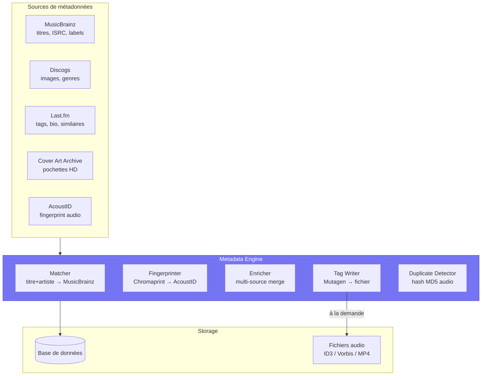
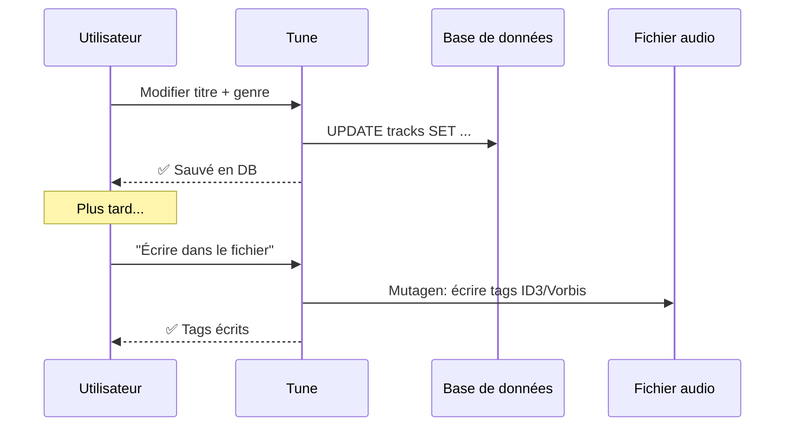
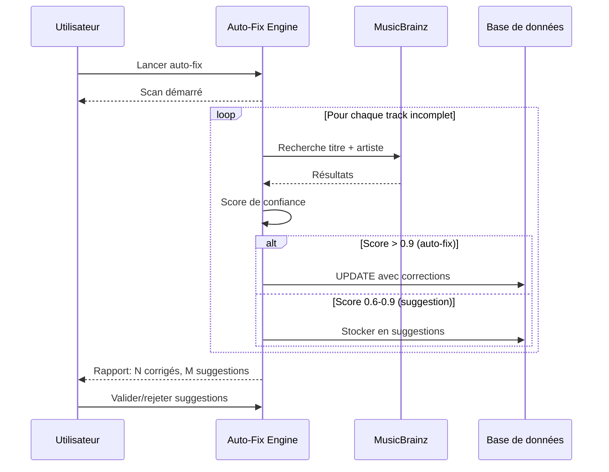
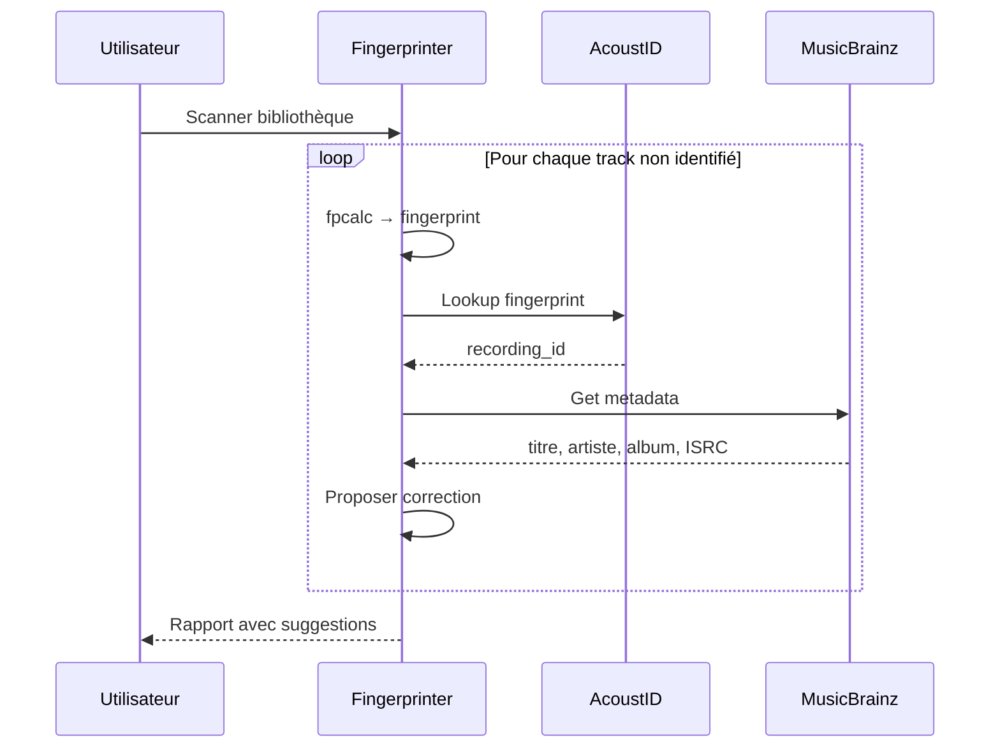

# Tune — Gestionnaire de Métadonnées (v0.5.8)

## 1. Décisions validées

| # | Question | Décision |
|---|----------|----------|
| 1 | Champs éditables | Complet : titre, artiste, album, année, genre, piste, disc, compositeur, ISRC, MusicBrainz ID, tags custom, commentaires, paroles |
| 2 | Écriture | DB par défaut + écriture tags fichier **à la demande** |
| 3 | Sources externes | MusicBrainz + Discogs + Last.fm + Cover Art Archive (tout gratuit) |
| 4 | Auto-fix | Suggestions interactives + auto-fix background avec rapport |
| 5 | Covers | Téléchargement auto manquantes + upload/drag-drop/recherche |
| 6 | Fingerprinting | AcoustID/Chromaprint batch sur toute la bibliothèque |
| 7 | Doublons | Hash audio MD5 uniquement (vrais doublons binaires) |
| 8 | Plateformes | Web + iOS/macOS + Flutter |
| 9 | Batch edit | Multi-sélection + rename artiste global |

---

## 2. Architecture



---

## 3. Module serveur

### Structure

```
tune_server/metadata_manager/
    __init__.py
    matcher.py          # MusicBrainz lookup par titre/artiste/album
    fingerprint.py      # Chromaprint + AcoustID identification
    enricher.py         # Multi-source enrichissement (MB + Discogs + Last.fm)
    cover_fetcher.py    # Cover Art Archive + Discogs images
    tag_writer.py       # Écriture tags fichier (Mutagen)
    duplicate.py        # Détection doublons par hash audio MD5
    auto_fix.py         # Scan background + rapport de corrections
    models.py           # Pydantic models
```

### Dépendances

| Package | Usage | Déjà installé |
|---------|-------|---------------|
| `mutagen` | Lecture/écriture tags | ✅ Oui |
| `musicbrainzngs` | API MusicBrainz | ❌ À ajouter |
| `pyacoustid` | Fingerprint AcoustID | ❌ À ajouter |
| `aiohttp` | HTTP async (Discogs, Last.fm, Cover Art) | ✅ Oui |

Binaire externe : `fpcalc` (Chromaprint CLI) pour le fingerprinting.

---

## 4. Champs de métadonnées

### Track (existant + nouveau)

| Champ | Existant | Nouveau | Source |
|-------|----------|---------|--------|
| title | ✅ | | Tags |
| artist_name | ✅ | | Tags |
| album_title | ✅ | | Tags |
| track_number | ✅ | | Tags |
| disc_number | ✅ | | Tags |
| duration_ms | ✅ | | Tags |
| format | ✅ | | Tags |
| sample_rate | ✅ | | Tags |
| bit_depth | ✅ | | Tags |
| isrc | ✅ (v0.5.6) | | Tags / MusicBrainz |
| genre | | ✅ | Tags / Last.fm |
| composer | | ✅ | Tags / MusicBrainz |
| year | | ✅ | Tags / MusicBrainz |
| lyrics | | ✅ | Tags |
| comment | | ✅ | Tags |
| musicbrainz_recording_id | | ✅ | MusicBrainz |
| acoustid | | ✅ | AcoustID |
| bpm | | ✅ | Tags |
| label | | ✅ | MusicBrainz / Discogs |
| custom_tags | | ✅ | JSON libre |

### Album (existant + nouveau)

| Champ | Existant | Nouveau |
|-------|----------|---------|
| title | ✅ | |
| artist_name | ✅ | |
| year | ✅ | |
| genre | ✅ | |
| cover_path | ✅ | |
| musicbrainz_release_id | | ✅ |
| label | | ✅ |
| catalog_number | | ✅ |
| total_discs | | ✅ |
| barcode | | ✅ |

---

## 5. API Endpoints

### Édition manuelle

```
PATCH /metadata/tracks/{id}           — éditer un track
PATCH /metadata/albums/{id}           — éditer un album
PATCH /metadata/artists/{id}          — éditer un artiste
POST  /metadata/tracks/{id}/write-tags — écrire les tags dans le fichier
POST  /metadata/albums/{id}/write-tags — écrire les tags de tous les tracks
```

### Batch edit

```
POST /metadata/batch/tracks           — modifier N tracks en une fois
POST /metadata/batch/rename-artist    — renommer un artiste partout
POST /metadata/batch/set-genre        — changer le genre sur N tracks
POST /metadata/batch/write-tags       — écrire les tags de N tracks
```

### Recherche / Matching

```
POST /metadata/lookup                 — chercher un track sur MusicBrainz
POST /metadata/lookup-album           — chercher un album sur MusicBrainz
POST /metadata/fingerprint/{id}       — identifier un track par fingerprint
POST /metadata/fingerprint-batch      — identifier N tracks en batch
```

### Enrichissement

```
POST /metadata/enrich/{id}            — enrichir un track (multi-sources)
POST /metadata/enrich-album/{id}      — enrichir un album complet
POST /metadata/auto-fix               — lancer le scan auto-fix background
GET  /metadata/auto-fix/status        — statut du scan en cours
GET  /metadata/auto-fix/report        — rapport du dernier scan
```

### Covers

```
GET  /metadata/covers/search          — chercher des pochettes (Cover Art Archive + Discogs)
POST /metadata/covers/album/{id}      — télécharger/assigner une cover
POST /metadata/covers/album/{id}/upload — upload manuel
```

### Doublons

```
POST /metadata/duplicates/scan        — scanner les doublons (hash MD5 audio)
GET  /metadata/duplicates             — lister les doublons trouvés
POST /metadata/duplicates/resolve     — résoudre (garder un, supprimer les autres)
```

---

## 6. Flux de travail

### Édition manuelle



### Auto-fix background



### Fingerprinting batch



---

## 7. Base de données — nouvelles colonnes/tables

```sql
-- Colonnes tracks (migration)
ALTER TABLE tracks ADD COLUMN genre TEXT;
ALTER TABLE tracks ADD COLUMN composer TEXT;
ALTER TABLE tracks ADD COLUMN year INTEGER;
ALTER TABLE tracks ADD COLUMN lyrics TEXT;
ALTER TABLE tracks ADD COLUMN comment TEXT;
ALTER TABLE tracks ADD COLUMN musicbrainz_recording_id TEXT;
ALTER TABLE tracks ADD COLUMN acoustid TEXT;
ALTER TABLE tracks ADD COLUMN bpm INTEGER;
ALTER TABLE tracks ADD COLUMN label TEXT;
ALTER TABLE tracks ADD COLUMN custom_tags TEXT;  -- JSON

-- Colonnes albums (migration)
ALTER TABLE albums ADD COLUMN musicbrainz_release_id TEXT;
ALTER TABLE albums ADD COLUMN label TEXT;
ALTER TABLE albums ADD COLUMN catalog_number TEXT;
ALTER TABLE albums ADD COLUMN barcode TEXT;

-- Suggestions auto-fix
CREATE TABLE IF NOT EXISTS metadata_suggestions (
    id INTEGER PRIMARY KEY AUTOINCREMENT,
    track_id INTEGER REFERENCES tracks(id) ON DELETE CASCADE,
    album_id INTEGER REFERENCES albums(id) ON DELETE CASCADE,
    field TEXT NOT NULL,           -- "title", "artist_name", "genre", etc.
    current_value TEXT,
    suggested_value TEXT NOT NULL,
    source TEXT NOT NULL,          -- "musicbrainz", "acoustid", "lastfm"
    confidence REAL DEFAULT 0.0,
    status TEXT DEFAULT 'pending', -- "pending", "accepted", "rejected"
    created_at TIMESTAMP DEFAULT CURRENT_TIMESTAMP
);

-- Rapport auto-fix
CREATE TABLE IF NOT EXISTS metadata_fix_reports (
    id INTEGER PRIMARY KEY AUTOINCREMENT,
    started_at TIMESTAMP,
    completed_at TIMESTAMP,
    tracks_scanned INTEGER DEFAULT 0,
    auto_fixed INTEGER DEFAULT 0,
    suggestions INTEGER DEFAULT 0,
    errors INTEGER DEFAULT 0,
    details TEXT                   -- JSON détaillé
);

-- Doublons détectés
CREATE TABLE IF NOT EXISTS duplicate_tracks (
    id INTEGER PRIMARY KEY AUTOINCREMENT,
    track_id_a INTEGER NOT NULL REFERENCES tracks(id) ON DELETE CASCADE,
    track_id_b INTEGER NOT NULL REFERENCES tracks(id) ON DELETE CASCADE,
    audio_hash TEXT NOT NULL,
    detected_at TIMESTAMP DEFAULT CURRENT_TIMESTAMP,
    resolved INTEGER DEFAULT 0
);
```

---

## 8. Phases d'implémentation

### Phase 1 : Édition manuelle + batch (v0.5.8a)

1. Nouvelles colonnes DB (migration)
2. API PATCH tracks/albums/artists
3. Batch edit (multi-select + rename artiste global)
4. Tag writer (Mutagen → fichier à la demande)
5. Web UI : formulaire d'édition dans MetadataView

### Phase 2 : Enrichissement externe (v0.5.8b)

6. MusicBrainz matcher (recherche par titre+artiste)
7. Cover Art Archive fetcher (pochettes manquantes auto)
8. Discogs enrichissement (images artistes, genres)
9. Last.fm tags/genres
10. API lookup + enrich endpoints

### Phase 3 : Fingerprinting + auto-fix (v0.5.8c)

11. Chromaprint/AcoustID intégration (fpcalc)
12. Fingerprint batch scanner
13. Auto-fix engine (background scan + rapport)
14. Suggestions UI (valider/rejeter)
15. WebSocket progress events

### Phase 4 : Doublons + covers avancées (v0.5.8d)

16. Hash MD5 audio pour détection doublons
17. UI résolution doublons
18. Cover search (multi-source)
19. Cover upload/drag-drop
20. Port iOS/macOS + Flutter

---

## 9. Comparaison

| Feature | Roon | MusicBee | Tune (actuel) | Tune (cible) |
|---------|------|----------|---------------|--------------|
| Édition métadonnées | ✅ | ✅ | ⚠️ basique | ✅ complet |
| Écriture tags fichier | ❌ | ✅ | ❌ | ✅ à la demande |
| MusicBrainz lookup | ✅ | ✅ | ❌ | ✅ |
| Fingerprinting | ✅ | ❌ | ❌ | ✅ AcoustID |
| Auto-fix background | ✅ | ❌ | ❌ | ✅ + rapport |
| Covers auto | ✅ | ✅ | ⚠️ (Discogs) | ✅ multi-source |
| Batch edit | ❌ | ✅ | ❌ | ✅ + rename global |
| Doublons | ❌ | ✅ | ❌ | ✅ hash MD5 |
| Suggestions | ✅ | ❌ | ❌ | ✅ |
| Open source | ❌ | ❌ | ✅ | ✅ |
