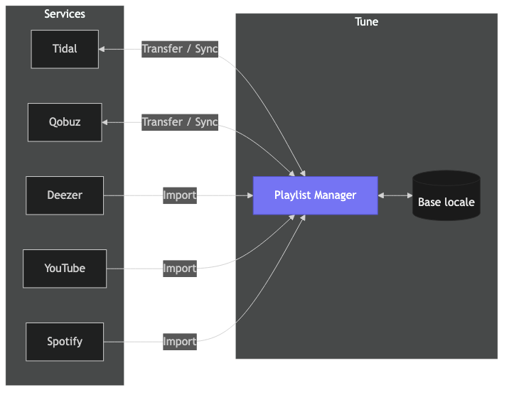
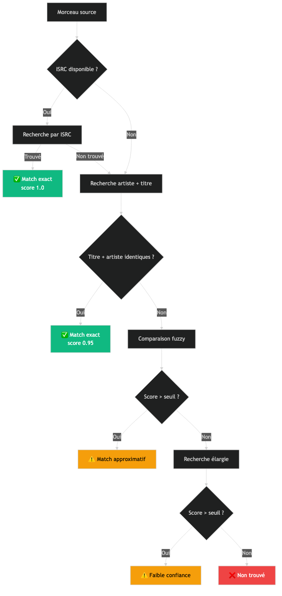
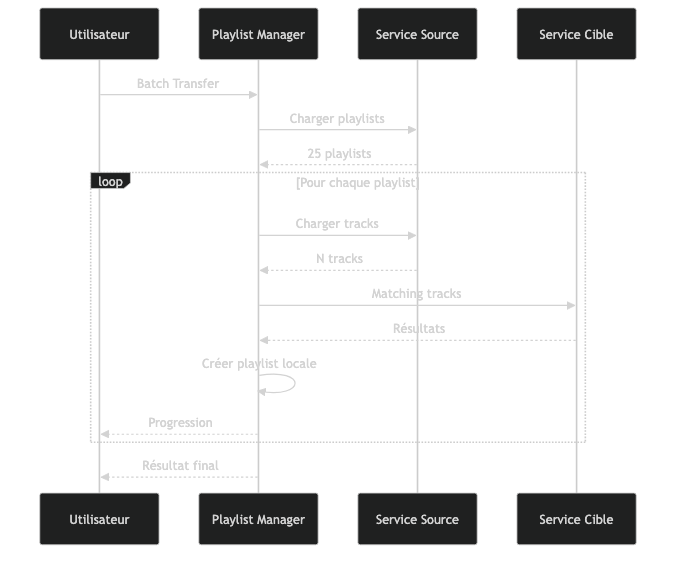
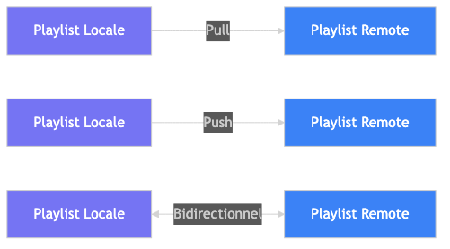
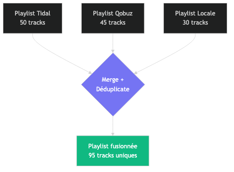

# Tune — Gestionnaire de Playlists

## Vue d'ensemble

Le Gestionnaire de Playlists permet de transférer, synchroniser, sauvegarder et fusionner vos playlists entre tous vos services de streaming et votre bibliothèque locale.

---

## 1. Transfert de playlist

Copier une playlist d'un service vers un autre avec matching intelligent des morceaux.

### Comment faire

1. Ouvrir **Gestionnaire de playlists** dans la sidebar
2. Cliquer sur une playlist
3. Cliquer **Transférer**
4. Choisir le service cible
5. Vérifier les résultats du matching
6. Confirmer

### Algorithme de matching

### Scoring composite

| Critère | Poids | Description |
|---------|-------|-------------|
| Titre | 40% | Similarité du titre normalisé |
| Artiste | 30% | Similarité du nom d'artiste |
| Durée | 20% | Proximité de durée (±30s) |
| Album | 10% | Similarité du titre d'album |

### Résultats possibles

- **✅ Matched** (score ≥ 0.9) — correspondance certaine
- **⚠️ Approximate** (score 0.6-0.9) — vérification recommandée
- **❌ Not found** (score < 0.6) — pas de correspondance

---

## 2. Batch Transfer

Transférer **toutes** les playlists d'un service en une seule opération.

### Comment faire

1. Onglet **Backup** dans le gestionnaire
2. Section "Batch Transfer"
3. Sélectionner le service source
4. Sélectionner la destination
5. Cliquer **Transférer tout**

---

## 3. Synchronisation

Maintenir une playlist synchronisée entre le local et un service.

### Directions de sync

| Direction | Description |
|-----------|-------------|
| **Pull** | Remote → Local : les nouveaux morceaux du service sont ajoutés localement |
| **Push** | Local → Remote : les morceaux locaux sont ajoutés sur le service |
| **Bidirectionnel** | Les deux sens, avec détection de conflits |

### Comment créer un lien sync

1. Onglet **Sync**
2. Cliquer **Créer un lien**
3. Sélectionner la playlist locale
4. Sélectionner le service + playlist distante
5. Choisir la direction
6. Cliquer **Sync Now** pour synchroniser

---

## 4. Backup

Sauvegarder un snapshot de toutes vos playlists (métadonnées + tracks).

### Comment faire

1. Onglet **Backup**
2. Cliquer **Backup toutes les playlists**
3. Le système sauvegarde chaque playlist avec ses tracks en JSON

### Ce qui est sauvegardé

- Nom de la playlist
- Service d'origine
- Pour chaque track : titre, artiste, album, durée, ISRC

---

## 5. Merge (Fusion)

Combiner plusieurs playlists en une seule.

- **Déduplification** : les doublons (même titre + artiste) sont supprimés
- Les tracks sont matchées à la bibliothèque locale quand possible

---

## 6. Export / Import

### Formats supportés

| Format | Extension | Description |
|--------|-----------|-------------|
| CSV | .csv | Tableur standard (Excel, Google Sheets) |
| JSON | .json | Structuré avec métadonnées complètes |
| XSPF | .xspf | XML Shareable Playlist Format (standard) |
| Text | .txt | Lisible humain : `Artist - Title [Album]` |

### Export

1. Ouvrir une playlist dans le gestionnaire
2. Actions → **Exporter**
3. Choisir le format
4. Le fichier est téléchargé

### Import

1. Gestionnaire → **Importer**
2. Sélectionner le fichier
3. Le système crée une playlist locale
4. Les tracks sont automatiquement matchées à la bibliothèque

---

## 7. Historique

Chaque opération (transfert, sync, backup) est enregistrée dans l'historique.

1. Onglet **Transferts**
2. Liste chronologique des opérations
3. Pour chaque entrée : service source/cible, nombre de tracks matchées/approximatives/non trouvées

---

## API Endpoints

| Méthode | Endpoint | Description |
|---------|----------|-------------|
| GET | `/playlist-manager/services` | Capabilities des services |
| POST | `/playlist-manager/transfer` | Transfert avec matching |
| POST | `/playlist-manager/batch-transfer` | Transfert en lot |
| POST | `/playlist-manager/merge` | Fusion de playlists |
| POST | `/playlist-manager/backup` | Backup toutes playlists |
| POST | `/playlist-manager/export` | Export fichier |
| POST | `/playlist-manager/import` | Import fichier |
| GET | `/playlist-manager/links` | Liens sync |
| POST | `/playlist-manager/links` | Créer lien sync |
| POST | `/playlist-manager/links/{id}/sync` | Sync maintenant |
| DELETE | `/playlist-manager/links/{id}` | Supprimer lien |
| GET | `/playlist-manager/history` | Historique |
| GET | `/playlist-manager/history/{id}` | Détail transfert |
