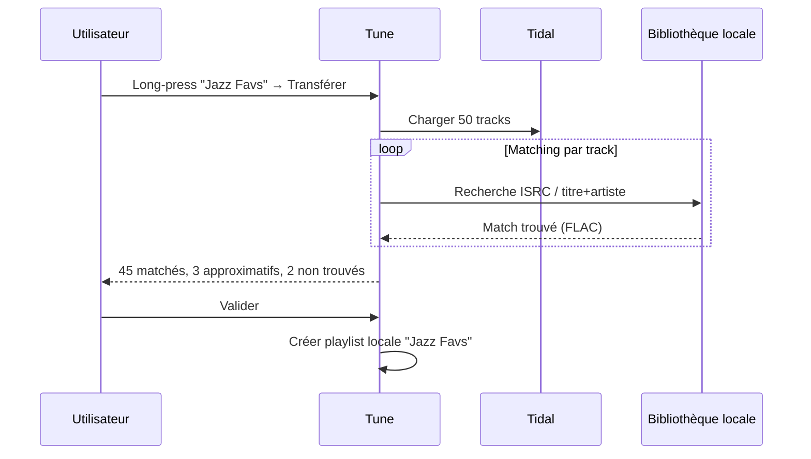
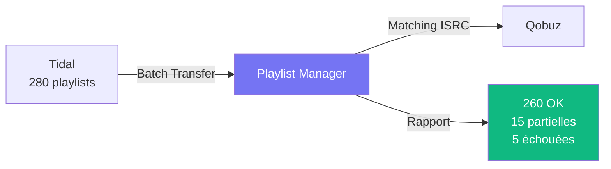
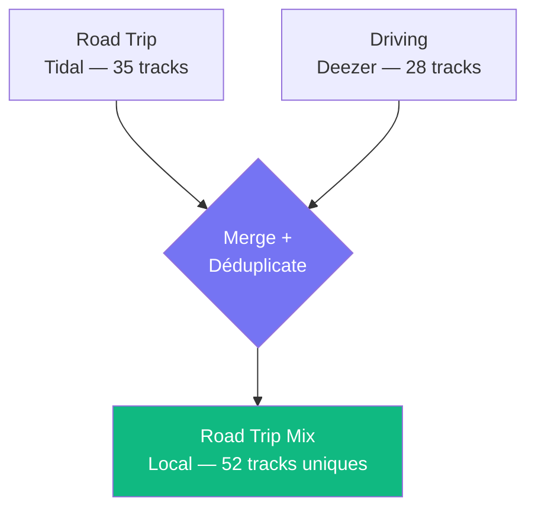
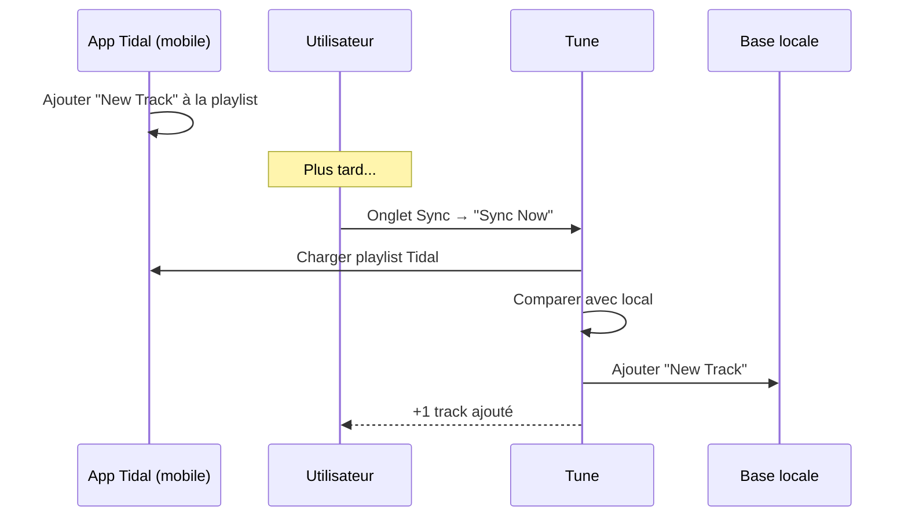
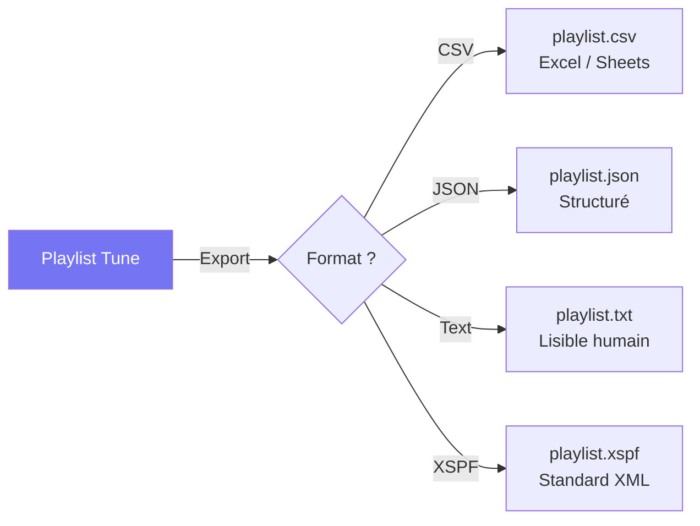
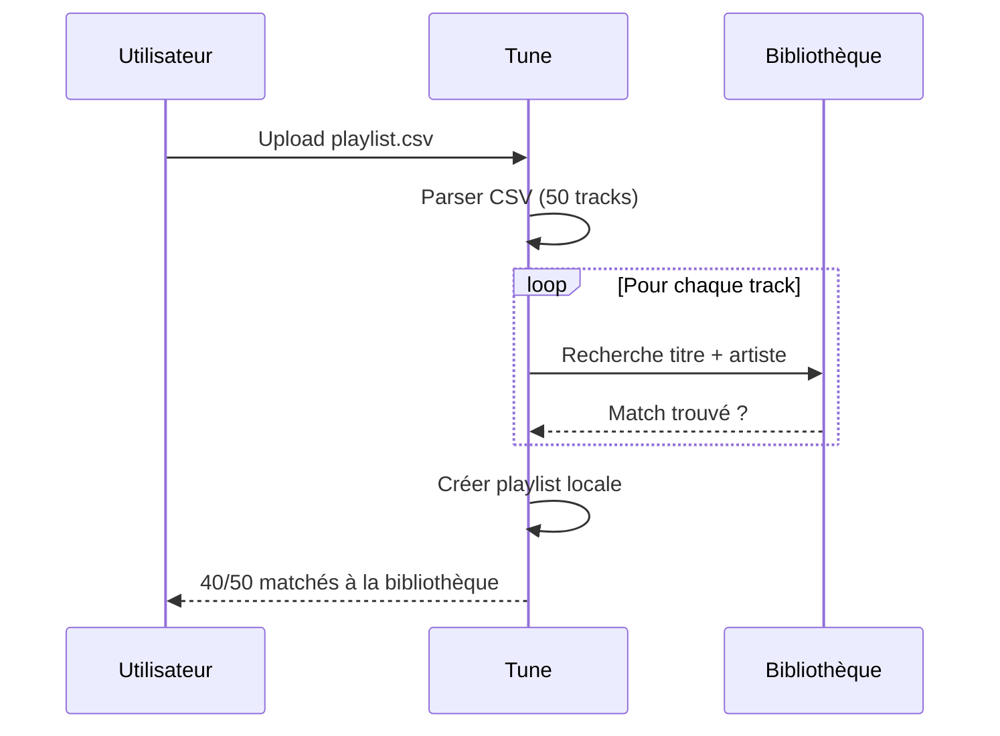
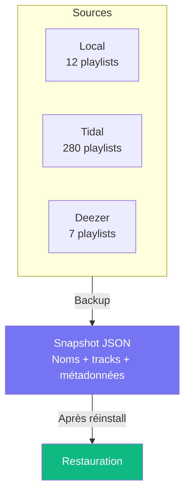
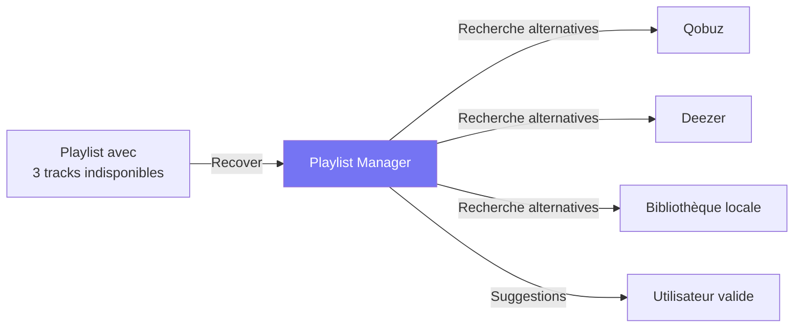

# Tune — Cas d'usage du Gestionnaire de Playlists

## 1. Transfert Tidal → Local (backup)

**Scénario** : Sauvegarder une playlist Tidal en local, au cas où l'abonnement expire.

**Résultat** : Playlist locale avec les fichiers FLAC de ta bibliothèque, indépendante de Tidal.

---

## 2. Migration Tidal → Qobuz (batch)

**Scénario** : Changement d'abonnement — retrouver toutes ses playlists sur Qobuz.

**Comment** :
1. Gestionnaire → onglet **Backup** → section "Batch Transfer"
2. Source: Tidal → Cible: Qobuz
3. Toutes les playlists transférées avec matching ISRC
4. Rapport consultable dans l'onglet **Transferts**

---

## 3. Fusion de playlists cross-services

**Scénario** : Combiner "Road Trip" (Tidal) + "Driving" (Deezer) en une seule playlist.

**Résultat** : Les doublons (même titre + artiste) sont automatiquement supprimés. Les tracks sont matchées à la bibliothèque locale quand possible.

---

## 4. Synchronisation continue

**Scénario** : Éditer sa playlist Tidal depuis l'app mobile Tidal et retrouver les changements dans Tune.

**Directions disponibles** :
| Direction | Effet |
|-----------|-------|
| **Pull** | Tidal → Local (ajout des nouveaux morceaux Tidal) |
| **Push** | Local → Tidal (envoie les ajouts locaux vers Tidal) |
| **Bidirectionnel** | Les deux sens avec détection de conflits |

---

## 5. Export pour partage

**Scénario** : Partager une playlist avec un ami qui n'a pas Tune.

**Formats** :
- **CSV** : Ouvrable dans Excel, Google Sheets, Soundiiz
- **JSON** : Pour les développeurs ou les outils automatisés
- **Text** : `1. Artist - Title [Album]` — lisible par tous
- **XSPF** : Standard XML, compatible VLC, Clementine, etc.

---

## 6. Import d'une playlist externe

**Scénario** : Un ami envoie sa playlist en CSV.

---

## 7. Backup complet avant formatage

**Scénario** : Réinstallation du serveur — sauvegarder toutes les playlists.

**Ce qui est sauvegardé** : nom de la playlist, service d'origine, et pour chaque track : titre, artiste, album, durée, ISRC.

---

## 8. Récupération de morceaux indisponibles

**Scénario** : Des morceaux de ta playlist Tidal ont été retirés du catalogue. Tune cherche des alternatives.

---

## Accès rapide

### Web client (.18)

| Fonctionnalité | Où ? |
|---------------|------|
| Voir playlists par source | Sidebar → **Playlists** (icônes en haut) |
| Transférer / Diff / Recover | Sidebar → **Gestionnaire de playlists** |
| Batch transfer | Gestionnaire → onglet **Backup** |
| Historique des transferts | Gestionnaire → onglet **Transferts** |
| Liens de sync | Gestionnaire → onglet **Sync** |

### iOS / iPadOS

| Fonctionnalité | Où ? |
|---------------|------|
| Voir playlists par source | Plus → **Playlists** |
| Gestionnaire | Plus → **Gestionnaire** (ou sidebar iPad) |
| Menu contextuel | Long-press sur une playlist |
| Transferts / Sync / Backup | Onglets dans le Gestionnaire |

---

## Tableau récapitulatif

| Cas d'usage | Complexité | Disponible |
|-------------|-----------|------------|
| Transfert single | Simple | ✅ Web + iOS |
| Batch transfer (tout) | Moyen | ✅ Web + iOS |
| Fusion/merge | Moyen | ✅ API |
| Sync Pull/Push | Moyen | ✅ Web + iOS |
| Export CSV/JSON/XSPF | Simple | ✅ API |
| Import fichier | Simple | ✅ API |
| Backup complet | Simple | ✅ Web + iOS |
| Recover indisponibles | Avancé | ✅ Web |
| Context menu iOS | Simple | ✅ Build 4 |
