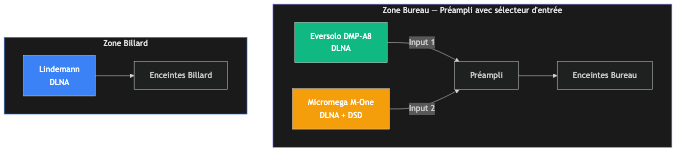
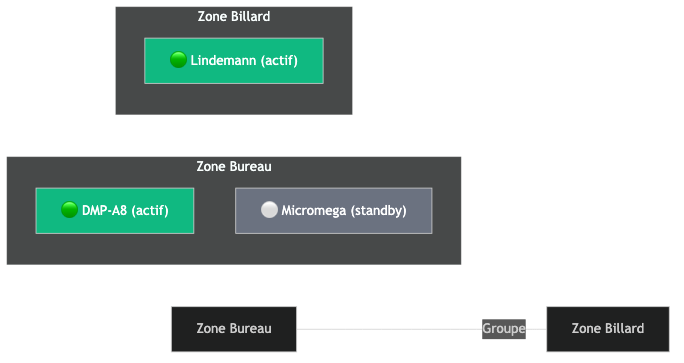
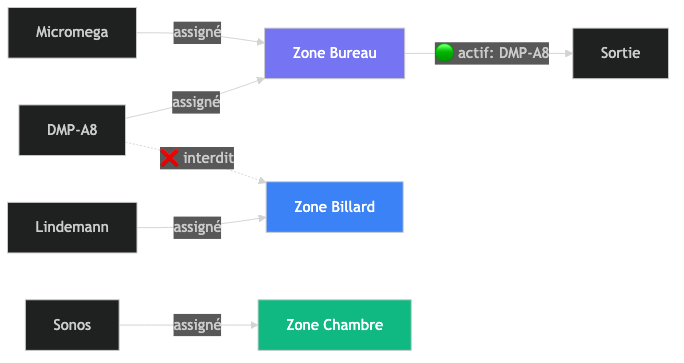
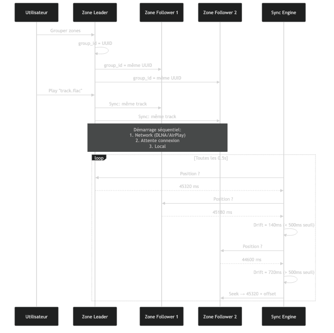
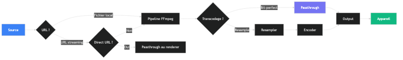
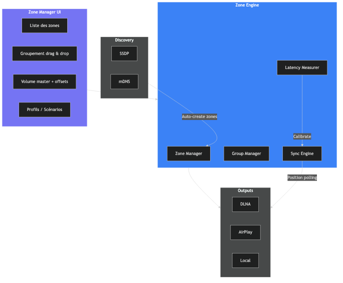

# Tune — Étude préparatoire : Gestion des Zones

## 0. Topologie réelle de référence



**Cas d'usage clés :**
- **Bureau** : l'utilisateur switch entre DMP-A8 et Micromega via le préampli physique. Tune doit pouvoir **hot-swap** l'appareil actif sans recréer la zone.
- **Billard** : Lindemann seul, simple.
- **Rez de jardin** : Bureau + Billard groupés → musique synchronisée sur les deux zones.

### Nouveau concept : Zone multi-appareils

Une zone peut avoir **plusieurs appareils assignés**, mais **un seul actif à la fois**. Le switch se fait dans l'app — l'utilisateur switch aussi son préampli.



### Scénarios nommés

| Scénario | Zones | Appareils actifs | Volume |
|----------|-------|-----------------|--------|
| Bureau seul | Bureau | DMP-A8 | 60% |
| Bureau Hi-Res | Bureau | Micromega (DSD) | 55% |
| Billard | Billard | Lindemann | 50% |
| Rez de jardin | Bureau + Billard (groupe) | DMP-A8 + Lindemann | 45% |

---

## 1. Architecture actuelle

### Qu'est-ce qu'une Zone ?

Une Zone est l'unité de lecture audio dans Tune. Elle combine :
- Un ou plusieurs **appareils de sortie** (un seul actif)
- Un **player** (contrôle lecture/pause/seek)
- Une **file d'attente** (queue de morceaux)
- Un **volume** persisté
- Un **offset de sync** (pour le multi-room)


### Schéma base de données (actuel + proposé)

```sql
-- Table actuelle
CREATE TABLE zones (
    id INTEGER PRIMARY KEY AUTOINCREMENT,
    name TEXT NOT NULL,
    output_type TEXT NOT NULL DEFAULT 'local',
    output_device_id TEXT,              -- appareil actif
    volume REAL DEFAULT 0.5,
    group_id TEXT,                      -- UUID multi-room
    sync_delay_ms INTEGER DEFAULT 0,
    created_at TIMESTAMP DEFAULT CURRENT_TIMESTAMP
);

-- NOUVEAU: Appareils assignés à une zone (1:N)
CREATE TABLE zone_devices (
    id INTEGER PRIMARY KEY AUTOINCREMENT,
    zone_id INTEGER NOT NULL REFERENCES zones(id) ON DELETE CASCADE,
    device_id TEXT NOT NULL,
    device_name TEXT,
    output_type TEXT NOT NULL,          -- dlna, airplay, local
    is_active INTEGER DEFAULT 0,       -- un seul actif par zone
    sync_delay_ms INTEGER DEFAULT 0,   -- offset par appareil
    added_at TIMESTAMP DEFAULT CURRENT_TIMESTAMP,
    UNIQUE(device_id)                  -- un appareil = une seule zone
);

-- NOUVEAU: Scénarios/Profils nommés
CREATE TABLE zone_profiles (
    id INTEGER PRIMARY KEY AUTOINCREMENT,
    name TEXT NOT NULL,
    description TEXT,
    config TEXT NOT NULL,               -- JSON: zones, groupes, volumes, appareils actifs
    icon TEXT,                          -- emoji ou SF Symbol
    created_at TIMESTAMP DEFAULT CURRENT_TIMESTAMP
);
```

---

## 2. Relations clés

### Un appareil peut-il appartenir à plusieurs Zones ?

**Non. La relation Device → Zone reste 1:1** (un appareil n'est assigné qu'à une seule zone).

**Mais une Zone peut avoir plusieurs appareils** (relation Zone → Devices = 1:N) avec un seul actif.



**Pourquoi un seul actif ?**
- Un appareil DLNA ne peut recevoir qu'un flux à la fois
- Deux appareils sur le même ampli = double son
- L'utilisateur switch physiquement son préampli + switch dans Tune

### Hot-swap d'appareil (nouveau)

**L'utilisateur peut changer l'appareil actif d'une zone** sans la recréer. La queue, le volume et l'historique sont conservés.


### Une Zone peut-elle être dans plusieurs groupes ?

**Non. La relation Zone → Group est N:1** (plusieurs zones dans un groupe, mais une zone dans un seul groupe).

---

## 3. Multi-Room (Groupement)

### Comment ça marche



### Rôle du Leader vs Followers

| Aspect | Leader | Followers |
|--------|--------|-----------|
| Contrôle playback | Oui (play/pause/next) | Non (suit le leader) |
| Queue | Possède la queue | Synchro sur la queue du leader |
| Volume | Indépendant | Indépendant |
| Seek | Déclenche la sync | Se recale sur le leader |

### Synchronisation


**sync_delay_ms** : Chaque zone peut avoir un offset positif ou négatif (±10 secondes) pour compenser les différences de distance acoustique ou de latence réseau.

---

## 4. Chaîne audio (Signal Path)



### Modes de lecture DLNA

| Mode | Description | Quand |
|------|-------------|-------|
| **Direct URL** | Renderer fetch depuis le CDN | Tidal, Qobuz, YouTube (sauf Micromega) |
| **Passthrough** | Server sert le fichier via HTTP | Fichiers locaux |
| **Proxy** | Server proxie HTTPS → HTTP | Micromega (pas de HTTPS) |
| **Transcodé** | FFmpeg transcode → HTTP stream | DSD vers PCM, resample |
| **DSD natif** | Passthrough DSF/DFF | Renderers DSD-capable |

---

## 5. Découverte des appareils


**Appareils découverts actuels** (réseau Bertrand) :
- DMP-A8 (DLNA + AirPlay)
- Micromega M-One (DLNA + AirPlay)
- Sonos Play:1 × 2 (DLNA)
- Mac Studio (AirPlay)
- Bureau, Chambre (AirPlay)

---

## 6. Limitations actuelles

### Problèmes identifiés

| # | Limitation | Impact | Difficulté |
|---|-----------|--------|------------|
| 1 | **Pas de changement d'appareil** sans recréer la zone | UX pénible | Moyen |
| 2 | **Groupes éphémères** (pas persistés au redémarrage) | Perte de config | Facile |
| 3 | **Pas de gestion de latence mesurée** | Sync imprécise | Difficile |
| 4 | **Pas de paire stéréo** (L/R sur 2 appareils) | Pas de stéréo élargie | Difficile |
| 5 | **Un seul groupe par zone** | Pas de scénarios multiples | Moyen |
| 6 | **Pas de zones automatiques** | Appareil découvert ≠ zone | Facile |
| 7 | **Pas de profils** de zones (jour/nuit, etc.) | Pas de scénarios | Moyen |
| 8 | **Gapless limité** en multi-room | Dépend du renderer DLNA | Difficile |
| 9 | **Pas de routage de canal** (mono, downmix) | Pas de personnalisation | Moyen |
| 10 | **Volumes non synchronisés** dans un groupe | Chaque zone a son volume | Choix de design |

---

## 7. Questions clés à trancher

### Q1 : Un appareil peut-il appartenir à plusieurs zones ?

**Réponse actuelle : Non (1:1)**

**Faut-il changer ?** Probablement non. Les raisons techniques sont solides :
- Un appareil ne peut jouer qu'un flux
- Créer des "zones virtuelles" par appareil n'a pas de sens audio

**Alternative** : Permettre de **déplacer** un appareil d'une zone à l'autre sans recréer la zone (hot-swap).

### Q2 : Faut-il des zones automatiques ?

**Proposition** : À la découverte d'un appareil, créer automatiquement une zone avec le nom de l'appareil. L'utilisateur peut ensuite renommer, grouper, supprimer.

### Q3 : Faut-il persister les groupes ?

**Proposition** : Oui. Sauvegarder les groupes en DB pour qu'ils survivent au redémarrage du serveur. Ajouter une table `zone_groups`.

### Q4 : Faut-il des profils/scénarios ?

**Proposition** : Oui à terme. Exemples :
- "Salon" : DMP-A8 seul, volume 60%
- "Soirée" : DMP-A8 + Sonos × 2, volume 40%
- "Bureau" : Micromega, volume 50%

Un profil = un snapshot de la config zones + groupes + volumes.

### Q5 : Faut-il mesurer la latence ?

**Proposition** : Oui. Envoyer un signal test, mesurer le round-trip, ajuster automatiquement `sync_delay_ms`. Mais complexe avec DLNA (pas de feedback latence standardisé).

### Q6 : Volumes liés dans un groupe ?

**Options** :
- A) Volumes indépendants (actuel) — chaque zone a son volume
- B) Volume groupe relatif — un master + offsets par zone
- C) Volume synchronisé — toutes les zones au même volume

**Recommandation** : Option B (master + offsets). Le plus flexible.

---

## 8. Améliorations proposées

### Phase 1 : UX Zone Manager (prioritaire)

1. **Hot-swap d'appareil** : changer l'appareil d'une zone sans la recréer
2. **Zones automatiques** : créer une zone à la découverte d'un appareil
3. **Persistance des groupes** : sauvegarder group_id au redémarrage
4. **UI Zone Manager** : drag & drop pour grouper, renommer, supprimer
5. **Volume groupe** : master volume avec offsets par zone

### Phase 2 : Sync avancée

6. **Mesure de latence** : signal test pour calibrer sync_delay_ms
7. **Gapless multi-room** : coordination SetNextAVTransportURI sur tous les renderers
8. **Indicateur de santé** : statut par zone (connecté, décalé, erreur)

### Phase 3 : Fonctionnalités avancées

9. **Profils/Scénarios** : sauvegarder et rappeler des configs
10. **Paire stéréo** : left/right sur 2 appareils (nécessite DSP)
11. **Routage de canaux** : mono, downmix, upmix
12. **Zones favorites** : accès rapide depuis le transport bar

---

## 9. Architecture cible



---

## 10. Comparaison avec la concurrence

| Feature | Roon | Sonos | Tune (actuel) | Tune (cible) |
|---------|------|-------|---------------|--------------|
| Multi-room | ✅ | ✅ | ✅ | ✅ |
| Sync < 50ms | ✅ | ✅ | ⚠️ ~500ms | ✅ |
| Groupement persisté | ✅ | ✅ | ❌ | ✅ |
| Zones automatiques | ✅ | ✅ | ❌ | ✅ |
| Volume groupe | ✅ | ✅ | ❌ | ✅ |
| Hot-swap appareil | ✅ | ❌ | ❌ | ✅ |
| Profils/Scénarios | ❌ | ❌ | ❌ | ✅ |
| Paire stéréo | ✅ | ✅ | ❌ | v2 |
| Mesure latence | ✅ | ✅ | ❌ | v2 |
| Open source | ❌ | ❌ | ✅ | ✅ |
