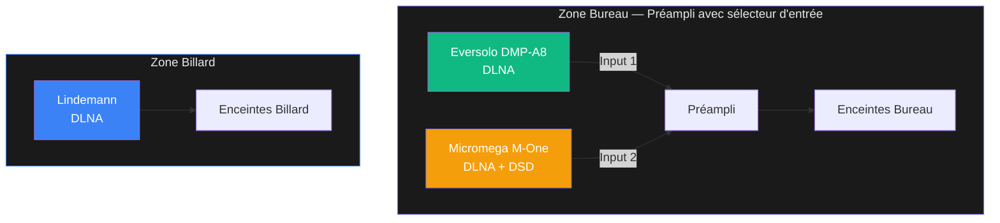
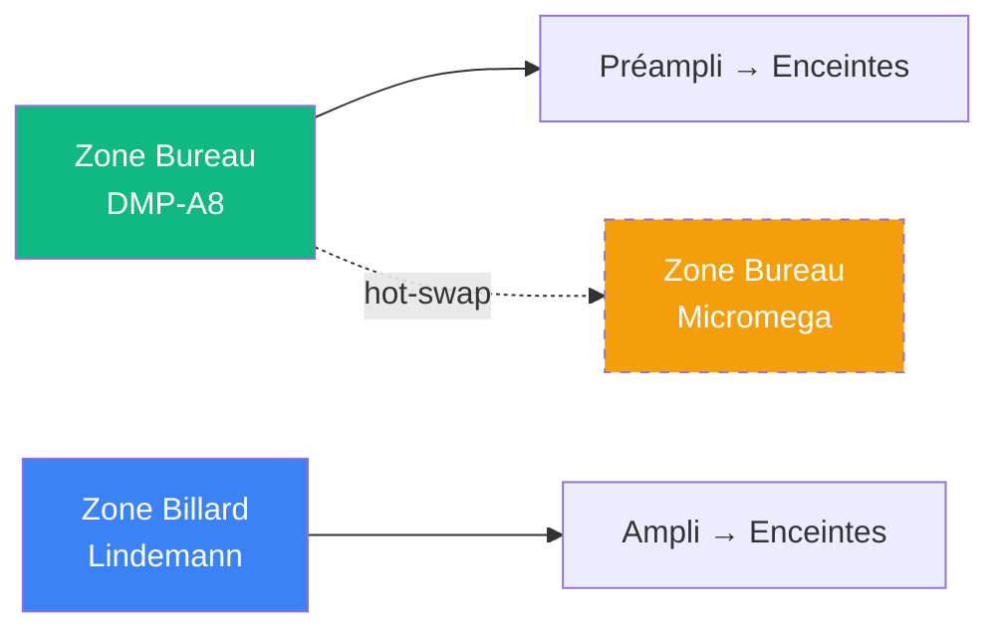
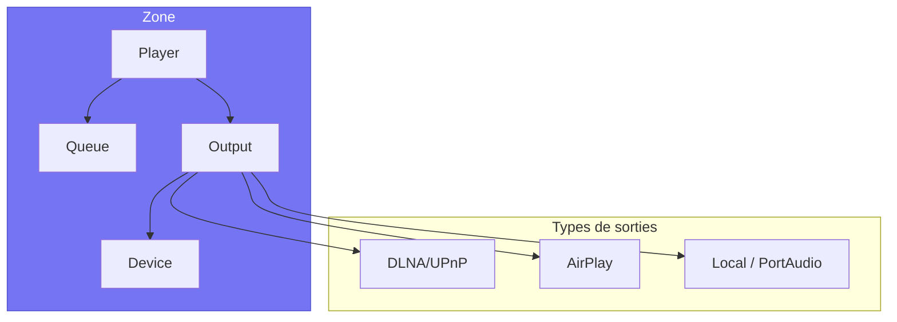
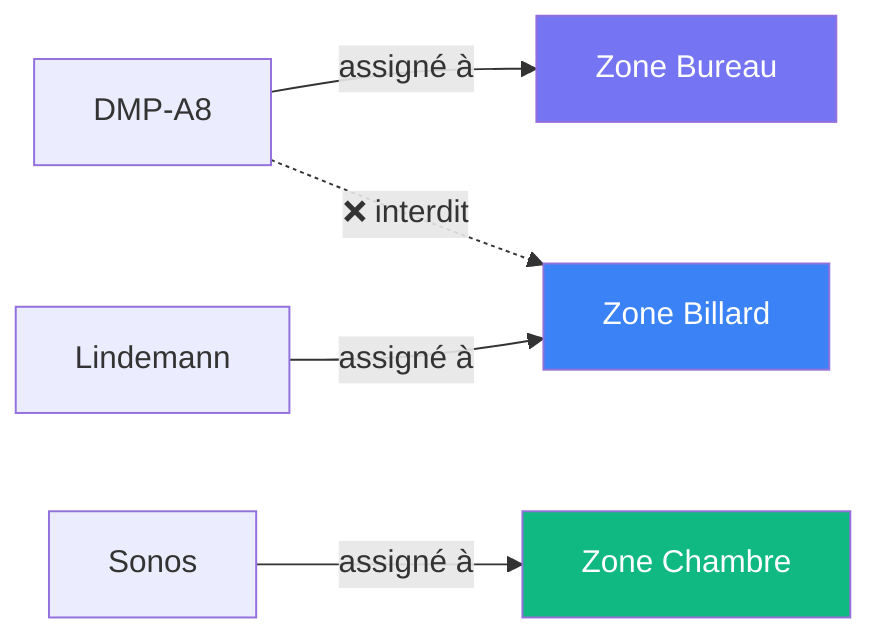
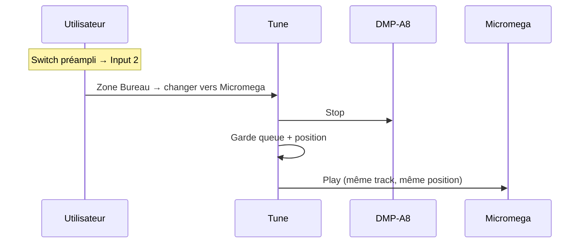
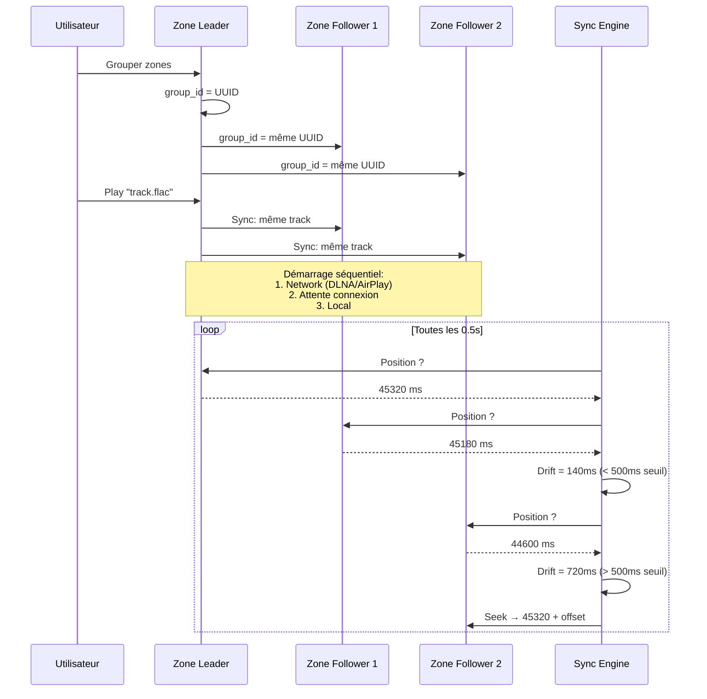
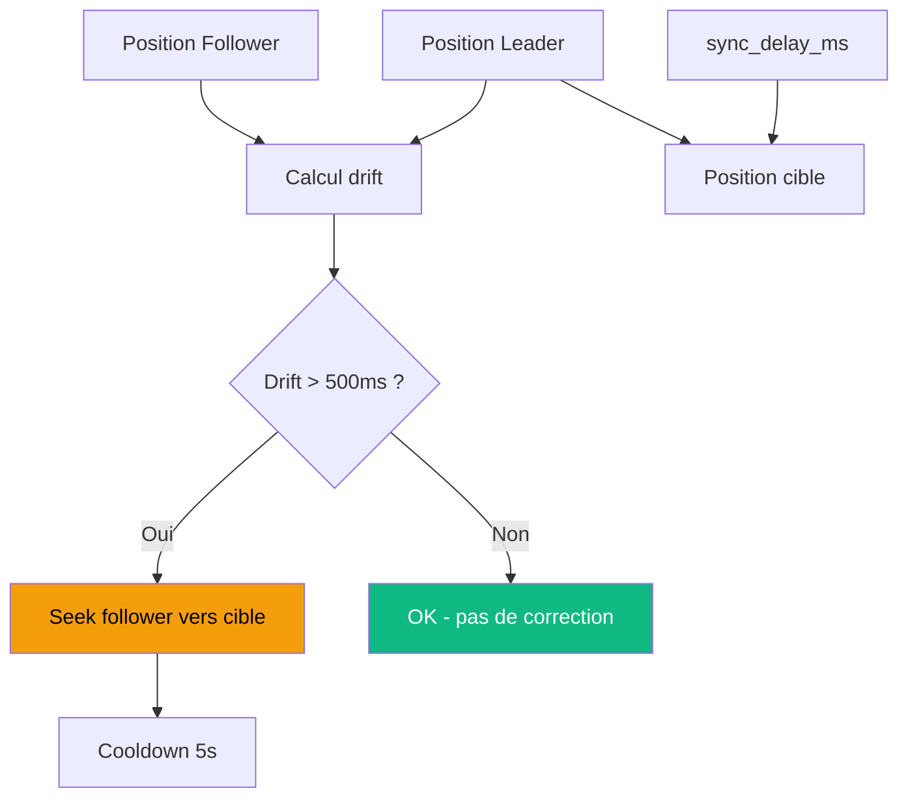
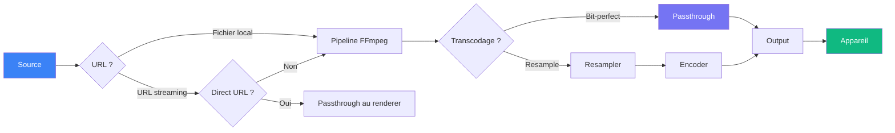
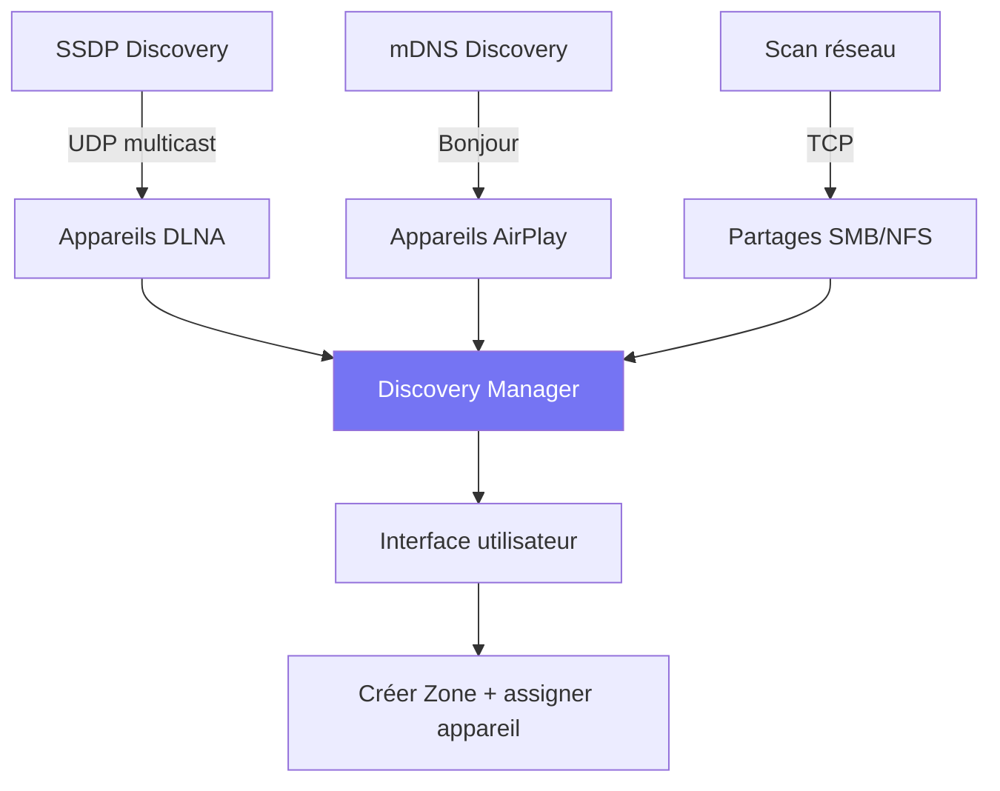
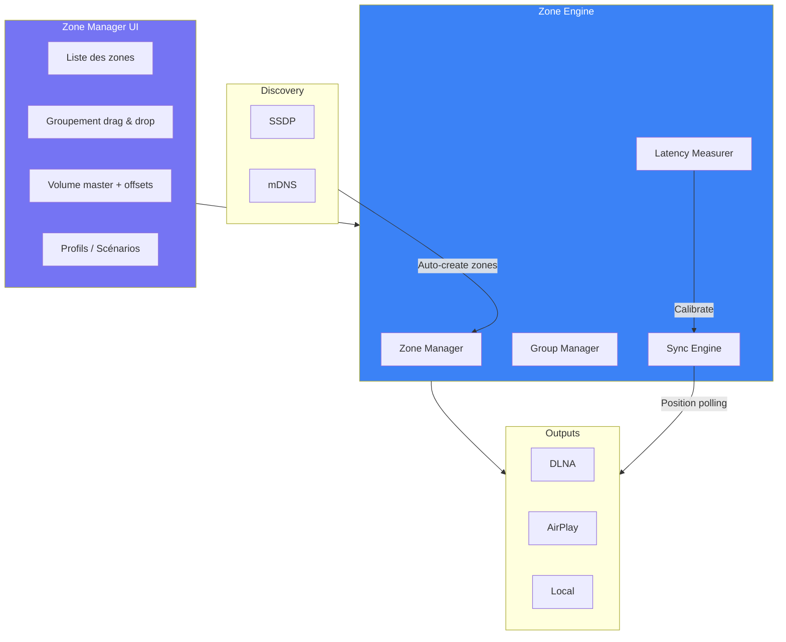

# Tune — Étude préparatoire : Gestion des Zones

## 0. Topologie réelle de référence



**Cas d'usage clés :**
- **Bureau** : l'utilisateur switch entre DMP-A8 et Micromega via le préampli physique. Tune doit pouvoir **hot-swap** l'appareil actif sans recréer la zone.
- **Billard** : Lindemann seul, simple.
- **Rez de jardin** : Bureau + Billard groupés → musique synchronisée sur les deux zones.

### Modèle : Zone = 1 appareil (1:1)

Chaque zone a **un seul appareil**. Pour changer d'appareil sur une zone, on fait un **hot-swap** (queue + position conservées).



Pour écouter sur les 2 zones : **groupement** Bureau + Billard.

### Scénarios nommés

| Scénario | Zones | Appareils actifs | Volume |
|----------|-------|-----------------|--------|
| Bureau seul | Bureau | DMP-A8 | 60% |
| Bureau Hi-Res | Bureau | Micromega (DSD) | 55% |
| Billard | Billard | Lindemann | 50% |
| Rez de jardin | Bureau + Billard (groupe) | DMP-A8 + Lindemann | 45% |

---

## 1. Architecture actuelle

### Qu'est-ce qu'une Zone ?

Une Zone est l'unité de lecture audio dans Tune. Elle combine :
- Un **appareil de sortie** (DLNA, AirPlay, sortie locale)
- Un **player** (contrôle lecture/pause/seek)
- Une **file d'attente** (queue de morceaux)
- Un **volume** persisté
- Un **offset de sync** (pour le multi-room)



### Schéma base de données (actuel + proposé)

```sql
-- Table actuelle
CREATE TABLE zones (
    id INTEGER PRIMARY KEY AUTOINCREMENT,
    name TEXT NOT NULL,
    output_type TEXT NOT NULL DEFAULT 'local',
    output_device_id TEXT,              -- appareil actif
    volume REAL DEFAULT 0.5,
    group_id TEXT,                      -- UUID multi-room
    sync_delay_ms INTEGER DEFAULT 0,
    created_at TIMESTAMP DEFAULT CURRENT_TIMESTAMP
);

-- NOUVEAU: Scénarios/Profils nommés
CREATE TABLE zone_profiles (
    id INTEGER PRIMARY KEY AUTOINCREMENT,
    name TEXT NOT NULL,
    description TEXT,
    config TEXT NOT NULL,               -- JSON: zones, groupes, volumes, appareils actifs
    icon TEXT,                          -- emoji ou SF Symbol
    created_at TIMESTAMP DEFAULT CURRENT_TIMESTAMP
);
```

---

## 2. Relations clés

### Un appareil peut-il appartenir à plusieurs Zones ?

**Non. La relation Device → Zone est strictement 1:1.**



**Pourquoi ?**
- Un appareil DLNA/AirPlay ne peut recevoir qu'un flux à la fois
- Évite les conflits de contrôle (volume, pause, seek)
- Pour jouer sur 2 appareils → **grouper** les zones

### Hot-swap d'appareil (nouveau)

**Changer l'appareil d'une zone** sans la recréer. La queue, le volume et la position sont conservés.



**Cas d'usage** : Bureau avec DMP-A8 et Micromega sur le même préampli. L'utilisateur switch physiquement l'entrée du préampli et change l'appareil dans Tune.

### Une Zone peut-elle être dans plusieurs groupes ?

**Non. La relation Zone → Group est N:1** (plusieurs zones dans un groupe, mais une zone dans un seul groupe).

---

## 3. Multi-Room (Groupement)

### Comment ça marche



### Rôle du Leader vs Followers

| Aspect | Leader | Followers |
|--------|--------|-----------|
| Contrôle playback | Oui (play/pause/next) | Non (suit le leader) |
| Queue | Possède la queue | Synchro sur la queue du leader |
| Volume | Indépendant | Indépendant |
| Seek | Déclenche la sync | Se recale sur le leader |

### Synchronisation



**sync_delay_ms** : Chaque zone peut avoir un offset positif ou négatif (±10 secondes) pour compenser les différences de distance acoustique ou de latence réseau.

---

## 4. Chaîne audio (Signal Path)



### Modes de lecture DLNA

| Mode | Description | Quand |
|------|-------------|-------|
| **Direct URL** | Renderer fetch depuis le CDN | Tidal, Qobuz, YouTube (sauf Micromega) |
| **Passthrough** | Server sert le fichier via HTTP | Fichiers locaux |
| **Proxy** | Server proxie HTTPS → HTTP | Micromega (pas de HTTPS) |
| **Transcodé** | FFmpeg transcode → HTTP stream | DSD vers PCM, resample |
| **DSD natif** | Passthrough DSF/DFF | Renderers DSD-capable |

---

## 5. Découverte des appareils



**Appareils découverts actuels** (réseau Bertrand) :
- DMP-A8 (DLNA + AirPlay)
- Micromega M-One (DLNA + AirPlay)
- Sonos Play:1 × 2 (DLNA)
- Mac Studio (AirPlay)
- Bureau, Chambre (AirPlay)

---

## 6. Limitations actuelles

### Problèmes identifiés

| # | Limitation | Impact | Difficulté |
|---|-----------|--------|------------|
| 1 | **Pas de changement d'appareil** sans recréer la zone | UX pénible | Moyen |
| 2 | **Groupes éphémères** (pas persistés au redémarrage) | Perte de config | Facile |
| 3 | **Pas de gestion de latence mesurée** | Sync imprécise | Difficile |
| 4 | **Pas de paire stéréo** (L/R sur 2 appareils) | Pas de stéréo élargie | Difficile |
| 5 | **Un seul groupe par zone** | Pas de scénarios multiples | Moyen |
| 6 | **Pas de zones automatiques** | Appareil découvert ≠ zone | Facile |
| 7 | **Pas de profils** de zones (jour/nuit, etc.) | Pas de scénarios | Moyen |
| 8 | **Gapless limité** en multi-room | Dépend du renderer DLNA | Difficile |
| 9 | **Pas de routage de canal** (mono, downmix) | Pas de personnalisation | Moyen |
| 10 | **Volumes non synchronisés** dans un groupe | Chaque zone a son volume | Choix de design |

---

## 7. Décisions validées

Résultat de l'entretien avec Bertrand (11 avril 2026) :

| # | Question | Décision |
|---|----------|----------|
| 1 | Découverte d'un appareil | **Suggestion** de créer une zone (notification) |
| 2 | Hot-swap (changer appareil) | **Lecture s'arrête**, relance manuelle sur le nouvel appareil |
| 3 | Persistance des groupes | **Oui**, persistés en base (survivent au reboot) |
| 4 | Volume multi-room | **Master + offset** par zone (ex: master 50%, bureau +10%) |
| 5 | Contenu d'un scénario | **Groupement + volumes** par zone |
| 6 | Activation scénario | À décider lors du design UI |
| 7 | Appareil hors ligne | **Zone reste "Hors ligne"**, reconnexion automatique |
| 8 | Zones simultanées max | **5+** (toute la maison) |
| 9 | Précision sync | **<50ms** (qualité audiophile) |
| 10 | Volume sans lecture | **Toujours accessible** (même si rien ne joue) |
| 11 | Gapless multi-room | **Parfait ou rien** — si un renderer ne supporte pas, désactivé pour le groupe |
| 12 | Retirer zone d'un groupe | **Mute** (reste dans le groupe mais silencieux) |

### Principes de design retenus

- **Zone = 1 appareil** (1:1 strict, hot-swap pour changer)
- **Groupes persistés** en base avec table `zone_groups`
- **Volume master** par groupe + offsets individuels
- **Sync <50ms** avec mesure de latence automatique
- **Gapless tout-ou-rien** par groupe
- **Mute par zone** dans un groupe (pas de dégroupage pour couper une zone)
- **Scénarios** = presets nommés de groupement + volumes
- **5+ zones** supportées simultanément

---

## 8. Améliorations proposées

### Phase 1 : UX Zone Manager (prioritaire)

1. **Hot-swap d'appareil** : changer l'appareil d'une zone (arrêt lecture, swap, relance manuelle)
2. **Suggestion de zone** : notification quand un nouvel appareil est découvert
3. **Persistance des groupes** : table `zone_groups` en DB
4. **UI Zone Manager** : liste des zones, grouper/dégrouper, renommer, supprimer
5. **Volume master + offsets** : slider master par groupe + offset par zone
6. **Mute par zone** : couper une zone dans un groupe sans la retirer
7. **Statut "Hors ligne"** : zone grisée avec reconnexion automatique
8. **Volume toujours accessible** : même sans lecture active

### Phase 2 : Sync audiophile

9. **Mesure de latence** : signal test pour calibrer sync_delay_ms automatiquement
10. **Sync <50ms** : polling haute fréquence + correction anticipée
11. **Gapless multi-room** : coordination SetNextAVTransportURI, tout-ou-rien par groupe
12. **Indicateur de santé** : statut par zone (connecté, décalé, muted, erreur)

### Phase 3 : Scénarios et avancé

13. **Scénarios nommés** : sauvegarder/rappeler des configs (groupement + volumes)
14. **Paire stéréo** : left/right sur 2 appareils (v2, nécessite DSP)
15. **Zones favorites** : accès rapide depuis le transport bar

---

## 9. Architecture cible



---

## 10. Comparaison avec la concurrence

| Feature | Roon | Sonos | Tune (actuel) | Tune (cible) |
|---------|------|-------|---------------|--------------|
| Multi-room | ✅ | ✅ | ✅ | ✅ |
| Sync < 50ms | ✅ | ✅ | ⚠️ ~500ms | ✅ |
| Groupement persisté | ✅ | ✅ | ❌ | ✅ |
| Suggestion de zone | ✅ | ✅ | ❌ | ✅ |
| Volume master + offset | ✅ | ✅ | ❌ | ✅ |
| Mute par zone (groupe) | ✅ | ✅ | ❌ | ✅ |
| Hot-swap appareil | ✅ | ❌ | ❌ | ✅ |
| Gapless multi-room | ✅ | ✅ | ⚠️ | ✅ (tout-ou-rien) |
| Scénarios nommés | ❌ | ❌ | ❌ | ✅ |
| Mesure latence auto | ✅ | ✅ | ❌ | ✅ |
| Paire stéréo | ✅ | ✅ | ❌ | v2 |
| Open source | ❌ | ❌ | ✅ | ✅ |
