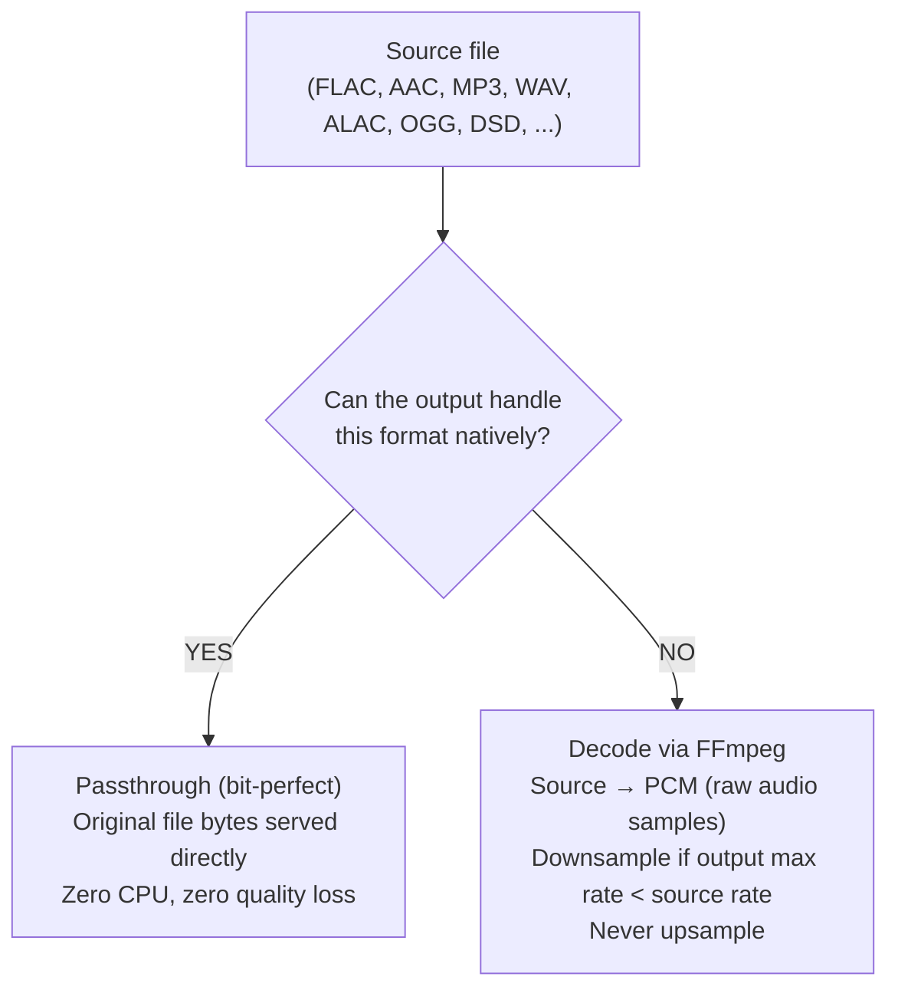
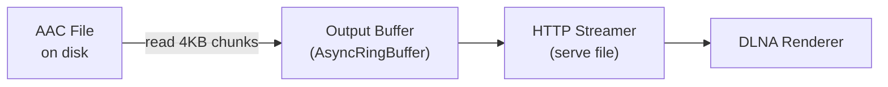
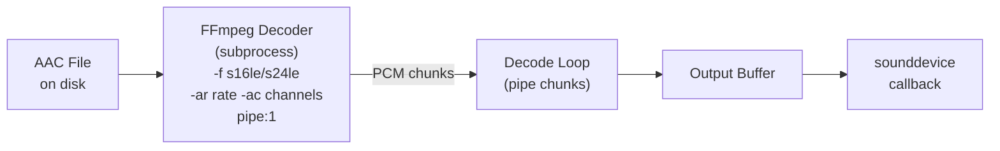
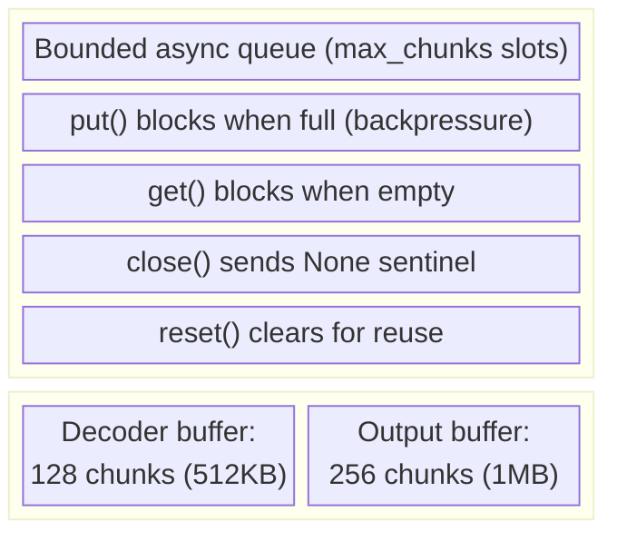
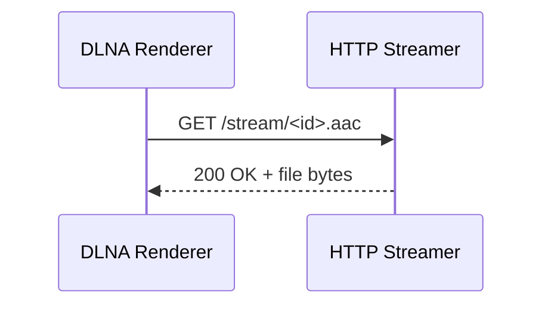
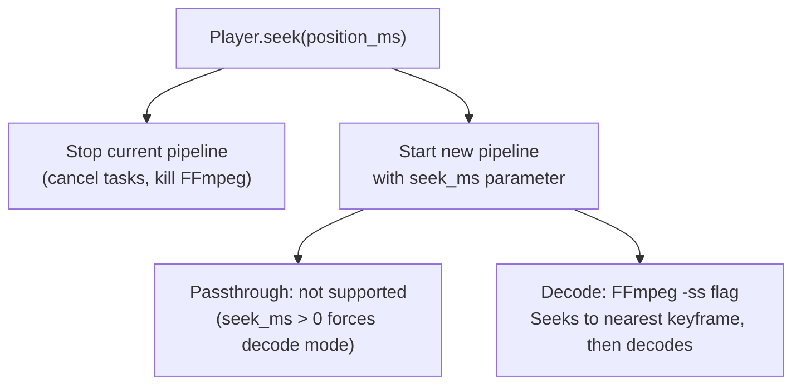
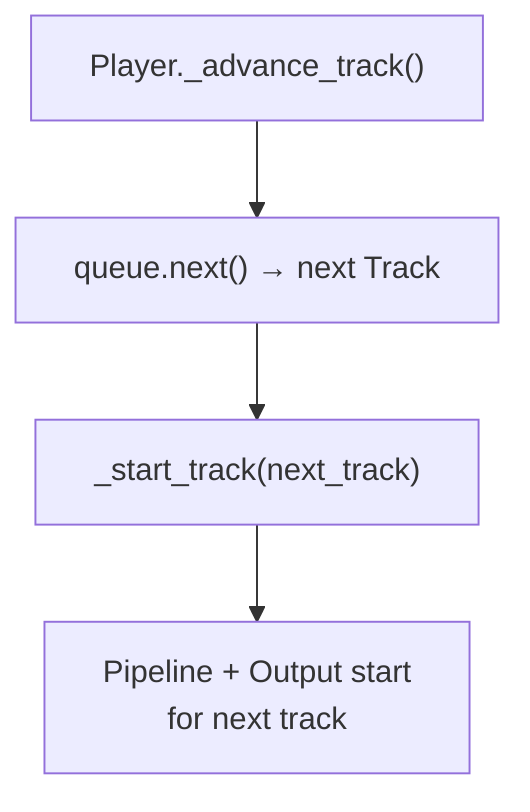

# Audio Pipeline

## Overview

The audio pipeline determines how audio data flows from a source file to an output device. The key decision is **passthrough vs. decode**.

## Decision Flow



## Passthrough Mode

Used when the output supports the source format. Example: DLNA renderer playing an AAC file.



- File is read in 4KB chunks via `asyncio.to_thread(f.read)`
- Chunks are pushed to `AsyncRingBuffer` (256 slots)
- For DLNA: the HTTP streamer serves the file directly with Range support
- `AudioStreamInfo` includes `file_size` for Content-Length headers

### Format Capabilities

```python
DLNA_CAPABILITIES = AudioCapabilities(
    formats={FLAC, WAV, MP3, AAC, OGG, ALAC},
    max_sample_rate=192000,
    max_bit_depth=24,
    supports_gapless=True,  # via SetNextAVTransportURI
)

LOCAL_CAPABILITIES = AudioCapabilities(
    formats={WAV},  # sounddevice only accepts raw PCM
    max_sample_rate=384000,
    max_bit_depth=32,
    supports_gapless=True,
)
```

## Decode Mode

Used when the output cannot handle the source format. Example: local soundcard playing an AAC file.



### FFmpeg Decoder

The decoder runs FFmpeg as an async subprocess:

```
ffmpeg -hide_banner -loglevel error [-ss <seek>] \
  -i <input_file> \
  -f s16le -ar 44100 -ac 2 -acodec pcm_s16le \
  pipe:1
```

- Output format: raw PCM (`s16le`, `s24le`, or `s32le`)
- Sample rate: min(source_rate, output_max_rate) — never upsamples
- Bit depth: min(source_depth, output_max_depth)
- Seek: `-ss` flag for FFmpeg input seeking (fast, uses keyframes)

### PCM Format Selection

| Source Bit Depth | PCM Output Format |
|-----------------|-------------------|
| ≤ 16 bits       | `s16le` (2 bytes/sample) |
| 17-24 bits      | `s24le` (3 bytes/sample) |
| > 24 bits       | `s32le` (4 bytes/sample) |

## Buffer Architecture



The buffer provides backpressure: if the output can't consume fast enough, the decoder slows down naturally. If the decoder is slower than real-time (shouldn't happen for local files), the output will briefly block.

## DLNA Streaming Details

For DLNA outputs, the HTTP Audio Streamer serves audio to the renderer:

### File Passthrough (most common)



Supports:
- `Content-Length` header (renderer knows total size)
- `Range` requests (206 Partial Content for seeking)
- `Accept-Ranges: bytes`
- DLNA headers: `transferMode.dlna.org: Streaming`

### Streaming Mode (for transcoded audio)

When audio is transcoded (PCM from decoder → re-encoded for DLNA), chunks are pushed to the stream session queue and served as a chunked response. No Content-Length, no Range support.

## Seek Implementation



Note: seeking in passthrough mode is not possible (can't serve partial file from arbitrary position in a compressed format). The pipeline automatically falls back to decode mode when `seek_ms > 0`.

## Gapless Playback

### Local Output
Pre-decode the next track while the current track plays. When the current track ends, the next track's PCM is already buffered.

### DLNA Output
Use `SetNextAVTransportURI` to tell the renderer what to play next. The renderer handles the transition internally.


