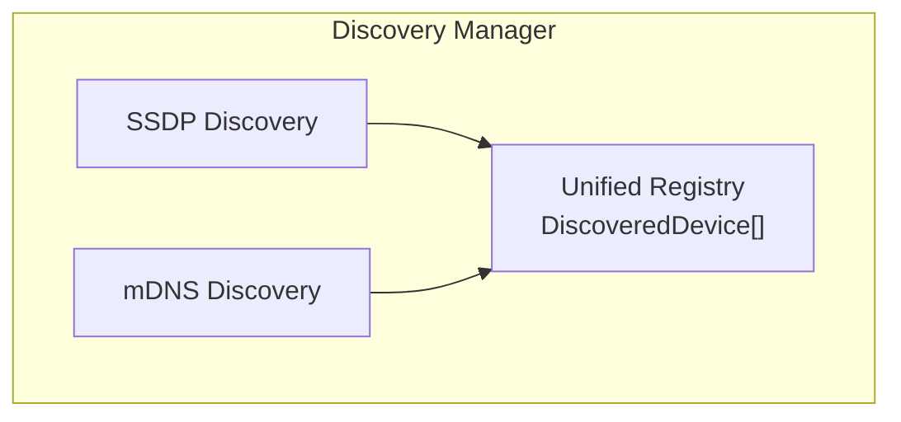
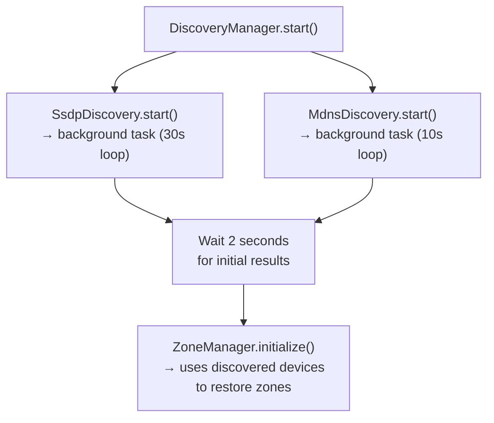

# Device Discovery

## Overview

The server automatically discovers network audio devices using two protocols:
- **SSDP** (Simple Service Discovery Protocol) for DLNA/UPnP renderers
- **mDNS** (Multicast DNS / Bonjour) for AirPlay devices

## Discovery Manager

The `DiscoveryManager` unifies both discovery backends into a single device registry.



## SSDP Discovery (DLNA)

### Protocol

1. Server sends M-SEARCH multicast to `239.255.255.250:1900`
2. DLNA renderers respond with their location URL
3. Server fetches device description XML
4. Creates `DmrDevice` wrapper for control

### Search Target

```
urn:schemas-upnp-org:device:MediaRenderer:1
```

### Scan Cycle

- Full scan every **30 seconds**
- Devices not seen in a cycle are marked as `available: false`
- `DEVICE_DISCOVERED` event emitted for new devices
- `DEVICE_LOST` event emitted when a device disappears

### Device Info Extracted

| Field | Source |
|-------|--------|
| `id` | USN (Unique Service Name) |
| `name` | `friendlyName` from device XML |
| `host` | Parsed from device URL |
| `port` | Parsed from device URL |
| `model` | `modelName` from device XML |
| `capabilities` | `{dlna: true, model: "..."}` |

### Example Discovered Devices

```
DMP-A8                  uuid:9C41535E-DB73-11F0-A7C6-800A805D4DEE::urn:...MediaRenderer:1
Sonos Play:1            uuid:RINCON_B8E937B44D0801400_MR::urn:...MediaRenderer:1
KDL-43WF660 (Sony TV)   uuid:14153f1c-bb62-11dd-9436-94db56a3b8de::urn:...MediaRenderer:1
Décodeur TV UHD         uuid:00ababad-7947-1048-8a00-5cb13ebb9dd4::urn:...MediaRenderer:1
```

### Library

`async-upnp-client` with `AiohttpRequester` for HTTP requests and `UpnpFactory` for device creation.

## mDNS Discovery (AirPlay)

### Protocol

1. Scans for AirPlay services via Bonjour/mDNS
2. Uses `pyatv.scan()` with a 10-second timeout
3. Extracts device configuration for later connection

### Services Scanned

- `_raop._tcp` (Remote Audio Output Protocol)
- `_airplay._tcp` (AirPlay)

### Scan Cycle

- Full scan every **10 seconds** (via `pyatv.scan(timeout=10)`)
- `DEVICE_DISCOVERED` event for new AirPlay devices

### Device Info Extracted

| Field | Source |
|-------|--------|
| `id` | Device identifier (MAC address or unique ID) |
| `name` | Device name (e.g., "Bureau", "Chambre") |
| `host` | IP address |
| `capabilities` | `{airplay: true}` |

### Example Discovered Devices

```
Chambre         BA:C9:C4:56:04:E8
DMP-A8          800a805d4dee
Bureau          90:56:82:20:10:FC
Mac Studio (2)  76:4D:00:C0:BD:51
```

### Library

`pyatv` for scanning and `zeroconf` for mDNS resolution.

## API

### List All Discovered Devices

```bash
curl localhost:8888/api/v1/devices
```

```json
[
    {
        "id": "uuid:9C41535E-...",
        "name": "DMP-A8",
        "type": "dlna",
        "host": "192.168.1.23",
        "port": 8080,
        "available": true,
        "capabilities": {"dlna": true, "model": "AV Renderer Device"}
    },
    {
        "id": "BA:C9:C4:56:04:E8",
        "name": "Chambre",
        "type": "airplay",
        "host": "192.168.1.30",
        "port": 7000,
        "available": true,
        "capabilities": {"airplay": true}
    }
]
```

## Network Share Discovery (SMB/NFS)

In addition to audio renderers, the server discovers network shares that may contain music libraries.

### Protocol

1. mDNS scans for SMB (`_smb._tcp`) and NFS services
2. For each discovered host, available shares/exports are enumerated
3. Shares can be mounted via the `/network/mounts` API

### Mount Management

Mounted shares are added to `TUNE_MUSIC_DIRS` and scanned by the library scanner. The mount manager:
- Persists mount configurations in SQLite
- Uses `sudo mount`/`umount` on Linux (requires sudoers configuration)
- Supports remounting after network reconnection

### API

```bash
# Discover network shares
curl localhost:8888/api/v1/network/shares

# Scan a specific host
curl "localhost:8888/api/v1/network/scan-host?host=192.168.1.10&protocol=smb"

# Mount a share
curl -X POST localhost:8888/api/v1/network/mounts \
  -H 'Content-Type: application/json' \
  -d '{"host": "192.168.1.10", "share": "music", "protocol": "smb"}'

# List mounts
curl localhost:8888/api/v1/network/mounts
```

## DLNA Media Server Discovery

The server also discovers DLNA MediaServer devices (distinct from MediaRenderer devices used for playback).

### Protocol

Uses SSDP with search target `urn:schemas-upnp-org:device:MediaServer:1`.

### Browsing

MediaServers expose a ContentDirectory service that can be browsed hierarchically. The API provides:

- `GET /network/media-servers` — list discovered servers
- `GET /network/media-servers/{id}/browse` — browse ContentDirectory
- `GET /network/media-servers/{id}/item/{item_id}/stream-url` — get stream URL for playback

## Startup Sequence



The 2-second wait ensures DLNA devices are available before zone initialization. For devices that appear later, the DLNA output factory has a 15-second retry mechanism.
