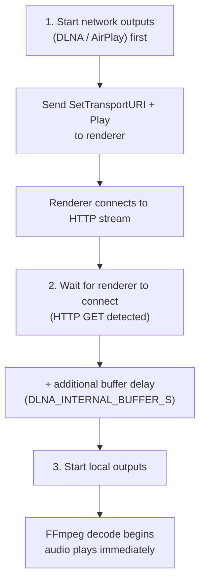
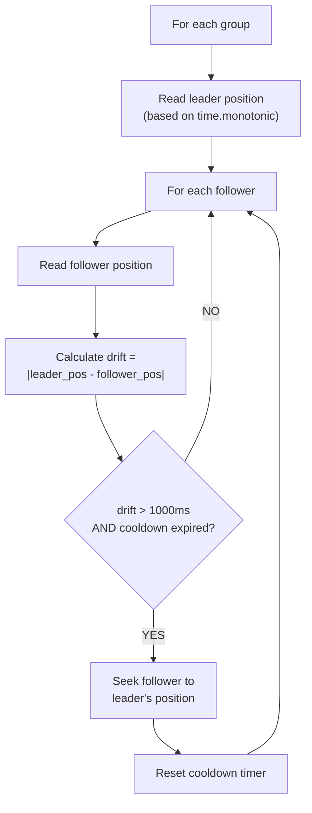
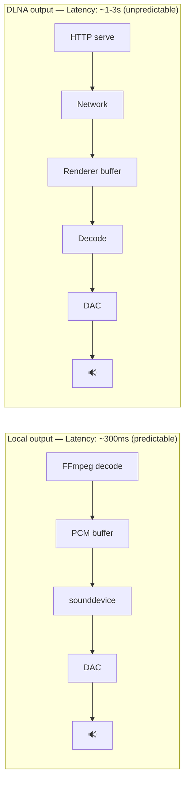

# Multi-Room Playback

## Overview

Zones can be grouped for synchronized multi-room playback. One zone is the **leader** (drives the queue), others are **followers** (mirror playback).

## Grouping

### Create a Group

```bash
POST /api/v1/zones/group
{
    "leader_id": 4,          # DLNA zone (EverSolo DMP-A8)
    "zone_ids": [1, 4]       # Local + DLNA
}
```

### Behavior When Grouped

- **Play/Pause/Stop/Next/Previous** on any zone in the group affects all zones
- The leader's queue is authoritative
- Followers play the same track at the same position

### Dissolve a Group

```bash
DELETE /api/v1/zones/group/<group-id>
```

Zones return to independent operation.

## Synchronized Start

When `group.play()` is called, the startup is staggered to compensate for DLNA buffering latency:



This ensures the DLNA renderer has time to buffer before the local output starts, reducing the perceived delay.

### Timing Diagram

```mermaid
gantt
    title Synchronized Start Timing
    dateFormat X
    axisFormat %L ms

    section DLNA
    SetTransportURI + Play sent        :dlna1, 0, 50
    Renderer HTTP GET (connected)      :dlna2, 50, 50
    Wait DLNA_INTERNAL_BUFFER_S        :dlna3, 50, 3000
    Renderer outputs audio (~approx)   :milestone, 3000, 0

    section LOCAL
    FFmpeg decode starts               :local1, 3050, 250
    First PCM samples reach sounddevice :milestone, 3300, 0
```



## Sync Engine

The sync engine runs as a background task, polling every 5 seconds to detect and correct drift between grouped zones.

### Parameters

| Parameter | Value | Description |
|-----------|-------|-------------|
| `DRIFT_THRESHOLD_MS` | 1000 | Only correct if drift exceeds 1 second |
| `CORRECTION_COOLDOWN_S` | 30 | Minimum time between corrections per follower |
| `SYNC_POLL_INTERVAL_S` | 5 | How often to check positions |

### Correction Mechanism



### Cooldown After Group Play

When a group starts playing, a 30-second cooldown prevents the sync engine from interfering with the staggered start.

## Limitations

### DLNA Sync Precision

DLNA renderers have inherent latency that varies by device:
- HTTP stream buffering: 0.5-3 seconds (device-dependent)
- No feedback mechanism for actual audio output time
- Position queries may not be supported or accurate

Practical sync accuracy: **~0.5-2 seconds** depending on the DLNA renderer.

### Why Perfect Sync Is Hard



The fundamental challenge: we control the local output pipeline end-to-end, but DLNA is a black box after we serve the HTTP stream. We don't know when audio actually exits the speakers.

### Comparison with Other Solutions

| Solution | Sync Method | Precision |
|----------|------------|-----------|
| **This server** | Staggered start + drift correction | ~0.5-2s |
| Roon (RAAT) | Proprietary protocol, clock sync | <1ms |
| Sonos | Custom protocol, NTP sync | <1ms |
| Snapcast | Buffer-based, NTP-synced playback | <5ms |
| DLNA standard | No sync specification | N/A |

For sub-millisecond sync, a custom streaming protocol (like Snapcast's approach) would be needed, bypassing DLNA entirely.

## Future Improvements

1. **Per-zone delay offset**: Configurable `sync_delay_ms` per zone, adjustable at runtime
2. **Snapcast integration**: Use Snapcast protocol for local network outputs
3. **NTP-based sync**: Synchronize clocks between server and clients
4. **Adaptive buffering**: Measure actual DLNA device latency and auto-calibrate
