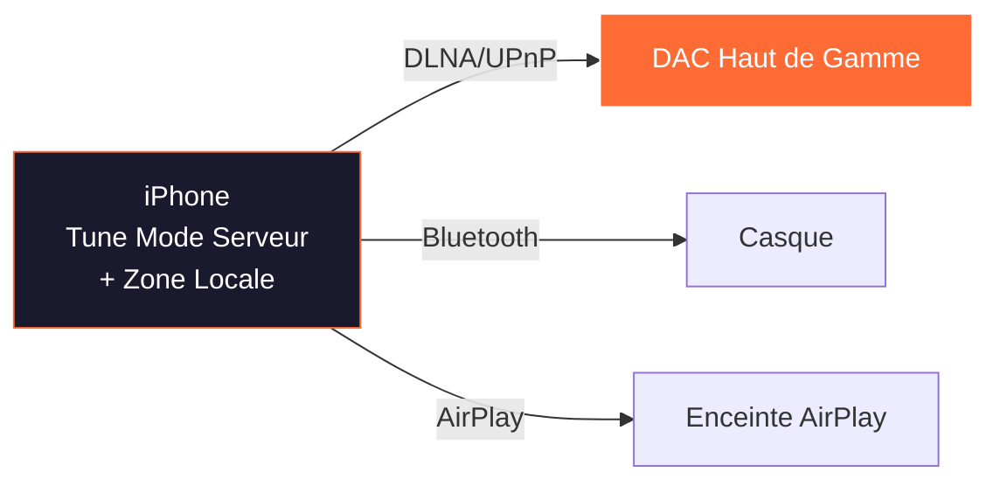
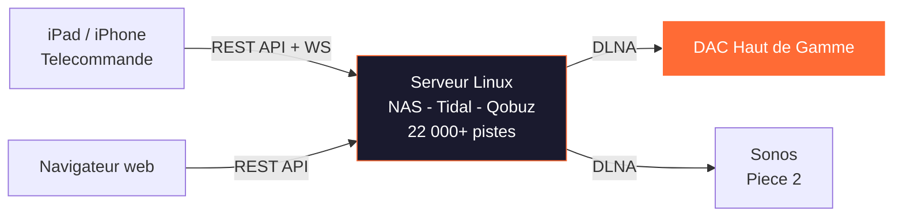
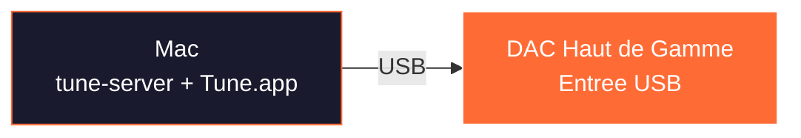
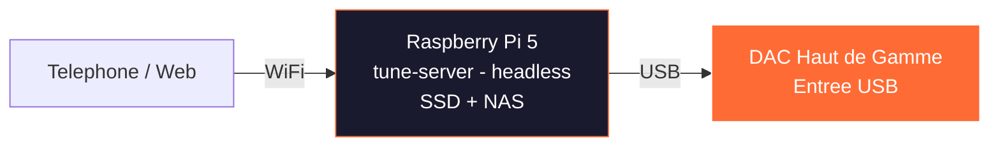
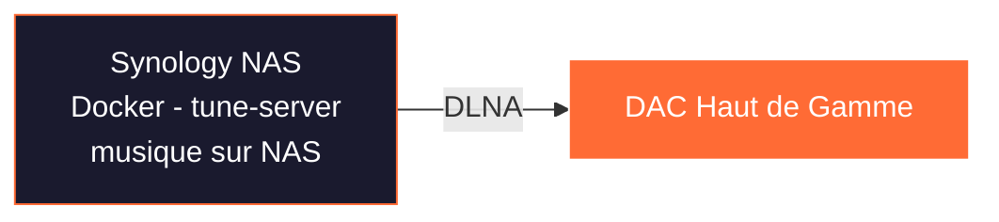

# TUNE — Le Serveur Musical Open Source qui Vise l'Excellence Audiophile

*Dossier de presse — Avril 2026*

---

## MozAIk Labs — L'essentiel

**Bertrand Clech** — Fondateur & Lead Developer

Ingenieur EPFL (Systemes de Communication — convergence IT/Telecom, 1995). Plus de 30 ans d'experience en ingenierie logicielle, telecom et systemes distribues. Audiophile et entrepreneur, passionne par le rapprochement entre l'audio haut de gamme et le logiciel moderne.

**MozAIk Labs** est une entreprise francaise dediee a la nouvelle generation de logiciels serveur musicaux pour audiophiles. Mission : offrir une lecture de qualite studio avec le confort du streaming moderne — sans compromis.

| | |
|---|---|
| **Fondateur** | Bertrand Clech |
| **Societe** | MozAIk Labs |
| **Site web** | [mozaiklabs.fr](https://mozaiklabs.fr) |
| **Localisation** | France |
| **Produit** | Tune — Serveur Musical Multi-room |
| **Statut** | Beta ouverte (v0.6.8, Avril 2026) |
| **Communaute** | Beta testeurs actifs via [mozaiklabs.fr/forum](https://mozaiklabs.fr/forum) |

**Equipement de reference :**
- Micromega M-One (ampli/DAC/streamer)
- EverSolo DMP-A8 (streamer)
- Lindemann (streamer)
- Sonos (multi-room)

**Services de Streaming :** Tidal HiFi+, Qobuz Studio

**Equipe :**
- Bertrand — Architecture, backend (Python/FastAPI), iOS (Swift/SwiftUI), infrastructure
- Matteo — Frontend, ecommerce (React/Laravel)
- JP — Conseiller en architecture
- Freddy — Partenariats materiel HiFi (Belgique)
- Claude AI (Anthropic) — Developpement assiste par IA & prototypage rapide

---

## En une phrase

Tune est un **serveur musical multi-room open source** qui unifie bibliotheques locales, partages reseau et 6 services de streaming avec une **lecture bit-perfect verifiee** vers les renderers DLNA/UPnP, AirPlay et les DAC USB — le tout pilotable depuis un iPad, un iPhone, un navigateur web ou une app Android.

---

## Pourquoi Tune merite qu'on en parle

### Le constat
Le marche du streaming audiophile est domine par des solutions fermees (Roon, BluOS, HEOS) ou limitees a un ecosysteme. L'audiophile qui possede un DAC haut de gamme, un NAS, des abonnements Tidal et Qobuz, et des appareils Apple et Android n'a pas de solution unifiee, ouverte et gratuite.

### La reponse de Tune
- **Open source et gratuit** — pas d'abonnement, pas de licence, code source public sur GitHub
- **Bit-perfect verifie** — checksum MD5 de bout en bout, pastille verte dans l'interface quand le signal n'a subi aucune alteration
- **6 services de streaming** — Tidal HiFi+ (192/24), Qobuz Studio (192/24), YouTube Music, Spotify, Deezer, Amazon Music
- **Fonctionne partout** — Linux, macOS, Windows, iPadOS, iOS, Android, Docker, Raspberry Pi
- **Multi-room avec synchronisation** — groupement de zones, compensation de delai par appareil
- **Stereo pairing** — separation des canaux gauche/droite sur deux enceintes DLNA distinctes via filtre FFmpeg
- **Serveur UPnP/DLNA integre** — Tune expose votre bibliotheque sur le reseau (port 8080), accessible depuis n'importe quelle app UPnP tierce
- **DSD natif** — passthrough DSF/DFF vers les renderers compatibles, sans conversion
- **Developpe avec l'IA** — Claude (Anthropic) est co-developpeur, accelerant la vitesse d'iteration d'un facteur 10

### Face a la concurrence

| | **Tune** | **Roon** | **jPlay** |
|---|---|---|---|
| **Prix** | Gratuit, open source | 14,99 $/mois ou 829,99 $ a vie | 49,99 $/an ou 199 $ a vie |
| **Code source** | Public (GitHub) | Ferme | Ferme |
| **Architecture** | Serveur + clients natifs | Roon Core + endpoints | App iOS (controle UPnP) |
| **Plateformes serveur** | Linux, macOS, Windows, iPadOS, Docker | Windows, macOS, Linux | — (pas de serveur) |
| **Plateformes client** | iOS, Android, Web, macOS | iOS, Android, Windows, macOS | iOS uniquement |
| **DSD natif** | Oui (passthrough) | Oui | Via le renderer UPnP |
| **Bit-perfect verifie** | Oui (checksum MD5 bout en bout) | Signal path indicatif | Non verifiable |
| **Chemin du signal** | Oui (inspire Roon) | Oui (pionniers) | Non |
| **Services streaming** | Tidal, Qobuz, YouTube, Spotify, Deezer, Amazon | Tidal, Qobuz | Tidal, Qobuz |
| **Bibliotheque locale** | Oui (scan + NAS/SMB) | Oui (scan + watch) | Oui (via serveur UPnP tiers) |
| **iPad comme serveur** | Oui (mode autonome) | Non | Oui (streaming vers renderer) |
| **Multi-room** | Oui (DLNA + AirPlay, sync) | Oui (RAAT proprietaire) | Non |
| **Stereo pairing** | Oui (L/R sur 2 enceintes DLNA) | Non | Non |
| **DLNA/UPnP** | Oui (renderer + serveur) | Non (RAAT uniquement) | Oui (controle de renderers) |
| **DSP / Convolution** | Oui (FFmpeg, reponse impulsionnelle) | Oui (riche) | Non (via HQPlayer externe) |
| **Metadonnees enrichies** | MusicBrainz + Discogs | Roon DB proprietaire (la reference) | Non |
| **Approche audio** | Passthrough intelligent + verification | DSP riche, upsampling, social | Minimalisme reseau, purisme signal |
| **Materiel dedie** | Non (tourne sur tout) | Nucleus (optionnel) | Non |

### Trois philosophies differentes

**Roon** (roon.app) est le leader etabli : la meilleure experience utilisateur du marche, des metadonnees encyclopediques, un algorithme de recommandation entraine sur 20 millions d'ecoutes mensuelles, et un ecosysteme "Roon Ready" de plus de 1 000 appareils certifies. Son protocole RAAT est proprietaire mais optimise pour l'audio. C'est aussi le plus cher — et il ne supporte que Tidal et Qobuz.

**jPlay** (jplay.app) est l'approche puriste : une app iOS qui streame directement vers les renderers UPnP depuis l'iPad/iPhone, avec une philosophie radicale — minimiser le trafic reseau pour reduire le "bruit" induit par le reseau. L'iPad fait office de serveur autonome (Qobuz, Tidal, musique locale). Pas de multi-room, pas de DSP integre (HQPlayer en externe). Son point fort : la simplicite et la qualite sonore revendiquee par la presse specialisee (hi-fi+).

**Tune** se positionne entre les deux : l'exigence bit-perfect verifiable (checksum MD5, ce que ni Roon ni jPlay ne proposent) avec la polyvalence multi-plateforme et multi-room de Roon, la sobriete du chemin audio de jPlay — le tout en open source et gratuit. Comme jPlay, il tourne sur iPad en mode autonome, mais ajoute le multi-room, le stereo pairing, le DSP, 6 services de streaming, et un serveur UPnP integre.

---

## Nouveautes v0.6 — Ce qui a change depuis la v0.5

La v0.6 represente un bond majeur en termes de fonctionnalites et de maturite. Voici les ajouts principaux :

### Stereo Pairing
Separation des canaux gauche et droite sur deux enceintes DLNA distinctes via le filtre FFmpeg `pan`. L'utilisateur cree une paire stereo depuis le Zone Manager : chaque enceinte recoit un seul canal (L ou R), reconstituant une image stereo physiquement separee. Ideal pour les setups avec deux enceintes actives mono ou deux streamers identiques.

### Zone Manager UI
Page dediee a la gestion des zones avec une grille visuelle : groupes de zones, sliders de volume, assignation d'appareils (DLNA, AirPlay, local), mesure de latence integree. Tout le multi-room se configure graphiquement.

### Onboarding Wizard
Assistant de premiere utilisation en 4 etapes (Bienvenue, Bibliotheque, Streaming, Termine) disponible sur toutes les plateformes (web, iOS, Android). L'utilisateur configure son installation en moins de 2 minutes.

### Configuration streaming depuis l'interface
Plus besoin d'editer un fichier `.env` pour activer les services de streaming. Les 6 connecteurs (Tidal, Qobuz, Spotify, YouTube, Deezer, Amazon Music) se configurent directement depuis la page Settings.

### Notifications toast
Retour visuel unifie sur toutes les actions (succes, erreur, avertissement) via des notifications toast non-intrusives dans l'interface web et les apps natives.

### Page de diagnostics
Page dediee affichant la sante du serveur, les statistiques de la base de donnees, les zones actives, les connexions streaming. Bouton "Copier dans le presse-papiers" pour faciliter les rapports de bugs.

### Reconnexion AirPlay intelligente
Mecanisme de reconnexion avec backoff exponentiel (2s / 5s / 10s / 30s) en cas de perte de connexion AirPlay. Plus de coupures definitives sur les reseaux instables.

### Robustesse streaming
Retry HTTP avec backoff exponentiel sur tous les connecteurs de streaming. Les micro-coupures CDN (Tidal, Qobuz) sont absorbees automatiquement.

### Playlist Manager avance
Fusion de playlists, snapshots (sauvegardes ponctuelles), synchronisation automatique entre services, creation de playlists a distance. Un vrai gestionnaire a la Soundiiz, integre dans Tune.

### Zone hot-unplug
Detection en temps reel de la disparition d'un appareil (SSDP/mDNS) : mise en pause automatique quand un renderer est debranche, reprise automatique quand il reapparait sur le reseau.

### Alignement multi-plateforme
Le client web (Svelte 5), l'app iOS/macOS (TestFlight) et l'app Android (Firebase) offrent desormais les memes fonctionnalites. Meme onboarding, meme zone manager, meme diagnostics.

---

## Comment ca marche — Pour le lecteur

### Le plus simple : un iPad et un DAC

L'iPad fait tourner Tune en mode serveur. Il scanne la musique locale, se connecte a Tidal et Qobuz, et envoie l'audio en DLNA a votre DAC. Pas de PC, pas de NAS — juste un iPad et votre systeme audio.

### L'installation audiophile : serveur Linux + telecommande

Un serveur Linux (Intel NUC, Raspberry Pi, vieux PC) fait tourner tune-server en permanence. Il scanne vos fichiers sur le NAS, se connecte aux services de streaming. Vous controllez tout depuis l'iPad, l'iPhone, un navigateur web ou un telephone Android.

### Le multi-room

Tune decouvre automatiquement tous les renderers DLNA et les appareils AirPlay sur votre reseau. Vous groupez les zones a volonte, avec compensation de delai par appareil. La nouveaute v0.6 : le stereo pairing permet de transformer deux enceintes en une paire stereo L/R.

---

## Cas d'usage — Comment Tune s'adapte a votre installation

### Scenario 1 : iPad seul (autonome)


- L'iPad fait tourner Tune en **mode serveur** (moteur embarque)
- Scanne la musique locale (stockage iPad + bibliotheque Apple Music)
- Se connecte aux services de streaming (Tidal, Qobuz)
- Envoie l'audio via **DLNA/UPnP** directement a votre DAC
- **Multi-room** : decouvre plusieurs renderers DLNA, peut grouper des zones
- **Ideal pour** : installation simple, audiophile nomade

### Scenario 1b : iPhone seul (audiophile portable)



- L'iPhone fait tourner Tune en **mode serveur** (autonome)
- Streame depuis Tidal/Qobuz, envoie vers DLNA, Bluetooth ou AirPlay
- **Ideal pour** : ecoute nomade, controle DLNA rapide

### Scenario 2 : Serveur Linux + iPad/iPhone en telecommande



- Serveur Linux (Intel NUC, Raspberry Pi, ou tout PC) fait tourner **tune-server**
- Bibliotheque complete avec enrichissement metadonnees, playlists
- **Ideal pour** : installation audiophile serieuse, grande bibliotheque, multi-room

### Scenario 3 : Serveur Linux + sorties multiples


- Plusieurs zones simultanees, chacune avec sa file d'attente et son volume
- Zones groupables pour une lecture synchronisee (multi-room)
- **Stereo pairing** : deux enceintes DLNA configurees en paire L/R
- Mix de sorties DLNA, AirPlay et DAC USB
- **Ideal pour** : sonorisation de toute la maison

### Scenario 4 : Mac de bureau (tout-en-un)



- tune-server + Tune.app natif, sortie USB directe vers le DAC
- **Ideal pour** : audiophile de bureau, ecoute au casque

### Scenario 5 : Raspberry Pi (audiophile embarque)



- Streamer dedie pour moins de 100 euros
- Sortie USB bit-perfect vers le DAC, controle depuis n'importe quel appareil
- **Ideal pour** : streamer dedie ultra-economique

### Scenario 6 : Docker sur NAS



- Tourne dans Docker sur Synology, QNAP, Unraid
- Bibliotheque deja sur le NAS — zero copie
- **Ideal pour** : proprietaires de NAS, zero materiel supplementaire

### Comparaison rapide

| Installation | Materiel | Multi-room | Chemin Audio | Complexite |
|---|---|---|---|---|
| **iPad seul** | iPad | Oui (DLNA) | iPad -> DLNA -> DAC | Facile |
| **Linux + telecommande** | Serveur + iPad | Oui | Serveur -> DLNA -> DAC | Moyen |
| **Linux + multi** | Serveur + tout | Oui (sync) | Sorties multiples | Avance |
| **Mac de bureau** | Mac | Oui | Mac -> USB -> DAC | Facile |
| **Raspberry Pi** | RPi + SSD | Oui | RPi -> USB -> DAC | Moyen |
| **Docker / NAS** | NAS | Oui | NAS -> DLNA -> DAC | Moyen |

---

## Architecture technique — Pour les curieux

### Topologie reseau


### Stack Serveur (Linux / macOS / Windows)

| Couche | Technologie | Role |
|---|---|---|
| Langage | Python 3.11+ (async) | Coeur serveur |
| API | FastAPI + Uvicorn | 106+ endpoints REST + WebSocket |
| Base de donnees | SQLite / **PostgreSQL** (double moteur) | Bibliotheque, playlists, zones |
| Pipeline Audio | FFmpeg | Decodage, transcodage, resampling |
| DLNA/UPnP | async-upnp-client | Controle renderer, decouverte SSDP |
| AirPlay | pyatv | Streaming vers appareils Apple |
| Sortie Locale | sounddevice + numpy | DAC USB / carte son |
| Metadonnees | mutagen + musicbrainzngs | Lecture/ecriture de tags, enrichissement |

### Apps natives (iPadOS / iOS / macOS)

| Couche | Technologie |
|---|---|
| Langage | Swift 6.0 (concurrence stricte) |
| UI | SwiftUI |
| DLNA | XMLParser + URLSession natifs |
| Streaming | Swift natif (sans dependances) |

### App Flutter (Android / iOS)

| Couche | Technologie |
|---|---|
| Langage | Dart 3.11+ |
| Audio | just_audio |
| Serveur embarque | Shelf + shelf_router |

### Client Web

| Couche | Technologie |
|---|---|
| Langage | TypeScript 5.7+ |
| Framework | Svelte 5 (runes) |
| Design | Responsive 3 breakpoints (bureau / tablette / mobile) |
| Langues | 8 langues (FR, EN, DE, ES, IT, ZH, KO, JA) |

---

## Chemin du signal — Ce qui interesse l'audiophile

### Strategies de lecture

| Strategie | Quand | CPU | Qualite |
|---|---|---|---|
| **Passthrough URL Directe** | Streaming -> DLNA | Zero | Bit-perfect |
| **Passthrough DSD Natif** | DSF/DFF -> renderer compatible | Zero | Bit-perfect |
| **Passthrough Fichier** | FLAC local -> renderer compatible | Minimal | Bit-perfect |
| **Transcodage FFmpeg** | Incompatibilite de format | Moyen | Transparent |

### Chemin du signal audio

```mermaid
graph LR
    subgraph Sources["Sources"]
        LOCAL["Fichiers Locaux<br/>FLAC - WAV - DSD"]
        TIDAL["Tidal<br/>FLAC 192/24"]
        QOBUZ["Qobuz<br/>FLAC 192/24"]
        RADIO["Radio<br/>HTTP/ICY"]
    end

    subgraph Pipeline["Pipeline Audio"]
        DEC["Decodage<br/>FFmpeg - Natif - DSD"]
        PROC["Traitement<br/>Passthrough - PCM - Resample"]
    end

    subgraph Output["Sortie"]
        DLNA["DLNA HTTP"]
        AIRP["AirPlay"]
        USB["DAC USB"]
    end

    DAC["DAC Haut de Gamme<br/>DAC -> Ampli -> Enceintes"]

    Sources --> DEC --> PROC --> Output --> DAC

    style Sources fill:#0d0d1a,stroke:#ff6b35,color:#fff
    style Pipeline fill:#1a1a2e,stroke:#64b5f6,color:#fff
    style Output fill:#1e1e38,stroke:#81c784,color:#fff
    style DAC fill:#ff6b35,stroke:#fff,color:#fff
```



### Affichage du chemin du signal (inspire de Roon)

```
Source : Qobuz FLAC 96/24
-> Transport : Passthrough URL Directe
-> Renderer : DAC Haut de Gamme (DLNA)
-> Horloge : Interne (renderer)
-> Traitement : Aucun (bit-perfect)
-> Sortie : 96kHz / 24-bit / 2ch
```

Pastille coloree dans la barre de transport : vert = bit-perfect, jaune = transcode. Log des decisions du pipeline depliable. Badge de verification checksum.

### Formats supportes

| Format | Resolution Max | DSD | Gapless |
|---|---|---|---|
| FLAC | 192 kHz / 24-bit | — | Oui |
| WAV | 192 kHz / 32-bit | — | Oui |
| ALAC | 192 kHz / 24-bit | — | Oui |
| DSD (DSF/DFF) | DSD128 (5,6 MHz) | Natif | Oui |
| DSD Fallback | 176,4 kHz / 24-bit PCM | Converti | Oui |
| AAC/MP3/OGG | 48 kHz / 16-bit | — | Oui |

### Qualite des services de streaming

| Service | Qualite Max | Format | Resolution |
|---|---|---|---|
| **Tidal** | HI_RES_LOSSLESS | FLAC | 192 kHz / 24-bit |
| **Qobuz** | Studio Ultra | FLAC | 192 kHz / 24-bit |
| **Amazon Music** | ULTRA_HD | FLAC | 96 kHz / 24-bit |
| **Deezer** | HiFi | FLAC | 44,1 kHz / 16-bit |
| **Spotify** | Premium | OGG 320k | Lossy |
| **YouTube** | Meilleur disponible | AAC/OPUS | Variable |

---

## Excellence audio — Les fonctionnalites cles (v0.6.8)

### Verification bit-perfect
- Checksum MD5 de bout en bout (fichier source -> entree renderer)
- Comparaison de hash : `source_hash == output_hash` verifie en passthrough
- Indicateur visuel : pastille verte "Bit-Perfect" ou jaune "Transcode"
- Log complet des decisions du pipeline

### Resampling avance
- Politique configurable : `auto`, `never`, `integer_ratio` (preferer 44,1 -> 88,2 -> 176,4 kHz)
- Preference de ratio entier pour une conversion audiophile
- Resampler SoX via FFmpeg en fallback

### Gestion des buffers
- Taille de buffer configurable par sortie
- Mode basse latence (10ms) pour DAC USB local
- Mode buffer large (200ms) pour les reseaux difficiles

### Support USB Audio Class
- **Mode exclusif** : bypass du mixer OS (PulseAudio/PipeWire) pour une sortie bit-perfect
- Passthrough DSD natif vers les renderers compatibles

### Correction acoustique / DSP
- Chaine de filtres DSP : tout filtre FFmpeg (egaliseur, basses, aigus, compresseur...)
- **Convolution** : import de fichiers de reponse impulsionnelle (Dirac Live, REW, Audiolens)
- Mode bypass pour les puristes (DSP desactive par defaut — zero traitement)

### Stereo Pairing (nouveau v0.6)
- Separation L/R via filtre FFmpeg `pan` sur deux renderers DLNA distincts
- Configuration depuis le Zone Manager UI
- Synchronisation fine entre les deux canaux

### Zone hot-unplug (nouveau v0.6)
- Detection SSDP/mDNS en temps reel de la disparition d'un appareil
- Mise en pause automatique, reprise automatique a la reconnexion

---

## Architecture multi-room

```
Zone 1 : "Salon" (DLNA -> DAC Haut de Gamme)
  |-- File d'attente : [Piste A, Piste B, Piste C]
  |-- Volume : 0.65
  +-- Etat : En lecture (position : 2:34)

Zone 2 : "Bureau" (DLNA -> Micromega M-One)
  |-- File d'attente : [Piste X, Piste Y]
  |-- Volume : 0.40
  +-- Etat : En pause

Groupe "Toute la Maison" (leader : Zone 1)
  |-- Zone 1 (leader, delai sync : 0ms)
  +-- Zone 2 (follower, delai sync : +150ms)

Paire Stereo "Salon L/R"
  |-- Zone 3 : Enceinte Gauche (canal L)
  +-- Zone 4 : Enceinte Droite (canal R)
```

- Polling adaptatif : 1s en lecture, 10s au repos
- Seuil de detection de derive : 500ms
- Compensation du delai par zone
- Demarrage echelonne pour les renderers reseau
- **Hot-unplug** : detection en temps reel, pause/reprise automatique
- **Stereo pairing** : separation L/R sur deux renderers via FFmpeg pan

---

## Statut actuel (v0.6.8 — Avril 2026)

| Fonctionnalite | Statut | Cible |
|---|---|---|
| **Gestion de bibliotheque** | Production | — |
| **Tidal HiFi+** | Streaming complet (FLAC 192/24) | — |
| **Qobuz Studio** | Streaming complet (FLAC 192/24) | — |
| **YouTube Music** | Streaming | — |
| **Spotify** | Streaming | — |
| **Deezer** | Streaming | — |
| **Amazon Music** | Streaming | — |
| **Sortie DLNA/UPnP** | Bit-perfect, DSD natif, gapless | — |
| **Sortie AirPlay** | Production (reconnexion backoff) | — |
| **Multi-room** | Groupement de zones + moteur de sync | — |
| **Stereo pairing** | L/R sur 2 enceintes DLNA | — |
| **Zone Manager UI** | Grille visuelle, latence, volumes | — |
| **Onboarding Wizard** | 4 etapes, toutes plateformes | — |
| **Playlist Manager** | Fusion, snapshots, sync inter-services | — |
| **Zone hot-unplug** | Detection SSDP/mDNS temps reel | — |
| **Diagnostics** | Sante serveur, stats DB, copie bug report | — |
| **Chemin du signal** | Affichage complet + verification bit-perfect | — |
| **DSP / Convolution** | Chaine FFmpeg + reponse impulsionnelle | — |
| **Client web** | Responsive, 8 langues, toasts | — |
| **iPadOS / iOS / macOS** | TestFlight | App Store v1.0 |
| **Android (Flutter)** | Firebase beta | Play Store v1.0 |
| **RAVENNA / AES67** | Planifie | Post v1.0 |
| **Docker** | Planifie | v0.9.0 |

---

## Angles pour un article

### L'angle technique
Un serveur musical open source qui fait de la verification bit-perfect par checksum MD5 — une premiere dans le monde audiophile. Comment un ingenieur EPFL met de la rigueur telecom dans l'audio haut de gamme.

### L'angle democratisation
Roon coute 829 $ a vie. Tune est gratuit, open source, et tourne sur un Raspberry Pi a 80 euros. L'audiophile n'a plus besoin de payer pour une lecture de qualite studio.

### L'angle IA
Un produit entier developpe avec Claude (Anthropic) comme co-developpeur. Serveur Python, apps Swift, Flutter, Svelte — un seul developpeur humain produit l'equivalent d'une equipe de 10 grace a l'IA. Quel futur pour le developpement logiciel ?

### L'angle open source vs. proprietaire
Face au protocole ferme RAAT de Roon et a l'ecosysteme verrouille des constructeurs, Tune mise sur DLNA/UPnP (standard ouvert) et le code source public. L'audiophile reprend le controle de sa chaine audio.

### L'angle francais
MozAIk Labs est une entreprise francaise qui defie les geants americains (Roon Labs, San Francisco) avec une approche technique et philosophique differente. Made in France, pense pour les audiophiles exigeants.

---

## Demo live — Programme de la session Teams

Voici ce qui sera presente en direct lors de notre echange :

1. **Onboarding wizard** — Premiere utilisation de Tune : les 4 etapes (Bienvenue, Bibliotheque, Streaming, Termine) en moins de 2 minutes
2. **Scan de bibliotheque + activation streaming** — Ajout d'un dossier musical, scan, puis connexion a Tidal/Qobuz depuis l'interface Settings
3. **Lecture sur renderer DLNA** — Lancement d'un morceau Qobuz en FLAC 96/24, verification du chemin du signal bit-perfect (pastille verte)
4. **Groupement multi-room** — Ajout d'un second renderer au groupe, lecture synchronisee, compensation de delai
5. **Stereo pairing** — Creation d'une paire stereo L/R sur deux enceintes DLNA depuis le Zone Manager
6. **Apps mobiles** — Demonstration des apps iOS (TestFlight) et Android (Firebase) : meme interface, memes fonctionnalites
7. **Page de diagnostics** — Sante du serveur, statistiques, copie du rapport pour le support

---

## FAQ — Qualite Audio

**Le son est-il degrade par Tune ?**
Non. Tune utilise le passthrough bit-perfect : le fichier audio (local ou streaming) est transmis sans aucune modification au renderer DLNA. Un checksum MD5 est calcule de bout en bout — si le fichier arrive intact, une pastille verte s'affiche dans l'interface. Aucun autre lecteur du marche ne propose cette verification.

**Quelle qualite pour le streaming ?**
Tidal HiFi+ jusqu'a 192 kHz / 24-bit (MQA decodage ou FLAC Hi-Res selon abonnement). Qobuz Studio jusqu'a 192 kHz / 24-bit en FLAC natif. Les flux sont transmis directement au renderer sans reechantillonnage.

**Le DSD est-il supporte ?**
Oui. Les fichiers DSF et DFF sont envoyes en passthrough natif aux renderers compatibles (DoP ou DSD direct). Pas de conversion PCM intermediaire. Pour les renderers non compatibles, Tune convertit en PCM a la frequence optimale (176.4 kHz pour du DSD64, etc.).

**Y a-t-il un reechantillonnage ?**
Uniquement si le renderer ne supporte pas la frequence d'origine. Dans ce cas, Tune utilise FFmpeg avec un filtre de resampling haute qualite. Le signal path dans l'interface indique exactement ce qui s'est passe : pastille jaune = transcode, verte = bit-perfect.

**Comment verifier que le signal est intact ?**
Le signal path (inspire de Roon) est visible dans la barre de lecture. Il detaille chaque etape : source, transport, traitement, sortie. Le badge MD5 confirme l'integrite bit-a-bit. C'est objectif et verifiable, pas juste indicatif.

**Quelle difference avec Roon sur la qualite ?**
Roon affiche un signal path indicatif ("lossless", "enhanced") mais ne propose pas de verification par checksum. Tune va plus loin avec un hash MD5 de bout en bout qui prouve mathematiquement que le signal n'a pas ete altere. Les deux sont excellents pour la qualite, mais seul Tune est verifiable et open source.

**Le multi-room degrade-t-il le son ?**
Non. Chaque zone recoit son propre flux bit-perfect. La synchronisation est geree au niveau temporel (compensation de delai par appareil), pas au niveau du signal audio. Aucun mixage, aucun reechantillonnage.

**Le stereo pairing affecte-t-il la qualite ?**
Le stereo pairing separe les canaux gauche et droit via un filtre FFmpeg (`pan=mono`). C'est une extraction de canal, pas un traitement : le signal de chaque canal est mathematiquement identique a l'original. La synchronisation entre les deux enceintes est assuree par le moteur de sync (precision < 50 ms).

---

## Pour tester

- **Telechargement** : [mozaiklabs.fr/download](https://mozaiklabs.fr/download) — binaires Linux, macOS, Windows
- **iOS / macOS** : TestFlight (lien sur demande)
- **Android** : Firebase App Distribution (lien sur demande)
- **Web** : lancez tune-server et ouvrez `http://localhost:8888`
- **Docker** : `docker pull mozaiklabs/tune-server` (bientot)

---

## Contact & Ressources

- **Contact presse** : Bertrand Clech — bertrand.clech@orange.fr — 07 51 86 45 20
- **Site web** : [mozaiklabs.fr](https://mozaiklabs.fr)
- **Telechargements** : [mozaiklabs.fr/download](https://mozaiklabs.fr/download)
- **GitHub** : [github.com/renesenses/tune-server-linux](https://github.com/renesenses/tune-server-linux)
- **Forum Beta** : [mozaiklabs.fr/forum](https://mozaiklabs.fr/forum)
- **Version actuelle** : v0.6.8 (Avril 2026)

---

*Document prepare par Bertrand & Claude — MozAIk Labs, Avril 2026*
