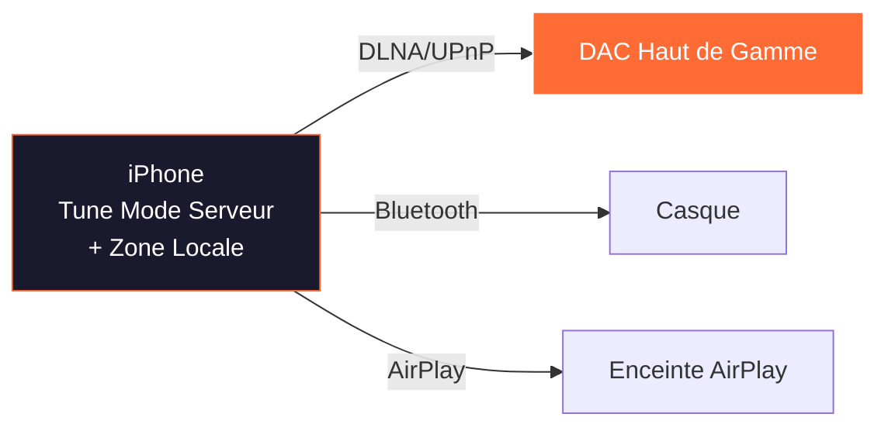
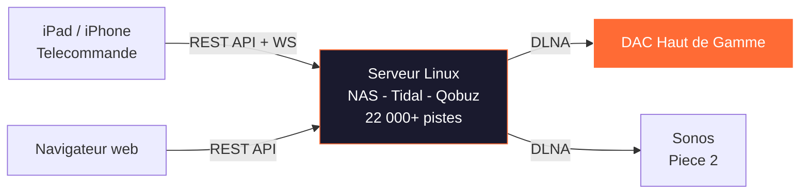
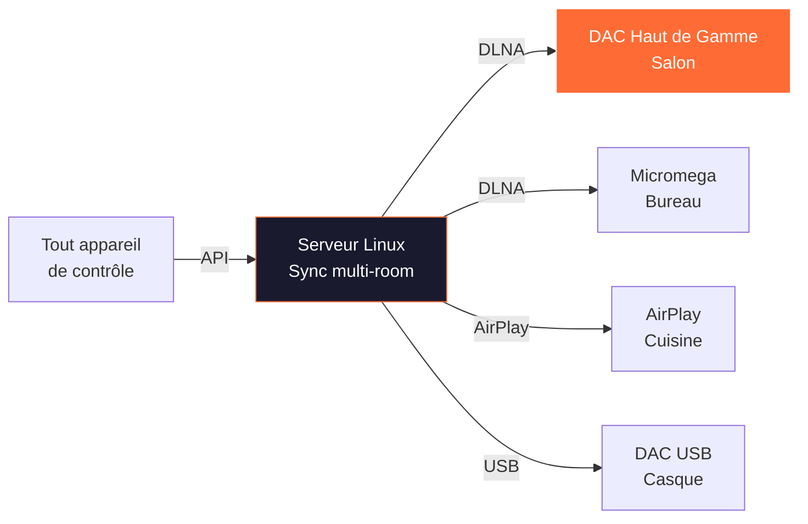
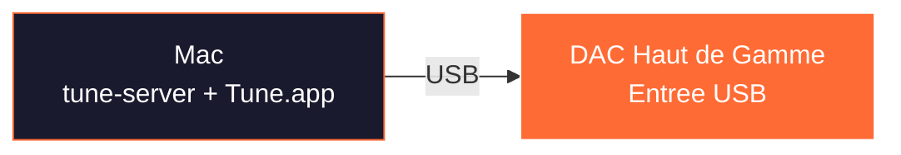
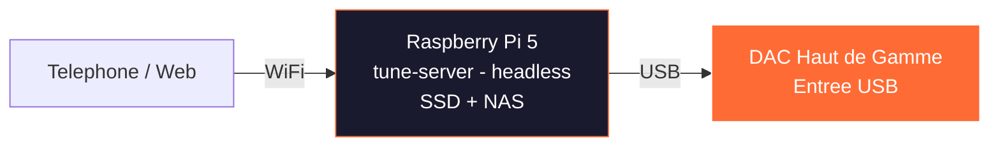
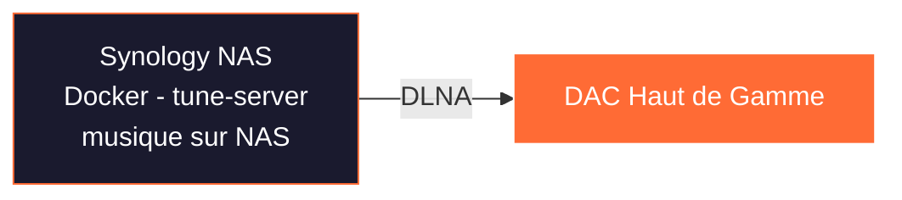
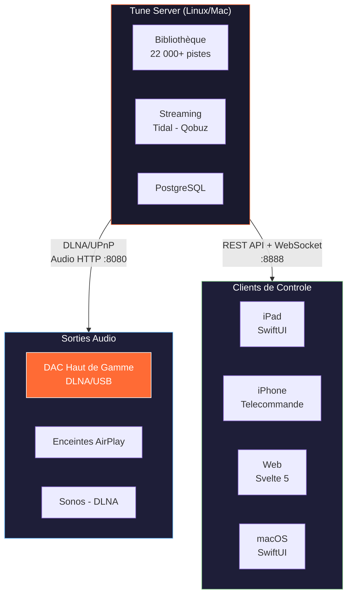

# TUNE — Le Serveur Musical Open Source qui Vise l'Excellence Audiophile

*Dossier de presse — Avril 2026*

---

## MozAIk Labs — L'essentiel

**Bertrand Clech** — Fondateur & Lead Developer

Ingénieur EPFL (Systèmes de Communication — convergence IT/Telecom, 1995). Plus de 30 ans d'expérience en ingénierie logicielle, télécom et systèmes distribués. Audiophile et entrepreneur, passionné par le rapprochement entre l'audio haut de gamme et le logiciel moderne.

**MozAIk Labs** est une entreprise française dédiée à la nouvelle génération de logiciels serveur musicaux pour audiophiles. Mission : offrir une lecture de qualité studio avec le confort du streaming moderne — sans compromis.

| | |
|---|---|
| **Fondateur** | Bertrand Clech |
| **Société** | MozAIk Labs |
| **Site web** | [mozaiklabs.fr](https://mozaiklabs.fr) |
| **Localisation** | France |
| **Produit** | Tune — Serveur Musical Multi-room |
| **Statut** | Beta ouverte (v0.6.8, Avril 2026) |
| **Communaute** | Beta testeurs actifs via [mozaiklabs.fr/forum](https://mozaiklabs.fr/forum) |

**Equipement de référence :**
- Micromega M-One (ampli/DAC/streamer)
- EverSolo DMP-A8 (streamer)
- Lindemann (streamer)
- Sonos (multi-room)

**Services de Streaming :** Tidal HiFi+, Qobuz Studio

**Equipe :**
- Bertrand — Architecture, backend (Python/FastAPI), iOS (Swift/SwiftUI), infrastructure
- Matteo — Frontend, ecommerce (React/Laravel)
- JP — Conseiller en architecture
- Freddy — Partenariats matériel HiFi (Belgique)
- Claude AI (Anthropic) — Développement assisté par IA & prototypage rapide

---

## En une phrase

Tune est un **serveur musical multi-room open source** qui unifié bibliothèques locales, partages réseau et 6 services de streaming avec une **lecture bit-perfect vérifiée** vers les renderers DLNA/UPnP, AirPlay et les DAC USB — le tout pilotable depuis un iPad, un iPhone, un navigateur web ou une app Android.

---

## Pourquoi Tune mérite qu'on en parle

### Le constat
Le marché du streaming audiophile est dominé par des solutions fermées (Roon, BluOS, HEOS) ou limitées à un écosystème. L'audiophile qui possède un DAC haut de gamme, un NAS, des abonnements Tidal et Qobuz, et des appareils Apple et Android n'a pas de solution unifiée, ouverte et gratuite.

### La réponse de Tune
- **Open source et gratuit** — pas d'abonnement, pas de licence, code source public sur GitHub
- **Bit-perfect verifie** — checksum MD5 de bout en bout, pastille verte dans l'interface quand le signal n'a subi aucune altération
- **6 services de streaming** — Tidal HiFi+ (192/24), Qobuz Studio (192/24), YouTube Music, Spotify, Deezer, Amazon Music
- **Fonctionne partout** — Linux, macOS, Windows, iPadOS, iOS, Android, Docker, Raspberry Pi
- **Multi-room avec synchronisation** — groupement de zones, compensation de délai par appareil
- **Stéréo pairing** — séparation des canaux gauche/droite sur deux enceintes DLNA distinctes via filtre FFmpeg
- **Serveur UPnP/DLNA intégré** — Tune expose votre bibliothèque sur le réseau (port 8080), accessible depuis n'importe quelle app UPnP tierce
- **DSD natif** — passthrough DSF/DFF vers les renderers compatibles, sans conversion
- **Développé avec l'IA** — Claude (Anthropic) est co-développeur, accélérant la vitesse d'itération d'un facteur 10

### Face à la concurrence

| | **Tune** | **Roon** | **jPlay** |
|---|---|---|---|
| **Prix** | Gratuit, open source | 14,99 $/mois ou 829,99 $ à vie | 49,99 $/an ou 199 $ à vie |
| **Code source** | Public (GitHub) | Fermé | Fermé |
| **Architecture** | Serveur + clients natifs | Roon Core + endpoints | App iOS (contrôle UPnP) |
| **Plateformes serveur** | Linux, macOS, Windows, iPadOS, Docker | Windows, macOS, Linux | — (pas de serveur) |
| **Plateformes client** | iOS, Android, Web, macOS | iOS, Android, Windows, macOS | iOS uniquement |
| **DSD natif** | Oui (passthrough) | Oui | Via le renderer UPnP |
| **Bit-perfect verifie** | Oui (checksum MD5 bout en bout) | Signal path indicatif | Non vérifiable |
| **Chemin du signal** | Oui (inspiré Roon) | Oui (pionniers) | Non |
| **Services streaming** | Tidal, Qobuz, YouTube, Spotify, Deezer, Amazon | Tidal, Qobuz | Tidal, Qobuz |
| **Bibliothèque locale** | Oui (scan + NAS/SMB) | Oui (scan + watch) | Oui (via serveur UPnP tiers) |
| **iPad comme serveur** | Oui (mode autonome) | Non | Oui (streaming vers renderer) |
| **Multi-room** | Oui (DLNA + AirPlay, sync) | Oui (RAAT propriétaire) | Non |
| **Stéréo pairing** | Oui (L/R sur 2 enceintes DLNA) | Non | Non |
| **DLNA/UPnP** | Oui (renderer + serveur) | Non (RAAT uniquement) | Oui (contrôle de renderers) |
| **DSP / Convolution** | Oui (FFmpeg, réponse impulsionnelle) | Oui (riche) | Non (via HQPlayer externe) |
| **Metadonnées enrichies** | MusicBrainz + Discogs | Roon DB propriétaire (la référence) | Non |
| **Approche audio** | Passthrough intelligent + vérification | DSP riche, upsampling, social | Minimalisme réseau, purisme signal |
| **Matériel dédié** | Non (tourne sur tout) | Nucleus (optionnel) | Non |

### Trois philosophies différentes

**Roon** (roon.app) est le leader établi : la meilleure expérience utilisateur du marché, des métadonnées encyclopédiques, un algorithme de recommandation entraîné sur 20 millions d'écoutes mensuelles, et un écosystème "Roon Ready" de plus de 1 000 appareils certifiés. Son protocole RAAT est propriétaire mais optimisé pour l'audio. C'est aussi le plus cher — et il ne supporte que Tidal et Qobuz.

**jPlay** (jplay.app) est l'approche puriste : une app iOS qui streame directement vers les renderers UPnP depuis l'iPad/iPhone, avec une philosophie radicale — minimiser le trafic réseau pour réduire le "bruit" induit par le réseau. L'iPad fait office de serveur autonome (Qobuz, Tidal, musique locale). Pas de multi-room, pas de DSP intégré (HQPlayer en externe). Son point fort : la simplicité et la qualité sonore revendiquée par la presse spécialisée (hi-fi+).

**Tune** se positionne entre les deux : l'exigence bit-perfect vérifiable (checksum MD5, ce que ni Roon ni jPlay ne proposent) avec la polyvalence multi-plateforme et multi-room de Roon, la sobriété du chemin audio de jPlay — le tout en open source et gratuit. Comme jPlay, il tourne sur iPad en mode autonome, mais ajoute le multi-room, le stéréo pairing, le DSP, 6 services de streaming, et un serveur UPnP intégré.

---

## Nouveautés v0.6 — Ce qui à changé depuis la v0.5

La v0.6 représente un bond majeur en termes de fonctionnalités et de maturité. Voici les ajouts principaux :

### Stéréo Pairing
Séparation des canaux gauche et droite sur deux enceintes DLNA distinctes via le filtre FFmpeg `pan`. L'utilisateur crée une paire stéréo depuis le Zone Manager : chaque enceinte reçoit un seul canal (L ou R), reconstituant une image stéréo physiquement séparée. Idéal pour les setups avec deux enceintes actives mono ou deux streamers identiques.

### Zone Manager UI
Page dédiée à la gestion des zones avec une grille visuelle : groupes de zones, sliders de volume, assignation d'appareils (DLNA, AirPlay, local), mesure de latence intégrée. Tout le multi-room se configure graphiquement.

### Onboarding Wizard
Assistant de première utilisation en 4 étapes (Bienvenue, Bibliothèque, Streaming, Terminé) disponible sur toutes les plateformes (web, iOS, Android). L'utilisateur configure son installation en moins de 2 minutes.

### Configuration streaming depuis l'interface
Plus besoin d'éditer un fichier `.env` pour activer les services de streaming. Les 6 connecteurs (Tidal, Qobuz, Spotify, YouTube, Deezer, Amazon Music) se configurent directement depuis la page Settings.

### Notifications toast
Retour visuel unifié sur toutes les actions (succès, erreur, avertissement) via des notifications toast non-intrusives dans l'interface web et les apps natives.

### Page de diagnostics
Page dédiée affichant la santé du serveur, les statistiques de la base de données, les zones actives, les connexions streaming. Bouton "Copier dans le presse-papiers" pour faciliter les rapports de bugs.

### Reconnexion AirPlay intelligente
Mécanisme de reconnexion avec backoff exponentiel (2s / 5s / 10s / 30s) en cas de perte de connexion AirPlay. Plus de coupures définitives sur les réseaux instables.

### Robustesse streaming
Retry HTTP avec backoff exponentiel sur tous les connecteurs de streaming. Les micro-coupures CDN (Tidal, Qobuz) sont absorbées automatiquement.

### Playlist Manager avance
Fusion de playlists, snapshots (sauvegardes ponctuelles), synchronisation automatique entre services, creation de playlists à distance. Un vrai gestionnaire à la Soundiiz, intégré dans Tune.

### Zone hot-unplug
Detection en temps reel de la disparition d'un appareil (SSDP/mDNS) : mise en pause automatique quand un renderer est debranche, reprise automatique quand il reapparait sur le réseau.

### Alignement multi-plateforme
Le client web (Svelte 5), l'app iOS/macOS (TestFlight) et l'app Android (Firebase) offrent desormais les memes fonctionnalités. Meme onboarding, meme zone manager, meme diagnostics.

---

## Comment ca marché — Pour le lecteur

### Le plus simple : un iPad et un DAC

L'iPad fait tourner Tune en mode serveur. Il scanne la musique locale, se connecte à Tidal et Qobuz, et envoie l'audio en DLNA à votre DAC. Pas de PC, pas de NAS — juste un iPad et votre systeme audio.

### L'installation audiophile : serveur Linux + télécommande

Un serveur Linux (Intel NUC, Raspberry Pi, vieux PC) fait tourner tune-server en permanence. Il scanne vos fichiers sur le NAS, se connecte aux services de streaming. Vous controllez tout depuis l'iPad, l'iPhone, un navigateur web ou un telephone Android.

### Le multi-room

Tune decouvre automatiquement tous les renderers DLNA et les appareils AirPlay sur votre réseau. Vous groupez les zones à volonte, avec compensation de délai par appareil. La nouveaute v0.6 : le stéréo pairing permet de transformer deux enceintes en une paire stéréo L/R.

---

## Cas d'usage — Comment Tune s'adapte à votre installation

### Scenario 1 : iPad seul (autonome)


- L'iPad fait tourner Tune en **mode serveur** (moteur embarque)
- Scanne la musique locale (stockage iPad + bibliothèque Apple Music)
- Se connecte aux services de streaming (Tidal, Qobuz)
- Envoie l'audio via **DLNA/UPnP** directement à votre DAC
- **Multi-room** : decouvre plusieurs renderers DLNA, peut grouper des zones
- **Idéal pour** : installation simple, audiophile nomade

### Scenario 1b : iPhone seul (audiophile portable)



- L'iPhone fait tourner Tune en **mode serveur** (autonome)
- Streame depuis Tidal/Qobuz, envoie vers DLNA, Bluetooth ou AirPlay
- **Idéal pour** : ecoute nomade, contrôle DLNA rapide

### Scenario 2 : Serveur Linux + iPad/iPhone en télécommande



- Serveur Linux (Intel NUC, Raspberry Pi, ou tout PC) fait tourner **tune-server**
- Bibliothèque complete avec enrichissement métadonnées, playlists
- **Idéal pour** : installation audiophile serieuse, grande bibliothèque, multi-room

### Scenario 3 : Serveur Linux + sorties multiples



- Plusieurs zones simultanees, chacune avec sa file d'attente et son volume
- Zones groupables pour une lecture synchronisee (multi-room)
- **Stéréo pairing** : deux enceintes DLNA configurées en paire L/R
- Mix de sorties DLNA, AirPlay et DAC USB
- **Idéal pour** : sonorisation de toute la maison

### Scenario 4 : Mac de bureau (tout-en-un)



- tune-server + Tune.app natif, sortie USB directe vers le DAC
- **Idéal pour** : audiophile de bureau, ecoute au casque

### Scenario 5 : Raspberry Pi (audiophile embarque)



- Streamer dédié pour moins de 100 euros
- Sortie USB bit-perfect vers le DAC, contrôle depuis n'importe quel appareil
- **Idéal pour** : streamer dédié ultra-economique

### Scenario 6 : Docker sur NAS



- Tourne dans Docker sur Synology, QNAP, Unraid
- Bibliothèque deja sur le NAS — zero copie
- **Idéal pour** : propriétaires de NAS, zero matériel supplementaire

### Comparaison rapide

| Installation | Matériel | Multi-room | Chemin Audio | Complexite |
|---|---|---|---|---|
| **iPad seul** | iPad | Oui (DLNA) | iPad -> DLNA -> DAC | Facile |
| **Linux + télécommande** | Serveur + iPad | Oui | Serveur -> DLNA -> DAC | Moyen |
| **Linux + multi** | Serveur + tout | Oui (sync) | Sorties multiples | Avance |
| **Mac de bureau** | Mac | Oui | Mac -> USB -> DAC | Facile |
| **Raspberry Pi** | RPi + SSD | Oui | RPi -> USB -> DAC | Moyen |
| **Docker / NAS** | NAS | Oui | NAS -> DLNA -> DAC | Moyen |

---

## Architecture technique — Pour les curieux

### Topologie réseau



### Stack Serveur (Linux / macOS / Windows)

| Couche | Technologie | Role |
|---|---|---|
| Langage | Python 3.11+ (async) | Coeur serveur |
| API | FastAPI + Uvicorn | 106+ endpoints REST + WebSocket |
| Base de données | SQLite / **PostgreSQL** (double moteur) | Bibliothèque, playlists, zones |
| Pipeline Audio | FFmpeg | Decodage, transcodage, resampling |
| DLNA/UPnP | async-upnp-client | Controle renderer, découverte SSDP |
| AirPlay | pyatv | Streaming vers appareils Apple |
| Sortie Locale | sounddevice + numpy | DAC USB / carte son |
| Metadonnées | mutagen + musicbrainzngs | Lecture/ecriture de tags, enrichissement |

### Apps natives (iPadOS / iOS / macOS)

| Couche | Technologie |
|---|---|
| Langage | Swift 6.0 (concurrence stricte) |
| UI | SwiftUI |
| DLNA | XMLParser + URLSession natifs |
| Streaming | Swift natif (sans dependances) |

### App Flutter (Android / iOS)

| Couche | Technologie |
|---|---|
| Langage | Dart 3.11+ |
| Audio | just_audio |
| Serveur embarque | Shelf + shelf_router |

### Client Web

| Couche | Technologie |
|---|---|
| Langage | TypeScript 5.7+ |
| Framework | Svelte 5 (runes) |
| Design | Responsive 3 breakpoints (bureau / tablette / mobile) |
| Langues | 8 langues (FR, EN, DE, ES, IT, ZH, KO, JA) |

---

## Chemin du signal — Ce qui interesse l'audiophile

### Stratégies de lecture

| Stratégie | Quand | CPU | Qualité |
|---|---|---|---|
| **Passthrough URL Directe** | Streaming -> DLNA | Zero | Bit-perfect |
| **Passthrough DSD Natif** | DSF/DFF -> renderer compatible | Zero | Bit-perfect |
| **Passthrough Fichier** | FLAC local -> renderer compatible | Minimal | Bit-perfect |
| **Transcodage FFmpeg** | Incompatibilité de format | Moyen | Transparent |

### Chemin du signal audio

```mermaid
graph LR
    subgraph Sources["Sources"]
        LOCAL["Fichiers Locaux<br/>FLAC - WAV - DSD"]
        TIDAL["Tidal<br/>FLAC 192/24"]
        QOBUZ["Qobuz<br/>FLAC 192/24"]
        RADIO["Radio<br/>HTTP/ICY"]
    end

    subgraph Pipeline["Pipeline Audio"]
        DEC["Decodage<br/>FFmpeg - Natif - DSD"]
        PROC["Traitement<br/>Passthrough - PCM - Resample"]
    end

    subgraph Output["Sortie"]
        DLNA["DLNA HTTP"]
        AIRP["AirPlay"]
        USB["DAC USB"]
    end

    DAC["DAC Haut de Gamme<br/>DAC -> Ampli -> Enceintes"]

    Sources --> DEC --> PROC --> Output --> DAC

    style Sources fill:#0d0d1a,stroke:#ff6b35,color:#fff
    style Pipeline fill:#1a1a2e,stroke:#64b5f6,color:#fff
    style Output fill:#1e1e38,stroke:#81c784,color:#fff
    style DAC fill:#ff6b35,stroke:#fff,color:#fff
```



### Affichage du chemin du signal (inspiré de Roon)

```
Source : Qobuz FLAC 96/24
-> Transport : Passthrough URL Directe
-> Renderer : DAC Haut de Gamme (DLNA)
-> Horloge : Interne (renderer)
-> Traitement : Aucun (bit-perfect)
-> Sortie : 96kHz / 24-bit / 2ch
```

Pastille colorée dans la barre de transport : vert = bit-perfect, jaune = transcode. Log des décisions du pipeline dépliable. Badge de vérification checksum.

### Formats supportés

| Format | Résolution Max | DSD | Gapless |
|---|---|---|---|
| FLAC | 192 kHz / 24-bit | — | Oui |
| WAV | 192 kHz / 32-bit | — | Oui |
| ALAC | 192 kHz / 24-bit | — | Oui |
| DSD (DSF/DFF) | DSD128 (5,6 MHz) | Natif | Oui |
| DSD Fallback | 176,4 kHz / 24-bit PCM | Converti | Oui |
| AAC/MP3/OGG | 48 kHz / 16-bit | — | Oui |

### Qualité des services de streaming

| Service | Qualité Max | Format | Résolution |
|---|---|---|---|
| **Tidal** | HI_RES_LOSSLESS | FLAC | 192 kHz / 24-bit |
| **Qobuz** | Studio Ultra | FLAC | 192 kHz / 24-bit |
| **Amazon Music** | ULTRA_HD | FLAC | 96 kHz / 24-bit |
| **Deezer** | HiFi | FLAC | 44,1 kHz / 16-bit |
| **Spotify** | Premium | OGG 320k | Lossy |
| **YouTube** | Meilleur disponible | AAC/OPUS | Variable |

---

## Excellence audio — Les fonctionnalités cles (v0.6.8)

### Verification bit-perfect
- Checksum MD5 de bout en bout (fichier source -> entree renderer)
- Comparaison de hash : `source_hash == output_hash` vérifié en passthrough
- Indicateur visuel : pastille verte "Bit-Perfect" ou jaune "Transcode"
- Log complet des décisions du pipeline

### Resampling avance
- Politique configurable : `auto`, `never`, `integer_ratio` (preferer 44,1 -> 88,2 -> 176,4 kHz)
- Préférence de ratio entier pour une conversion audiophile
- Resampler SoX via FFmpeg en fallback

### Gestion des buffers
- Taille de buffer configurable par sortie
- Mode basse latence (10ms) pour DAC USB local
- Mode buffer large (200ms) pour les réseaux difficiles

### Support USB Audio Class
- **Mode exclusif** : bypass du mixer OS (PulseAudio/PipeWire) pour une sortie bit-perfect
- Passthrough DSD natif vers les renderers compatibles

### Correction acoustique / DSP
- Chaine de filtres DSP : tout filtre FFmpeg (egaliseur, basses, aigus, compresseur...)
- **Convolution** : import de fichiers de réponse impulsionnelle (Dirac Live, REW, Audiolens)
- Mode bypass pour les puristes (DSP desactive par defaut — zero traitement)

### Stéréo Pairing (nouveau v0.6)
- Séparation L/R via filtre FFmpeg `pan` sur deux renderers DLNA distincts
- Configuration depuis le Zone Manager UI
- Synchronisation fine entre les deux canaux

### Zone hot-unplug (nouveau v0.6)
- Detection SSDP/mDNS en temps reel de la disparition d'un appareil
- Mise en pause automatique, reprise automatique à la reconnexion

---

## Architecture multi-room

```
Zone 1 : "Salon" (DLNA -> DAC Haut de Gamme)
  |-- File d'attente : [Piste A, Piste B, Piste C]
  |-- Volume : 0.65
  +-- Etat : En lecture (position : 2:34)

Zone 2 : "Bureau" (DLNA -> Micromega M-One)
  |-- File d'attente : [Piste X, Piste Y]
  |-- Volume : 0.40
  +-- Etat : En pause

Groupe "Toute la Maison" (leader : Zone 1)
  |-- Zone 1 (leader, délai sync : 0ms)
  +-- Zone 2 (follower, délai sync : +150ms)

Paire Stéréo "Salon L/R"
  |-- Zone 3 : Enceinte Gauche (canal L)
  +-- Zone 4 : Enceinte Droite (canal R)
```

- Polling adaptatif : 1s en lecture, 10s au repos
- Seuil de détection de derive : 500ms
- Compensation du délai par zone
- Demarrage echelonne pour les renderers réseau
- **Hot-unplug** : détection en temps reel, pause/reprise automatique
- **Stéréo pairing** : séparation L/R sur deux renderers via FFmpeg pan

---

## Statut actuel (v0.6.8 — Avril 2026)

| Fonctionnalite | Statut | Cible |
|---|---|---|
| **Gestion de bibliothèque** | Production | — |
| **Tidal HiFi+** | Streaming complet (FLAC 192/24) | — |
| **Qobuz Studio** | Streaming complet (FLAC 192/24) | — |
| **YouTube Music** | Streaming | — |
| **Spotify** | Streaming | — |
| **Deezer** | Streaming | — |
| **Amazon Music** | Streaming | — |
| **Sortie DLNA/UPnP** | Bit-perfect, DSD natif, gapless | — |
| **Sortie AirPlay** | Production (reconnexion backoff) | — |
| **Multi-room** | Groupement de zones + moteur de sync | — |
| **Stéréo pairing** | L/R sur 2 enceintes DLNA | — |
| **Zone Manager UI** | Grille visuelle, latence, volumes | — |
| **Onboarding Wizard** | 4 étapes, toutes plateformes | — |
| **Playlist Manager** | Fusion, snapshots, sync inter-services | — |
| **Zone hot-unplug** | Detection SSDP/mDNS temps reel | — |
| **Diagnostics** | Sante serveur, stats DB, copie bug report | — |
| **Chemin du signal** | Affichage complet + vérification bit-perfect | — |
| **DSP / Convolution** | Chaine FFmpeg + réponse impulsionnelle | — |
| **Client web** | Responsive, 8 langues, toasts | — |
| **iPadOS / iOS / macOS** | TestFlight | App Store v1.0 |
| **Android (Flutter)** | Firebase beta | Play Store v1.0 |
| **RAVENNA / AES67** | Planifie | Post v1.0 |
| **Docker** | Planifie | v0.9.0 |

---

## Angles pour un article

### L'angle technique
Un serveur musical open source qui fait de la vérification bit-perfect par checksum MD5 — une première dans le monde audiophile. Comment un ingenieur EPFL met de la rigueur télécom dans l'audio haut de gamme.

### L'angle democratisation
Roon coute 829 $ à vie. Tune est gratuit, open source, et tourne sur un Raspberry Pi à 80 euros. L'audiophile n'a plus besoin de payer pour une lecture de qualité studio.

### L'angle IA
Un produit entier développé avec Claude (Anthropic) comme co-développeur. Serveur Python, apps Swift, Flutter, Svelte — un seul développeur humain produit l'equivalent d'une equipe de 10 grace à l'IA. Quel futur pour le développément logiciel ?

### L'angle open source vs. propriétaire
Face au protocole ferme RAAT de Roon et à l'écosystème verrouille des constructeurs, Tune mise sur DLNA/UPnP (standard ouvert) et le code source public. L'audiophile reprend le contrôle de sa chaine audio.

### L'angle francais
MozAIk Labs est une entreprise française qui defie les geants americains (Roon Labs, San Francisco) avec une approche technique et philosophique differente. Made in France, pense pour les audiophiles exigeants.

---

## Demo live — Programme de la session Teams

Voici ce qui sera presente en direct lors de notre echangé :

1. **Onboarding wizard** — Premiere utilisation de Tune : les 4 étapes (Bienvenue, Bibliothèque, Streaming, Terminé) en moins de 2 minutes
2. **Scan de bibliothèque + activation streaming** — Ajout d'un dossier musical, scan, puis connexion à Tidal/Qobuz depuis l'interface Settings
3. **Lecture sur renderer DLNA** — Lancement d'un morceau Qobuz en FLAC 96/24, vérification du chemin du signal bit-perfect (pastille verte)
4. **Groupement multi-room** — Ajout d'un second renderer au groupe, lecture synchronisee, compensation de délai
5. **Stéréo pairing** — Creation d'une paire stéréo L/R sur deux enceintes DLNA depuis le Zone Manager
6. **Apps mobiles** — Demonstration des apps iOS (TestFlight) et Android (Firebase) : meme interface, memes fonctionnalités
7. **Page de diagnostics** — Sante du serveur, statistiques, copie du rapport pour le support

---

## FAQ — Qualité Audio

**Le son est-il dégradé par Tune ?**
Non. Tune utilise le passthrough bit-perfect : le fichier audio (local ou streaming) est transmis sans aucune modification au renderer DLNA. Un checksum MD5 est calcule de bout en bout — si le fichier arrive intact, une pastille verte s'affiche dans l'interface. Aucun autre lecteur du marché ne propose cette vérification.

**Quelle qualité pour le streaming ?**
Tidal HiFi+ jusqu'a 192 kHz / 24-bit (MQA decodage ou FLAC Hi-Res selon abonnement). Qobuz Studio jusqu'a 192 kHz / 24-bit en FLAC natif. Les flux sont transmis directement au renderer sans rééchantillonnage.

**Le DSD est-il supporte ?**
Oui. Les fichiers DSF et DFF sont envoyes en passthrough natif aux renderers compatibles (DoP ou DSD direct). Pas de conversion PCM intermediaire. Pour les renderers non compatibles, Tune convertit en PCM à la fréquence optimale (176.4 kHz pour du DSD64, etc.).

**Y a-t-il un rééchantillonnage ?**
Uniquement si le renderer ne supporte pas la fréquence d'origine. Dans ce cas, Tune utilise FFmpeg avec un filtre de resampling haute qualité. Le signal path dans l'interface indique exactement ce qui s'est passe : pastille jaune = transcode, verte = bit-perfect.

**Comment verifier que le signal est intact ?**
Le signal path (inspiré de Roon) est visible dans la barre de lecture. Il détaillé chaque etape : source, transport, traitement, sortie. Le badge MD5 confirme l'intégrité bit-a-bit. C'est objectif et vérifiable, pas juste indicatif.

**Quelle difference avec Roon sur la qualité ?**
Roon affiche un signal path indicatif ("lossless", "enhanced") mais ne propose pas de vérification par checksum. Tune va plus loin avec un hash MD5 de bout en bout qui prouve mathématiquement que le signal n'a pas ete altéré. Les deux sont excellents pour la qualité, mais seul Tune est vérifiable et open source.

**Le multi-room dégradé-t-il le son ?**
Non. Chaque zone reçoit son propre flux bit-perfect. La synchronisation est gérée au niveau temporel (compensation de délai par appareil), pas au niveau du signal audio. Aucun mixage, aucun rééchantillonnage.

**Le stéréo pairing affecte-t-il la qualité ?**
Le stéréo pairing sépare les canaux gauche et droit via un filtre FFmpeg (`pan=mono`). C'est une extraction de canal, pas un traitement : le signal de chaque canal est mathématiquement identique à l'original. La synchronisation entre les deux enceintes est assurée par le moteur de sync (précision < 50 ms).

---

## DSD et Buffering — Détails techniques

### Le DSD en bref

Le DSD (Direct Stream Digital) est fondamentalement différent du PCM : un flux 1-bit à très haute fréquence (2.8 MHz pour DSD64, 5.6 MHz pour DSD128). Les fichiers sont stockés au format **.dsf** (Sony) ou **.dff** (Philips).

### Passthrough natif (renderer compatible)

Si le renderer annonce le support DSD dans ses protocoles DLNA (`audio/x-dsf`, `audio/x-dff`), Tune envoie le fichier DSF/DFF **tel quel**, octet par octet — aucune conversion, aucun traitement. Le renderer fait la conversion DSD→analogique en interne avec son propre DAC. C'est la meilleure qualité possible.

Tune détecte le support DSD de deux façons :
- **Protocoles DLNA** : analyse des capacités annoncées par le renderer (`http-get:*:audio/x-dsf:*`)
- **Heuristique** : reconnaissance de devices connus (Micromega, EverSolo, Linn, dCS, Hegel, etc.)

### Conversion DSD→PCM (renderer non compatible)

Si le renderer ne supporte pas le DSD natif, Tune convertit automatiquement via FFmpeg :
- Fréquence cible : **famille 44.1 kHz** (44.1, 88.2, 176.4 ou 352.8 kHz)
- Pourquoi ? Le DSD est basé sur 2.8224 MHz (= 64 × 44 100 Hz). Convertir vers 48/96/192 kHz imposerait un rééchantillonnage non-entier qui introduit des artefacts audibles. En restant dans la famille 44.1 kHz, la conversion est un simple sous-échantillonnage entier — mathématiquement propre.
- Profondeur : 24-bit
- Résultat : un flux PCM haute résolution, transparent à l'écoute

### Gestion du buffering

Le pipeline audio utilise un buffer circulaire asynchrone (64 chunks de 8 KB = 512 KB). Le flux est :

```
Fichier/FFmpeg → Buffer (512 KB) → HTTP → Renderer DLNA
```

**Backpressure automatique** : si le renderer consomme plus lentement que le décodeur produit, le buffer se remplit et le décodeur ralentit naturellement. Aucune donnée n'est perdue, aucun buffer overflow.

**Cas du DSD** : les fichiers DSF sont volumineux (un album DSD64 stéréo ≈ 3–4 GB, débit ≈ 5.6 MB/s). Le buffer de 512 KB se remplit en ~90 ms, mais le mécanisme de backpressure s'adapte automatiquement au débit du renderer.

**Cas du streaming** (Tidal, Qobuz) : en mode URL directe, le renderer récupère le flux depuis le CDN sans passer par le buffer de Tune — la latence est minimale.

---

## Pour tester

- **Téléchargement** : [mozaiklabs.fr/download](https://mozaiklabs.fr/download) — binaires Linux, macOS, Windows
- **iOS / macOS** : TestFlight (lien sur demande)
- **Android** : Firebase App Distribution (lien sur demande)
- **Web** : lancez tune-server et ouvrez `http://localhost:8888`
- **Docker** : `docker pull mozaiklabs/tune-server` (bientot)

---

## Contact & Ressources

- **Contact presse** : Bertrand Clech — bertrand.clech@orange.fr — 07 51 86 45 20
- **Site web** : [mozaiklabs.fr](https://mozaiklabs.fr)
- **Téléchargements** : [mozaiklabs.fr/download](https://mozaiklabs.fr/download)
- **GitHub** : [github.com/renesenses/tune-server-linux](https://github.com/renesenses/tune-server-linux)
- **Forum Beta** : [mozaiklabs.fr/forum](https://mozaiklabs.fr/forum)
- **Version actuelle** : v0.6.8 (Avril 2026)

---

*Document préparé par Bertrand & Claude — MozAIk Labs, Avril 2026*
