# TUNE — Architecture Technique pour l'Audio Haut de Gamme

*Avril 2026*

---

## Qui sommes-nous — MozAIk Labs

**Bertrand Clech** — Fondateur & Lead Developer

Ingénieur EPFL (Systèmes de Communication — convergence IT/Telecom, 1995). Plus de 30 ans d'expérience en ingénierie logicielle, télécom et systèmes distribués. Audiophile et entrepreneur, passionné par le rapprochement entre l'audio haut de gamme et le logiciel moderne.

**MozAIk Labs** est une entreprise française dédiée à la nouvelle génération de logiciels serveur musicaux pour audiophiles. Notre mission : offrir une lecture de qualité studio avec le confort du streaming moderne — sans compromis.

| | |
|---|---|
| **Fondateur** | Bertrand Clech |
| **Société** | MozAIk Labs |
| **Site web** | [mozaiklabs.fr](https://mozaiklabs.fr) |
| **Localisation** | France |
| **Produit** | Tune — Serveur Musical Multi-room |
| **Statut** | Beta (v0.5.0, Avril 2026) |
| **Beta testeurs** | Communauté active via [mozaiklabs.fr/forum](https://mozaiklabs.fr/forum) |

**Équipement Audio :**
- Micromega M-One (ampli/DAC/streamer)
- EverSolo DMP-A8 (streamer)
- Lindemann (streamer)
- Sonos (multi-room)

**Services de Streaming :** Tidal HiFi+, Qobuz Studio

**Équipe :**
- Bertrand — Architecture, backend (Python/FastAPI), iOS (Swift/SwiftUI), infrastructure
- Matteo — Frontend, ecommerce (React/Laravel)
- JP — Conseiller en architecture
- Freddy — Partenariats matériel HiFi (Belgique)
- Claude AI (Anthropic) — Développement assisté par IA & prototypage rapide

---

## 1. Qu'est-ce que Tune ?

Un **serveur musical multi-room** qui unifie bibliothèques locales, partages réseau et 6 services de streaming (Tidal, Qobuz, Spotify, YouTube, Deezer, Amazon Music) avec une **lecture bit-perfect** vers les renderers DLNA/UPnP, les appareils AirPlay et les sorties locales.

**Différenciateurs clés :**
- Lecture bit-perfect et DSD natif en passthrough
- Recherche fédérée sur toutes les sources
- Multi-room avec synchronisation
- Architecture ouverte, auto-hébergé
- Fonctionne sur Linux, macOS, Windows, iPadOS, iOS, Android

---

## 2. Stack Technique par Plateforme

---

## 1b. Cas d'Usage — Comment Tune s'adapte à votre Installation

### Scénario 1 : iPad seul (autonome)


- L'iPad fait tourner Tune en **mode serveur** (moteur embarqué)
- Scanne la musique locale (stockage iPad + bibliothèque Apple Music)
- Se connecte aux services de streaming (Tidal, Qobuz)
- Envoie l'audio via **DLNA/UPnP** directement à votre DAC
- Contrôle la lecture depuis l'écran tactile de l'iPad
- **Multi-room** : l'iPad découvre plusieurs renderers DLNA, peut grouper des zones pour une lecture synchronisée
- **Idéal pour** : installation simple, une ou plusieurs pièces, audiophile nomade

### Scénario 1b : iPhone seul (audiophile portable)

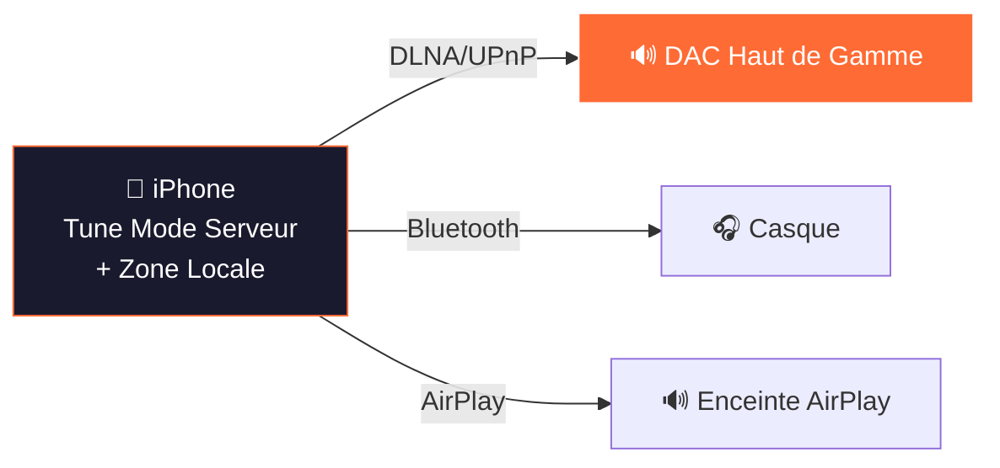

- L'iPhone fait tourner Tune en **mode serveur** (autonome, pas besoin de serveur externe)
- La zone locale streame depuis Tidal/Qobuz via l'appareil
- Peut envoyer vers les **renderers DLNA du même réseau**, le Bluetooth ou l'AirPlay
- Interface complète avec bibliothèque, recherche, playlists, favoris
- **Idéal pour** : écoute nomade, audiophile en déplacement, contrôle DLNA rapide

### Scénario 2 : Serveur Linux + iPad/iPhone en télécommande

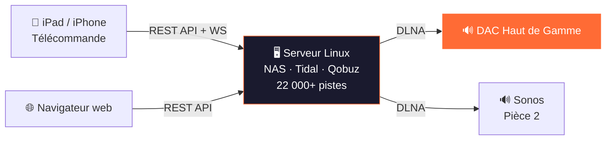

- Serveur Linux (Intel NUC, Raspberry Pi, ou tout PC) fait tourner **tune-server**
- Scanne les partages NAS/SMB, dossiers locaux, services de streaming
- Bibliothèque complète avec PostgreSQL, enrichissement métadonnées, playlists
- iPad/iPhone/Mac se connecte en **télécommande** via WiFi (REST API + WebSocket)
- Accès navigateur web à `http://serveur:8888` depuis tout appareil
- Le serveur envoie l'audio à **plusieurs renderers DLNA** simultanément (multi-room)
- **Idéal pour** : installation audiophile sérieuse, grande bibliothèque, multi-room, stockage NAS

### Scénario 3 : Serveur Linux + sorties multiples

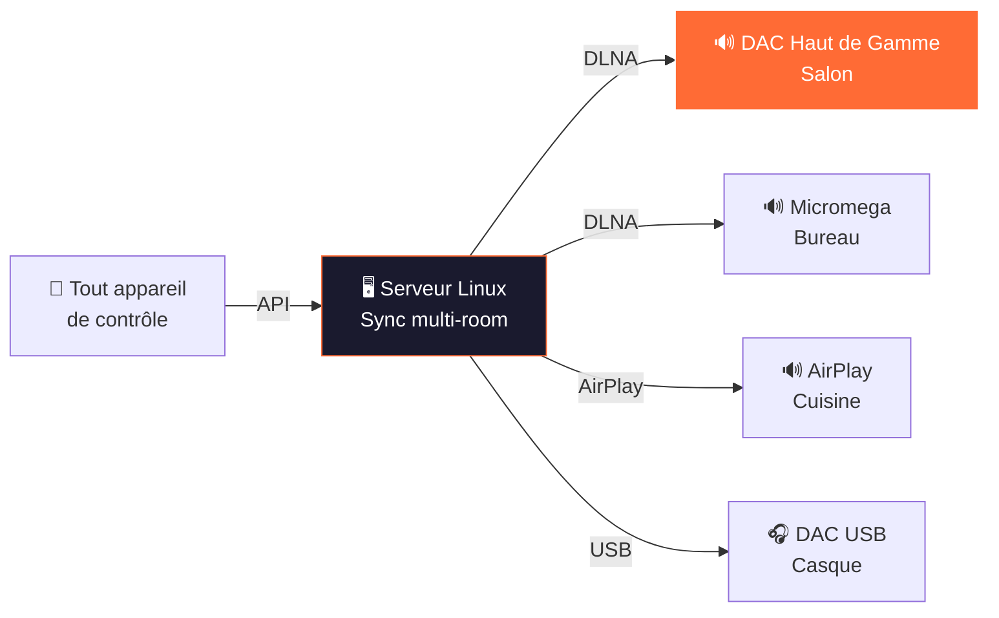

- Le même serveur Linux pilote **plusieurs zones simultanément**
- Chaque zone a sa propre file d'attente, son volume et sa sortie
- Les zones peuvent être **groupées pour une lecture synchronisée** (multi-room)
- Compensation du délai de synchronisation par zone
- Mix de sorties DLNA, AirPlay et DAC USB
- **Idéal pour** : sonorisation de toute la maison, équipement mixte, pièces audiophile + casual

### Scénario 4 : Mac de bureau (tout-en-un)

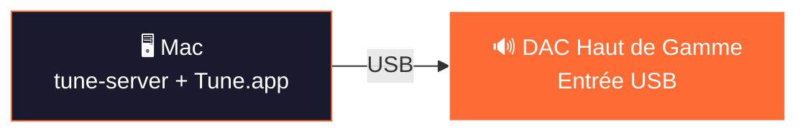

- Le Mac fait tourner **tune-server** (terminal) et **Tune.app** (interface native)
- Sortie USB directe vers le DAC (sounddevice, mode exclusif prévu)
- Interface web accessible depuis tout navigateur du réseau
- **Idéal pour** : audiophile de bureau, écoute au casque, solution simple tout-en-un

### Scénario 5 : Raspberry Pi (audiophile embarqué)

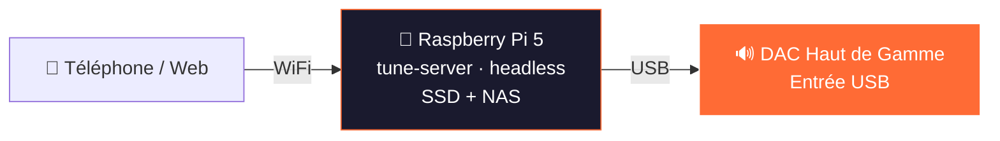

- Raspberry Pi dédié fait tourner tune-server sans écran (headless)
- Musique sur SSD USB ou NAS monté
- Sortie USB vers DAC (bit-perfect, mode exclusif)
- Contrôle depuis tout téléphone/tablette/navigateur du réseau
- **Idéal pour** : streamer dédié ultra-économique, audiophile minimaliste

### Scénario 6 : iPhone en télécommande + AirPlay

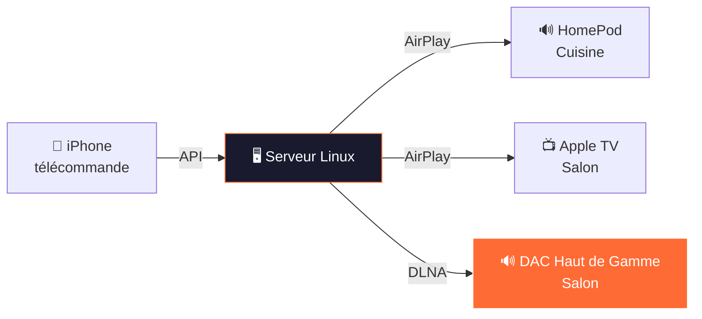

- L'iPhone contrôle le serveur (app native ou web)
- Le serveur streame vers **AirPlay et DLNA simultanément**
- Mix écosystème Apple + renderers DLNA audiophiles
- **Idéal pour** : foyer Apple avec audio haut de gamme dans une pièce

### Scénario 7 : Téléphone Android + app Flutter


- Android fait tourner Tune avec serveur embarqué (Flutter)
- Sortie DLNA directe vers le DAC
- Services de streaming (Tidal, Qobuz)
- **Idéal pour** : utilisateurs Android, installation portable

### Scénario 8 : PC Windows (bureau/studio)

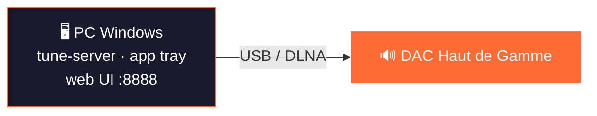

- Windows fait tourner tune-server en application tray
- Sortie USB ou DLNA
- Interface web depuis tout navigateur
- **Idéal pour** : studio/bureau, environnements Windows uniquement

### Scénario 9 : Docker (NAS / homelab)

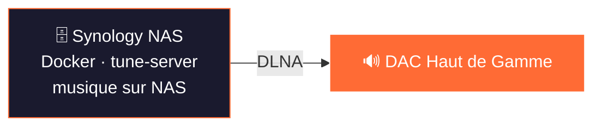

- Tourne dans Docker sur NAS (Synology, QNAP, Unraid)
- Bibliothèque musicale déjà sur le NAS — zéro copie
- Sortie DLNA vers tout renderer du réseau
- **Idéal pour** : propriétaires de NAS, solution zéro matériel

### Comparaison rapide

| Installation | Matériel | Bibliothèque | Multi-room | Chemin Audio | Complexité |
|-------|----------|---------|------------|------------|------------|
| **iPad seul** | iPad | Locale + streaming | Oui (DLNA) | iPad → DLNA → DAC(s) | ★☆☆ |
| **Linux + télécommande** | Serveur + iPad | NAS + streaming | Oui | Serveur → DLNA → DAC | ★★☆ |
| **Linux + multi** | Serveur + tout | NAS + streaming | Oui (sync) | Serveur → sorties multiples | ★★★ |
| **Mac de bureau** | Mac | Locale + streaming | Optionnel | Mac → USB → DAC | ★☆☆ |
| **Raspberry Pi** | RPi + SSD | SSD/NAS + streaming | Optionnel | RPi → USB → DAC | ★★☆ |
| **iPhone + AirPlay** | Serveur + iPhone | NAS + streaming | Oui | Serveur → AirPlay/DLNA | ★★☆ |
| **Android** | Téléphone Android | Locale + streaming | Non | Téléphone → DLNA → DAC | ★☆☆ |
| **Windows** | PC | Locale + streaming | Optionnel | PC → USB/DLNA → DAC | ★☆☆ |
| **Docker / NAS** | NAS | Volumes NAS | Oui | NAS → DLNA → DAC | ★★☆ |

---

### Serveur Linux / macOS / Windows

| Couche | Technologie | Rôle |
|-------|-----------|---------|
| Langage | Python 3.11+ (async) | Coeur serveur |
| API | FastAPI + Uvicorn | 106+ endpoints REST + WebSocket |
| Base de données | SQLite / **PostgreSQL** (double moteur) | Bibliothèque, playlists, zones |
| Pipeline Audio | FFmpeg | Décodage, transcodage, resampling |
| DLNA/UPnP | async-upnp-client | Contrôle renderer, découverte SSDP |
| AirPlay | pyatv | Streaming vers appareils Apple |
| Sortie Locale | sounddevice + numpy | DAC USB / carte son |
| Streamer HTTP | aiohttp (:8080) | Service audio pour renderers DLNA |
| Métadonnées | mutagen + musicbrainzngs | Lecture/écriture de tags, enrichissement |
| Surveillance fichiers | watchfiles | Rafraîchissement bibliothèque temps réel |

### iPadOS / iOS / macOS (SwiftUI)

| Couche | Technologie | Rôle |
|-------|-----------|---------|
| Langage | Swift 6.0 (concurrence stricte) | App native |
| UI | SwiftUI | Responsive iPad/iPhone/Mac |
| Base de données | GRDB 7.0+ | ORM SQLite |
| Audio | AVPlayer | Tous formats via streaming HTTP |
| DLNA | XMLParser + URLSession natifs | Contrôle UPnP |
| Streaming | Swift natif (sans dépendances) | Tidal, Qobuz, YouTube |

### Flutter (Android / iOS)

| Couche | Technologie | Rôle |
|-------|-----------|---------|
| Langage | Dart 3.11+ | Cross-platform |
| Base de données | Drift 2.20+ | ORM SQLite |
| Audio | just_audio | Décodeurs natifs de la plateforme |
| Serveur HTTP | Shelf + shelf_router | API REST embarquée |

### Client Web

| Couche | Technologie | Rôle |
|-------|-----------|---------|
| Langage | TypeScript 5.7+ | SPA type-safe |
| Framework | Svelte 5 (runes) | UI réactive |
| Build | Vite 6.0+ | Build rapide |
| Design | 3 breakpoints | Bureau / Tablette / Mobile |

---

## 3. Architecture Audio

### Chemin du Signal

```mermaid
graph LR
    subgraph SRC["📀 Sources"]
        direction TB
        S1["Fichiers Locaux<br/>FLAC · WAV · DSD · ALAC"]
        S2["CDN Streaming<br/>Tidal FLAC 192/24<br/>Qobuz FLAC 192/24"]
        S3["Partages Réseau<br/>SMB / NFS"]
        S4["Radio<br/>HTTP / ICY"]
    end

    subgraph DEC["⚙️ Décodage"]
        D1["FFmpeg<br/>Conversion PCM"]
        D2["Passthrough<br/>bit-perfect"]
        D3["DSD Natif<br/>DSF / DFF"]
    end

    subgraph RES["🔧 Resampling"]
        R1["Uniquement si<br/>incompatibilité format"]
        R2["Jamais d'upsampling"]
    end

    subgraph OUT["🔊 Sortie"]
        O1["DLNA / UPnP<br/>Stream HTTP"]
        O2["AirPlay<br/>pyatv"]
        O3["DAC Local<br/>USB · sounddevice"]
    end

    SRC --> DEC --> RES --> OUT

    style SRC fill:#0d0d1a,stroke:#ff6b35,color:#fff
    style DEC fill:#1a1a2e,stroke:#64b5f6,color:#fff
    style RES fill:#1e1e38,stroke:#81c784,color:#fff
    style OUT fill:#1a1a2e,stroke:#ff6b35,color:#fff
```

### Stratégies de Lecture

| Stratégie | Quand | CPU | Qualité |
|----------|------|-----|---------|
| **Passthrough URL Directe** | Streaming → DLNA | Zéro | Bit-perfect |
| **Passthrough DSD Natif** | DSF/DFF → renderer compatible DSD | Zéro | Bit-perfect |
| **Passthrough Fichier** | FLAC local → renderer compatible FLAC | Minimal | Bit-perfect |
| **Transcodage FFmpeg** | Incompatibilité de format | Moyen | Transparent |

### Formats Supportés & Qualité

| Format | Résolution Max | DSD | Gapless |
|--------|---------------|-----|---------|
| FLAC | 192 kHz / 24-bit | — | ✓ |
| WAV | 192 kHz / 32-bit | — | ✓ |
| ALAC | 192 kHz / 24-bit | — | ✓ |
| DSD (DSF/DFF) | DSD128 (5,6 MHz) | Natif | ✓ |
| DSD Fallback | 176,4 kHz / 24-bit PCM | Converti | ✓ |
| AAC/MP3/OGG | 48 kHz / 16-bit | — | ✓ |

### Qualité des Services de Streaming

| Service | Qualité Max | Format | Résolution |
|---------|-----------|--------|------------|
| **Tidal** | HI_RES_LOSSLESS | FLAC | 192 kHz / 24-bit |
| **Qobuz** | Studio Ultra | FLAC | 192 kHz / 24-bit |
| **Amazon Music** | ULTRA_HD | FLAC | 96 kHz / 24-bit |
| **Deezer** | HiFi | FLAC | 44,1 kHz / 16-bit |
| **Spotify** | Premium | OGG 320k | Lossy |
| **YouTube** | Meilleur disponible | AAC/OPUS | Variable |

---

## 4. Détails d'Implémentation DLNA/UPnP

### Communication avec le Renderer

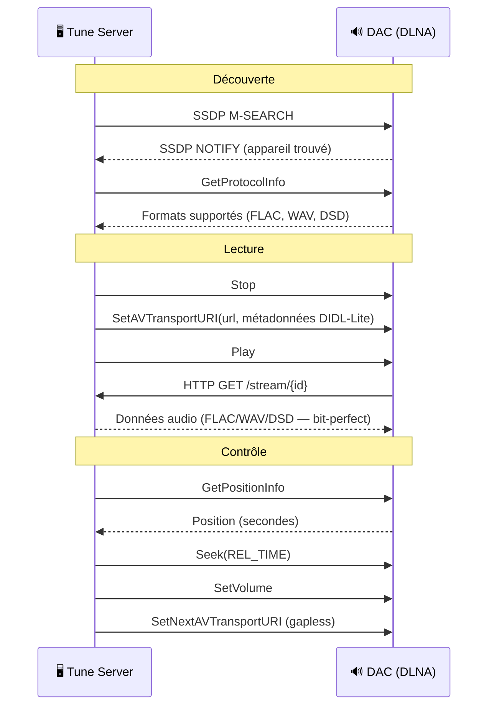

### Métadonnées DIDL-Lite

Chaque piste envoyée au renderer inclut les métadonnées complètes :
```xml
<DIDL-Lite>
  <item>
    <dc:title>Titre de la Piste</dc:title>
    <upnp:artist>Nom de l'Artiste</upnp:artist>
    <upnp:album>Titre de l'Album</upnp:album>
    <res protocolInfo="http-get:*:audio/flac:*"
         sampleFrequency="96000"
         bitsPerSample="24"
         nrAudioChannels="2"
         duration="0:04:32.000">
      http://192.168.1.29:8080/stream/abc123
    </res>
    <upnp:albumArtURI>http://192.168.1.29:8080/artwork/cover.jpg</upnp:albumArtURI>
  </item>
</DIDL-Lite>
```

### Détection DSD

```python
# Auto-détection de la capacité DSD via GetProtocolInfo ou nom de l'appareil
if "audio/x-dsf" in sink_protocols or "DSD" in device_model:
    # Servir les fichiers DSF/DFF en bit-perfect
    # MIME: audio/x-dsf ou audio/x-dff
else:
    # Transcoder en 176,4kHz/24-bit PCM via FFmpeg
```

---

## 5. Architecture Multi-Room

### Modèle de Zones

```
Zone 1 : "Salon" (DLNA → DAC Haut de Gamme)
  ├─ File d'attente : [Piste A, Piste B, Piste C]
  ├─ Volume : 0.65
  └─ État : En lecture (position : 2:34)

Zone 2 : "Bureau" (DLNA → Micromega M-One)
  ├─ File d'attente : [Piste X, Piste Y]
  ├─ Volume : 0.40
  └─ État : En pause

Groupe "Toute la Maison" (leader : Zone 1)
  ├─ Zone 1 (leader, délai sync : 0ms)
  └─ Zone 2 (follower, délai sync : +150ms)
```

### Moteur de Synchronisation

- Polling adaptatif : 1s en lecture, 10s au repos
- Seuil de détection de dérive : 500ms
- Compensation du délai de synchronisation par zone
- Mesure et cache de la latence DLNA
- Démarrage échelonné pour les renderers réseau

---

## 6. Axes d'Amélioration pour un Son Parfait

### 6.1 Synchronisation d'Horloge (Critique pour l'Audiophile)

**État actuel :** L'horloge audio est pilotée par l'horloge interne du renderer. Tune envoie les données via HTTP ; le renderer met en buffer et lit à son propre rythme d'horloge.

**Améliorations proposées :**

#### A. Support Word Clock Externe
- Ajout du support entrée/sortie word clock externe via le renderer DLNA
- Implémentation de la négociation `ClockSource` dans UPnP GetProtocolInfo
- Permettre à Tune d'annoncer ses capacités d'horloge

#### B. En-têtes de Timing Précis
- Ajout d'en-têtes HTTP personnalisés pour un timing au sample près :
  ```
  X-Tune-SampleRate: 192000
  X-Tune-BitDepth: 24
  X-Tune-Timestamp: 1712345678.123456789
  X-Tune-SampleOffset: 0
  ```
- Le renderer peut utiliser ces données pour une reconstruction sans jitter

#### C. Sortie RAVENNA/AES67
- Ajout du support protocole audio réseau RAVENNA/AES67
- Synchronisation d'horloge PTP (IEEE 1588) — précision sub-microseconde
- Transport audio réseau de qualité professionnelle
- Intégration directe avec l'entrée réseau des DAC haut de gamme

#### D. Protocole type RAAT (Roon)
- Implémentation d'un transport audio personnalisé avec :
  - Récupération d'horloge depuis les paquets réseau
  - Gestion de buffer adaptative
  - Élimination du jitter à l'étage de sortie

### 6.2 Vérification Bit-Perfect

**Proposé :**
- Vérification de checksum de bout en bout (fichier source → entrée renderer)
- Comparaison de hash audio avant/après transport
- Indicateur visuel dans l'UI : "Bit-Perfect ✓" ou "Transcodé ⚠️"
- Log de toutes les décisions du chemin du signal pour audit

### 6.3 Resampling Avancé

**Actuel :** Resampler SoX via FFmpeg quand nécessaire.

**Proposé pour les DAC haut de gamme :**
- Option pour ne jamais resampler (refuser les formats incompatibles)
- Resampling SoX "Very High Quality" à phase linéaire en fallback
- Algorithme de resampling configurable par l'utilisateur
- Préférence de resampling à ratio entier (44,1→88,2→176,4)

### 6.4 Gestion des Buffers

**Proposé :**
- Taille de pré-buffer configurable par renderer
- Mode buffer large pour les environnements réseau difficiles
- Mode zéro-buffer pour la latence la plus basse (DAC USB local)
- Buffer circulaire avec ordonnancement prioritaire (thread audio temps réel)

### 6.5 Support USB Audio Class

**Pour une entrée DAC USB directe :**
- Mode exclusif ALSA/CoreAudio (bypass du mixer OS)
- USB Audio Class 2.0 avec récupération d'horloge asynchrone
- DSD over PCM (DoP) direct ou DSD natif via USB
- Vérification bit-perfect via périphérique ALSA hw:

### 6.6 Intégration Correction Acoustique

**Proposé :**
- Chaîne de plugins DSP (convolution, EQ, crossover)
- Import de filtres Dirac Live, REW ou Audiolens
- Configuration DSP par zone
- Mode bypass pour les puristes (zéro traitement)

### 6.7 Affichage du Chemin du Signal

**Fonctionnalité audiophile proposée :**
- Afficher le chemin complet du signal dans l'UI :
  ```
  Source : Qobuz FLAC 96/24
  → Transport : Passthrough URL Directe HTTP
  → Renderer : DAC Haut de Gamme (DLNA)
  → Horloge : Interne (renderer)
  → Traitement : Aucun (bit-perfect)
  → Sortie : 96kHz / 24-bit / 2ch
  ```
- Indicateur de qualité coloré (vert = bit-perfect, jaune = transcodé)

---

## 7. Proposition de Partenariat Matériel

### Phase 1 : DLNA Basique (Déjà Fonctionnel)
- Tune découvre tout renderer DLNA/UPnP via SSDP
- Lecture FLAC/WAV/DSD via UPnP standard
- Contrôle du volume via SetVolume
- Affichage des métadonnées sur l'appareil

### Phase 2 : Intégration Avancée
- Profils d'appareils personnalisés par fabricant (réglages optimaux)
- Détection et passthrough DSD natif
- Gapless via SetNextAVTransportURI
- Rapport du chemin du signal

### Phase 3 : Protocole Natif
- Transport audio TCP direct (bypass overhead HTTP)
- Synchronisation d'horloge PTP
- DSD natif (pas DoP)
- API de contrôle pour le matériel partenaire
- Interface Tune co-brandée

### Phase 4 : Produit Commun
- Tune Server embarqué dans le matériel partenaire
- Image Linux pré-configurée
- Pipeline audio accéléré matériellement
- Intégration word clock
- Solution streamer audiophile clé en main

---

## 8. Diagrammes d'Architecture

### Topologie Réseau

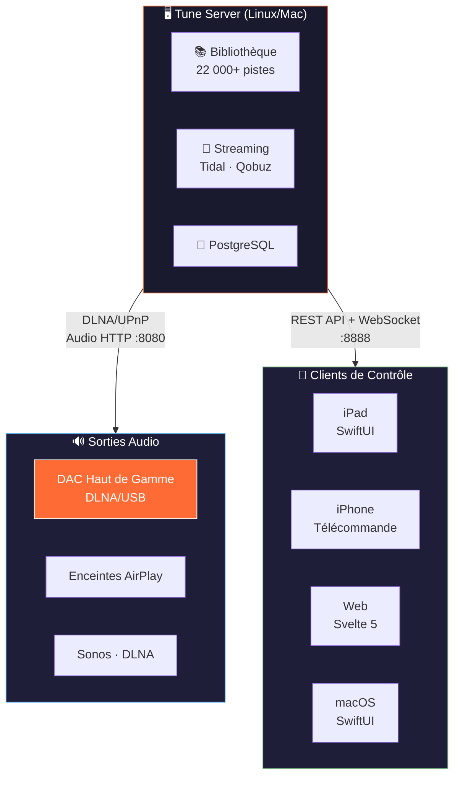

### Chemin du Signal Audio

```mermaid
graph LR
    subgraph Sources["📀 Sources"]
        LOCAL["Fichiers Locaux<br/>FLAC · WAV · DSD"]
        TIDAL["Tidal<br/>FLAC 192/24"]
        QOBUZ["Qobuz<br/>FLAC 192/24"]
        RADIO["Radio<br/>HTTP/ICY"]
    end

    subgraph Pipeline["⚙️ Pipeline Audio"]
        DEC["Décodage<br/>FFmpeg · Natif · DSD"]
        PROC["Traitement<br/>Passthrough · PCM · Resample"]
    end

    subgraph Output["🔊 Sortie"]
        DLNA["DLNA HTTP"]
        AIRP["AirPlay"]
        USB["DAC USB"]
    end

    DAC["🎵 DAC Haut de Gamme<br/>DAC → Ampli → Enceintes"]

    Sources --> DEC --> PROC --> Output --> DAC

    style Sources fill:#0d0d1a,stroke:#ff6b35,color:#fff
    style Pipeline fill:#1a1a2e,stroke:#64b5f6,color:#fff
    style Output fill:#1e1e38,stroke:#81c784,color:#fff
    style DAC fill:#ff6b35,stroke:#fff,color:#fff
```

---

## 9. Feuille de Route

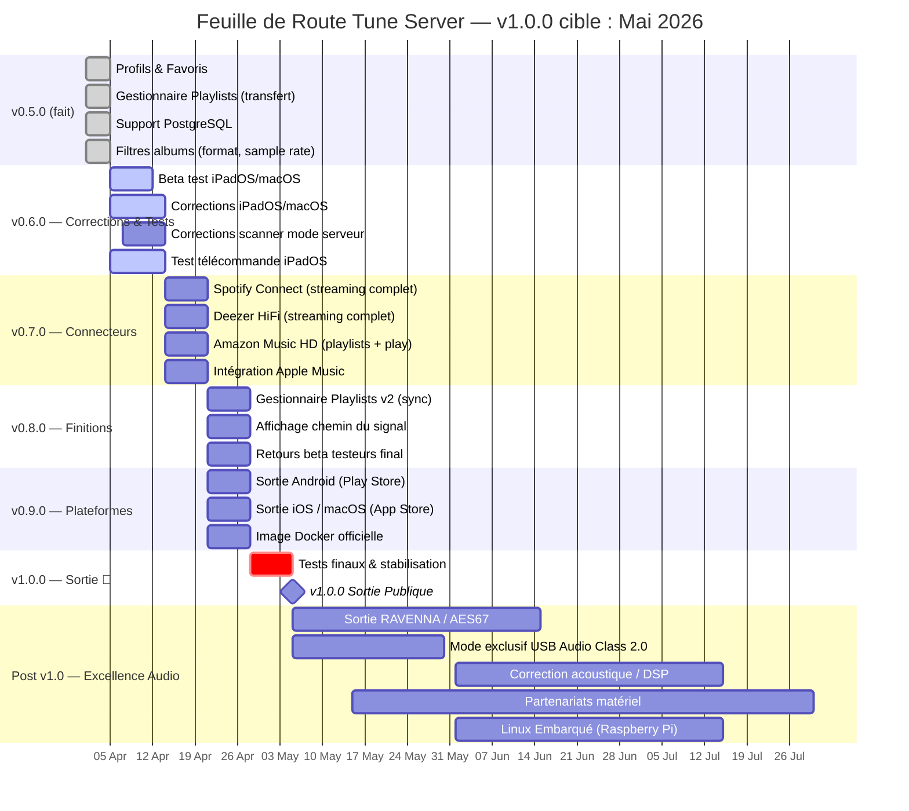

### Statut Actuel (v0.5.0 — Avril 2026)

| Fonctionnalité | Statut | Cible |
|---------|--------|--------|
| **Gestion de bibliothèque** | ✅ Production | — |
| **Tidal HiFi+** | ✅ Streaming complet (FLAC 192/24) | — |
| **Qobuz Studio** | ✅ Streaming complet (FLAC 192/24) | — |
| **YouTube Music** | ✅ Streaming | — |
| **Spotify** | ⚠️ Aperçu uniquement | v0.6.0 |
| **Deezer** | ⚠️ Aperçu uniquement | v0.6.0 |
| **Amazon Music** | ⚠️ Recherche uniquement | v0.6.0 |
| **Apple Music** | 🔜 iPadOS uniquement | v0.6.0 |
| **Sortie DLNA/UPnP** | ✅ Bit-perfect, DSD natif, gapless | — |
| **Sortie AirPlay** | ✅ Production | — |
| **Multi-room** | ✅ Groupement de zones + moteur de sync | — |
| **Gestionnaire de Playlists** | ✅ Transfert, diff, récupération | — |
| **Profils & Favoris** | ✅ Multi-utilisateur | — |
| **Client web** | ✅ Responsive, 8 langues | — |
| **iPadOS / iOS / macOS** | ✅ TestFlight | App Store v1.0 |
| **Android (Flutter)** | 🔜 Beta | Play Store v1.0 |
| **RAVENNA / AES67** | 🔜 Planifié | Post v1.0 |
| **DSP / Correction acoustique** | 🔜 Planifié | Post v1.0 |
| **Intégration matérielle** | 🔜 Planifié | Post v1.0 |

### Chemin vers la v1.0.0 (Mai 2026)

1. **Tests beta & corrections** — Tests actifs iPadOS/macOS, corrections scanner, lecture et UI
2. **Compléter tous les connecteurs streaming** — Spotify Connect, Deezer HiFi, Amazon Music HD, Apple Music
3. **Finaliser le Gestionnaire de Playlists** — Améliorer la précision du matching, synchronisation bidirectionnelle
4. **Sorties App Store / Play Store** — iOS, macOS, Android en version publique
5. **v1.0.0** — Stable, fonctionnellement complet, prêt pour les partenariats matériel

---

## 10. Contact & Ressources

- **Site web** : https://mozaiklabs.fr
- **Téléchargements** : https://mozaiklabs.fr/download
- **GitHub** : github.com/renesenses/tune-server-linux
- **Forum Beta** : https://mozaiklabs.fr/forum
- **Version actuelle** : v0.5.0 (Avril 2026)

---

*Document préparé par Bertrand & Claude — MozAIk Labs, Avril 2026*
