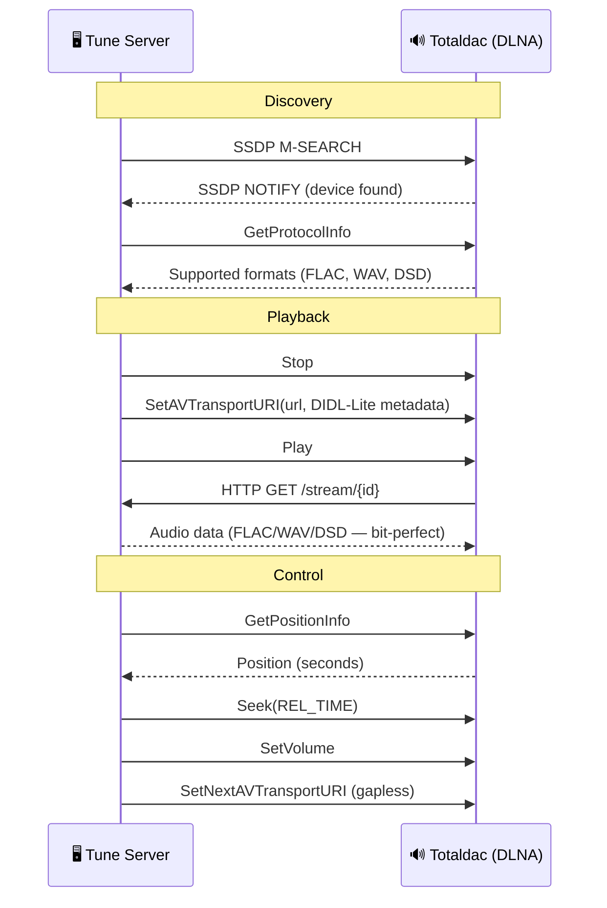
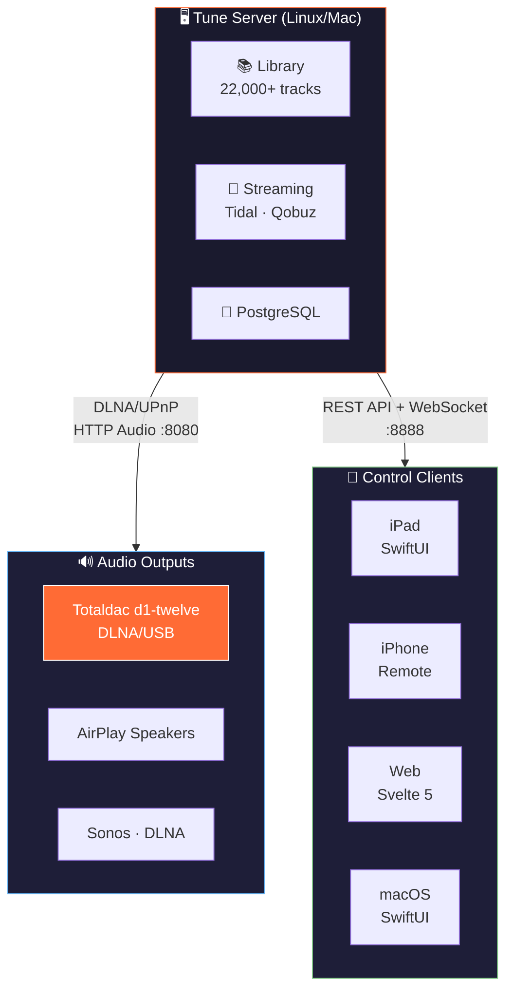
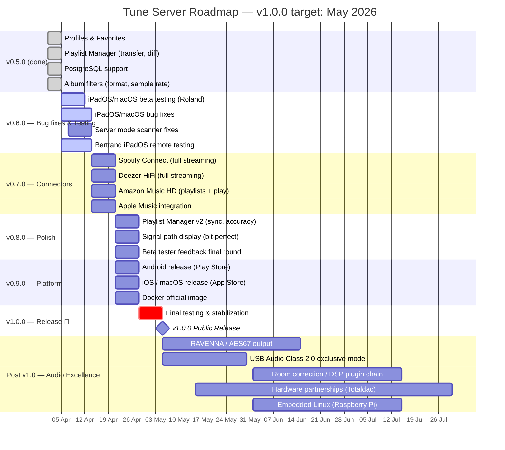

# TUNE — Technical Architecture for High-End Audio Integration

*Prepared for Vincent Briet, Totaldac — April 2026*

---

## About — MozAIk Labs

**Bertrand Clech** — Founder & Lead Developer

EPFL Engineer (Communication Systems — IT/Telecom convergence, 1995). 30+ years of experience in software engineering, telecom, and distributed systems. Audiophile and entrepreneur, passionate about bridging the gap between high-end audio and modern software.

**MozAIk Labs** is a French company focused on building the next generation of music server software for audiophiles. Our mission: deliver studio-quality playback with the convenience of modern streaming — without compromise.

| | |
|---|---|
| **Founder** | Bertrand Clech |
| **Company** | MozAIk Labs |
| **Website** | [mozaiklabs.fr](https://mozaiklabs.fr) |
| **Location** | France |
| **Product** | Tune — Multi-room Music Server |
| **Status** | Beta (v0.5.0, April 2026) |
| **Beta testers** | Active community via [mozaiklabs.fr/forum](https://mozaiklabs.fr/forum) |

**Audio Equipment:**
- Micromega M-One (amplifier/DAC/streamer)
- EverSolo DMP-A8 (streamer)
- Lindemann (streamer)
- Sonos (multi-room)

**Streaming Services:** Tidal HiFi+, Qobuz Studio

**Team:**
- Bertrand — Architecture, backend (Python/FastAPI), iOS (Swift/SwiftUI), infrastructure
- Matteo — Frontend, ecommerce (React/Laravel)
- JP — Architecture advisor
- Freddy — HiFi hardware partnerships (Belgium)
- Claude AI (Anthropic) — AI-assisted development & rapid prototyping

---

## 1. What is Tune?

A **multi-room music server** that unifies local libraries, network shares, and 6 streaming services (Tidal, Qobuz, Spotify, YouTube, Deezer, Amazon Music) with **bit-perfect playback** to DLNA/UPnP renderers, AirPlay devices, and local outputs.

**Key differentiators:**
- Bit-perfect and native DSD passthrough
- Federated search across all sources
- Multi-room with synchronization
- Open architecture, self-hosted
- Runs on Linux, macOS, Windows, iPadOS, iOS, Android

---

## 2. Technology Stack by Platform

### Linux / macOS / Windows Server

| Layer | Technology | Purpose |
|-------|-----------|---------|
| Language | Python 3.11+ (async) | Server core |
| API | FastAPI + Uvicorn | 106+ REST endpoints + WebSocket |
| Database | SQLite / **PostgreSQL** (dual engine) | Library, playlists, zones |
| Audio Pipeline | FFmpeg | Decode, transcode, resample |
| DLNA/UPnP | async-upnp-client | Renderer control, SSDP discovery |
| AirPlay | pyatv | Apple device streaming |
| Local Output | sounddevice + numpy | USB DAC / soundcard |
| HTTP Streamer | aiohttp (:8080) | Audio serving for DLNA renderers |
| Metadata | mutagen + musicbrainzngs | Tag reading/writing, enrichment |
| File Watching | watchfiles | Real-time library refresh |

### iPadOS / iOS / macOS (SwiftUI)

| Layer | Technology | Purpose |
|-------|-----------|---------|
| Language | Swift 6.0 (strict concurrency) | Native app |
| UI | SwiftUI | Responsive iPad/iPhone/Mac |
| Database | GRDB 7.0+ | SQLite ORM |
| Audio | AVPlayer | All formats via HTTP streaming |
| DLNA | Native XMLParser + URLSession | UPnP control |
| Streaming | Native Swift (no dependencies) | Tidal, Qobuz, YouTube |

### Flutter (Android / iOS)

| Layer | Technology | Purpose |
|-------|-----------|---------|
| Language | Dart 3.11+ | Cross-platform |
| Database | Drift 2.20+ | SQLite ORM |
| Audio | just_audio | Native platform decoders |
| HTTP Server | Shelf + shelf_router | Embedded REST API |

### Web Client

| Layer | Technology | Purpose |
|-------|-----------|---------|
| Language | TypeScript 5.7+ | Type-safe SPA |
| Framework | Svelte 5 (runes) | Reactive UI |
| Build | Vite 6.0+ | Fast build |
| Design | 3 breakpoints | Desktop / Tablet / Mobile |

---

## 3. Audio Architecture

### Signal Path

```mermaid
graph LR
    subgraph SRC["📀 Sources"]
        direction TB
        S1["Local Files<br/>FLAC · WAV · DSD · ALAC"]
        S2["Streaming CDN<br/>Tidal FLAC 192/24<br/>Qobuz FLAC 192/24"]
        S3["Network Shares<br/>SMB / NFS"]
        S4["Radio<br/>HTTP / ICY"]
    end

    subgraph DEC["⚙️ Decode"]
        D1["FFmpeg<br/>PCM conversion"]
        D2["Passthrough<br/>bit-perfect"]
        D3["Native DSD<br/>DSF / DFF"]
    end

    subgraph RES["🔧 Resample"]
        R1["Only if format<br/>mismatch"]
        R2["Never upsample"]
    end

    subgraph OUT["🔊 Output"]
        O1["DLNA / UPnP<br/>HTTP stream"]
        O2["AirPlay<br/>pyatv"]
        O3["Local DAC<br/>USB · sounddevice"]
    end

    SRC --> DEC --> RES --> OUT

    style SRC fill:#0d0d1a,stroke:#ff6b35,color:#fff
    style DEC fill:#1a1a2e,stroke:#64b5f6,color:#fff
    style RES fill:#1e1e38,stroke:#81c784,color:#fff
    style OUT fill:#1a1a2e,stroke:#ff6b35,color:#fff
```



### Playback Strategies

| Strategy | When | CPU | Quality |
|----------|------|-----|---------|
| **Direct URL Passthrough** | Streaming → DLNA | Zero | Bit-perfect |
| **Native DSD Passthrough** | DSF/DFF → DSD-capable renderer | Zero | Bit-perfect |
| **File Passthrough** | Local FLAC → FLAC-capable renderer | Minimal | Bit-perfect |
| **FFmpeg Transcode** | Format mismatch | Medium | Transparent |

### Supported Formats & Quality

| Format | Max Resolution | DSD | Gapless |
|--------|---------------|-----|---------|
| FLAC | 192 kHz / 24-bit | — | ✓ |
| WAV | 192 kHz / 32-bit | — | ✓ |
| ALAC | 192 kHz / 24-bit | — | ✓ |
| DSD (DSF/DFF) | DSD128 (5.6 MHz) | Native | ✓ |
| DSD Fallback | 176.4 kHz / 24-bit PCM | Converted | ✓ |
| AAC/MP3/OGG | 48 kHz / 16-bit | — | ✓ |

### Streaming Service Quality

| Service | Max Quality | Format | Resolution |
|---------|-----------|--------|------------|
| **Tidal** | HI_RES_LOSSLESS | FLAC | 192 kHz / 24-bit |
| **Qobuz** | Studio Ultra | FLAC | 192 kHz / 24-bit |
| **Amazon Music** | ULTRA_HD | FLAC | 96 kHz / 24-bit |
| **Deezer** | HiFi | FLAC | 44.1 kHz / 16-bit |
| **Spotify** | Premium | OGG 320k | Lossy |
| **YouTube** | Best available | AAC/OPUS | Variable |

---

## 4. DLNA/UPnP Implementation Details

### Renderer Communication



### DIDL-Lite Metadata

Every track sent to the renderer includes full metadata:
```xml
<DIDL-Lite>
  <item>
    <dc:title>Track Title</dc:title>
    <upnp:artist>Artist Name</upnp:artist>
    <upnp:album>Album Title</upnp:album>
    <res protocolInfo="http-get:*:audio/flac:*"
         sampleFrequency="96000"
         bitsPerSample="24"
         nrAudioChannels="2"
         duration="0:04:32.000">
      http://192.168.1.29:8080/stream/abc123
    </res>
    <upnp:albumArtURI>http://192.168.1.29:8080/artwork/cover.jpg</upnp:albumArtURI>
  </item>
</DIDL-Lite>
```

### DSD Detection

```python
# Auto-detect DSD capability from GetProtocolInfo or device name
if "audio/x-dsf" in sink_protocols or "DSD" in device_model:
    # Serve DSF/DFF files bit-perfect
    # MIME: audio/x-dsf or audio/x-dff
else:
    # Transcode to 176.4kHz/24-bit PCM via FFmpeg
```

---

## 5. Multi-Room Architecture

### Zone Model

```
Zone 1: "Salon" (DLNA → Totaldac d1-twelve)
  ├─ Queue: [Track A, Track B, Track C]
  ├─ Volume: 0.65
  └─ State: Playing (position: 2:34)

Zone 2: "Bureau" (DLNA → Micromega M-One)
  ├─ Queue: [Track X, Track Y]
  ├─ Volume: 0.40
  └─ State: Paused

Group "Whole House" (leader: Zone 1)
  ├─ Zone 1 (leader, sync_delay: 0ms)
  └─ Zone 2 (follower, sync_delay: +150ms)
```

### Synchronization Engine

- Adaptive polling: 1s when playing, 10s when idle
- Drift detection threshold: 500ms
- Per-zone sync delay compensation
- DLNA latency measurement and caching
- Staggered start for network renderers

---

## 6. Improvement Axes for Perfect Sound

### 6.1 Clock Synchronization (Critical for Audiophile)

**Current state:** Audio clocking is driven by the renderer's internal clock. Tune sends data via HTTP; the renderer buffers and plays at its own clock rate.

**Proposed improvements:**

#### A. External Word Clock Support
- Add support for external word clock input/output via the DLNA renderer
- Implement `ClockSource` negotiation in UPnP GetProtocolInfo
- Allow Tune to advertise clock capabilities

#### B. Precision Timing Headers
- Add custom HTTP headers for sample-accurate timing:
  ```
  X-Tune-SampleRate: 192000
  X-Tune-BitDepth: 24
  X-Tune-Timestamp: 1712345678.123456789
  X-Tune-SampleOffset: 0
  ```
- Renderer can use these for jitter-free reconstruction

#### C. RAVENNA/AES67 Output
- Add RAVENNA/AES67 network audio protocol support
- PTP (IEEE 1588) clock synchronization — sub-microsecond precision
- Professional-grade network audio transport
- Direct integration with Totaldac's network input

#### D. Roon-style RAAT Protocol
- Implement a custom audio transport with:
  - Clock recovery from network packets
  - Adaptive buffer management
  - Jitter elimination at the output stage

### 6.2 Bit-Perfect Verification

**Proposed:**
- End-to-end checksum verification (source file → renderer input)
- Audio hash comparison before/after transport
- Visual indicator in UI: "Bit-Perfect ✓" or "Transcoded ⚠️"
- Log all signal path decisions for auditing

### 6.3 Advanced Resampling

**Current:** FFmpeg SoX resampler when needed.

**Proposed for Totaldac:**
- Option for no resampling ever (refuse incompatible formats)
- SoX "Very High Quality" linear-phase resampling as fallback
- User-configurable resampling algorithm
- Integer ratio resampling preference (44.1→88.2→176.4)

### 6.4 Buffer Management

**Proposed:**
- Configurable pre-buffer size per renderer
- Large buffer mode for network-challenged environments
- Zero-buffer mode for lowest latency (local USB DAC)
- Ring buffer with priority scheduling (real-time audio thread)

### 6.5 USB Audio Class Support

**For direct Totaldac USB input:**
- ALSA/CoreAudio exclusive mode (bypass OS mixer)
- USB Audio Class 2.0 with async clock recovery
- Direct DSD over PCM (DoP) or native DSD via USB
- Bit-perfect verification via ALSA hw: device

### 6.6 Room Correction Integration

**Proposed:**
- DSP plugin chain (convolution, EQ, crossover)
- Import Dirac Live, REW, or Audiolens filters
- Per-zone DSP configuration
- Bypass mode for purists (zero processing)

### 6.7 Signal Path Display

**Proposed audiophile feature:**
- Show the complete signal path in the UI:
  ```
  Source: Qobuz FLAC 96/24
  → Transport: HTTP Direct URL Passthrough
  → Renderer: Totaldac d1-twelve (DLNA)
  → Clock: Internal (renderer)
  → Processing: None (bit-perfect)
  → Output: 96kHz / 24-bit / 2ch
  ```
- Color-coded quality indicator (green = bit-perfect, yellow = transcoded)

---

## 7. Totaldac Integration Proposal

### Phase 1: Basic DLNA (Already Working)
- Tune discovers Totaldac via SSDP
- FLAC/WAV/DSD playback via standard UPnP
- Volume control via SetVolume
- Metadata display on device

### Phase 2: Enhanced Integration
- Custom device profile for Totaldac (optimal settings)
- DSD native detection and passthrough
- Gapless via SetNextAVTransportURI
- Signal path reporting

### Phase 3: Totaldac-Native Protocol
- Direct TCP audio transport (bypass HTTP overhead)
- PTP clock synchronization
- Native DSD (not DoP)
- Remote control API for Totaldac hardware
- Totaldac-branded Tune interface

### Phase 4: Joint Product
- Tune Server embedded in Totaldac hardware
- Pre-configured Linux image
- Hardware-accelerated audio pipeline
- Word clock integration
- Totaldac d1-twelve with Tune built-in

---

## 8. Architecture Diagrams

### Network Topology



### Audio Signal Path

```mermaid
graph LR
    subgraph Sources["📀 Sources"]
        LOCAL["Local Files<br/>FLAC · WAV · DSD"]
        TIDAL["Tidal<br/>FLAC 192/24"]
        QOBUZ["Qobuz<br/>FLAC 192/24"]
        RADIO["Radio<br/>HTTP/ICY"]
    end

    subgraph Pipeline["⚙️ Audio Pipeline"]
        DEC["Decode<br/>FFmpeg · Native · DSD"]
        PROC["Processing<br/>Passthrough · PCM · Resample"]
    end

    subgraph Output["🔊 Output"]
        DLNA["DLNA HTTP"]
        AIRP["AirPlay"]
        USB["USB DAC"]
    end

    DAC["🎵 Totaldac d1-twelve<br/>DAC → Amp → Speakers"]

    Sources --> DEC --> PROC --> Output --> DAC

    style Sources fill:#0d0d1a,stroke:#ff6b35,color:#fff
    style Pipeline fill:#1a1a2e,stroke:#64b5f6,color:#fff
    style Output fill:#1e1e38,stroke:#81c784,color:#fff
    style DAC fill:#ff6b35,stroke:#fff,color:#fff
```



---

## 9. Roadmap



### Current Status (v0.5.0 — April 2026)

| Feature | Status | Target |
|---------|--------|--------|
| **Library management** | ✅ Production | — |
| **Tidal HiFi+** | ✅ Full streaming (FLAC 192/24) | — |
| **Qobuz Studio** | ✅ Full streaming (FLAC 192/24) | — |
| **YouTube Music** | ✅ Streaming | — |
| **Spotify** | ⚠️ Preview only | v0.6.0 |
| **Deezer** | ⚠️ Preview only | v0.6.0 |
| **Amazon Music** | ⚠️ Search only | v0.6.0 |
| **Apple Music** | 🔜 iPadOS only | v0.6.0 |
| **DLNA/UPnP output** | ✅ Bit-perfect, DSD native, gapless | — |
| **AirPlay output** | ✅ Production | — |
| **Multi-room** | ✅ Zone grouping + sync engine | — |
| **Playlist Manager** | ✅ Transfer, diff, recovery | — |
| **User Profiles & Favorites** | ✅ Multi-user | — |
| **Web client** | ✅ Responsive, 8 languages | — |
| **iPadOS / iOS / macOS** | ✅ TestFlight | App Store v1.0 |
| **Android (Flutter)** | 🔜 Beta | Play Store v1.0 |
| **RAVENNA / AES67** | 🔜 Planned | Post v1.0 |
| **DSP / Room correction** | 🔜 Planned | Post v1.0 |
| **Hardware integration** | 🔜 Planned | Post v1.0 |

### Path to v1.0.0 (May 2026)

1. **Beta testing & bug fixes** — Active iPadOS/macOS testing with Roland (Germany) and Bertrand, fix scanner, playback, and UI issues
2. **Complete all streaming connectors** — Spotify Connect, Deezer HiFi, Amazon Music HD, Apple Music
3. **Finalize Playlist Manager** — Improve matching accuracy, two-way sync
4. **App Store / Play Store releases** — iOS, macOS, Android public releases
5. **v1.0.0** — Stable, feature-complete, ready for hardware partnerships

---

## 10. Contact & Resources

- **Website**: https://mozaiklabs.fr
- **Downloads**: https://mozaiklabs.fr/download
- **GitHub**: github.com/renesenses/tune-server-linux
- **Beta Forum**: https://mozaiklabs.fr/forum
- **Current Version**: v0.5.0 (April 2026)

---

*Document prepared by Bertrand & Claude — MozAIk Labs, April 2026*
